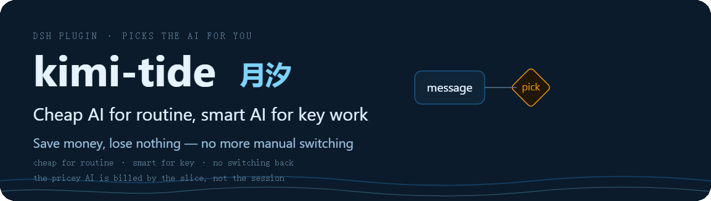
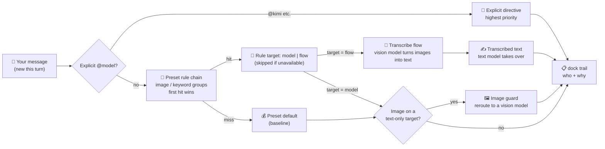

<p align="center">
  English ｜ <a href="README.md">简体中文</a>
</p>

<p align="center">
  
</p>
<p align="center">
  <a href="https://github.com/tafcear/kimi-tide/releases"></a>
  <a href="https://github.com/tafcear/kimi-tide/actions/workflows/ci.yml"></a>
  <a href="https://github.com/tafcear/kimi-tide/blob/main/LICENSE"></a>
</p>

**kimi-tide (MoonTide) is the "pick the right model at every step" plugin for DSH.**

DSH (DeepSeek Harness) is DeepSeek's official open-source AI coding agent framework — you work with an AI assistant in a web UI, and models, tools, and interface all load as plugins (the official motto: *Everything is a Plugin*). You can connect several models to DSH: some understand screenshots, some are great at code, some are cheap and fast. But by default **a DSH session sticks to one model from start to finish** — switching means doing it by hand, and remembering to switch back.

With kimi-tide installed: **paste a screenshot and it goes to a model that can see it; write code and it goes to the coding model; small talk and translation go to the cheap one** — and the "🌙 MoonTide" panel below the input box always shows who was picked and why. The rules are yours to write and edit. Kimi and DeepSeek are just the ready-made examples — **any model you connect can be routed your way**.

**For you if**: you use DSH with more than one model connected.
**Not for you if**: you use a single model, or haven't set up DSH yet (set up DSH first, then come back).

---

## What problem it solves

**Scenario 1: you paste a screenshot, and the model says it can't see images**

- Before: switch to a vision model by hand → paste → ask → remember to switch back.
- After: just paste. Image-bearing messages go to a model that can see; the next text-only message returns to your default model automatically.

**Scenario 2: you switched models and forgot to switch back**

- Before: one screenshot moved you to the expensive model — and the rest of the session kept burning it.
- After: kimi-tide decides **per step**, not per session — once the image is handled, your next message is back on the default model.

**Scenario 3: your quota burns faster than expected**

- Before: every message — including "hello" and "translate this" — runs on the most expensive model.
- After: pick the "saving" preset (a ready-made bundle of default model + rules) — small talk, translation, and daily chores go to the cheap model; only code and images touch the expensive ones. The panel shows your plan's remaining quota in real time (Kimi/GLM plans; models without a plan stay greyed out).

---

## Routing logic in 30 seconds

When a message arrives, kimi-tide decides in this order:

1. **Explicit pick**: the message says `@kimi` or similar → use it (highest priority).
2. **Rule hit**: walk the preset's rules in order — has an image? hit a keyword group? → the first rule that fires wins.
3. **Baseline**: nothing fires → use the preset's default model.
4. **Image guard**: even if a text-only model was picked, an image-bearing message is rerouted to a model that can see — no crashes.



> A "flow" is a small automation pipeline (e.g.: images are turned into text first, then a cheap text model takes over); "vision" means a model that can read images; the "dock panel" is the "🌙 MoonTide" panel below the input box.

## What it looks like

[](docs/assets/readme/kimi-tide-architecture.html)

*Click for full size; download the linked HTML and open it in a browser for the interactive diagram (pan/zoom/search, light & dark themes).*

---

## Quick Start

### 1. Prerequisites

- Node.js ≥ 22
- DSH `@deepseek-ai/dsh@0.1.1-rc.2` or newer
- The models you want to route among are connected in DSH — **any provider works**. To use Kimi, grab a **Kimi Code Console API key** (the quota panel rides the same key)

### 2. Connect candidate models (DSH "Settings → Models" page)

Add a model source (example: **`kimi-coding`** with `apiKeyEnv` set to `KIMI_API_KEY`, then paste your key in the credential area — the 4 Kimi models appear in the catalog automatically). **Mount as many providers as you like**: kimi-tide's candidate pool is the full Models-page catalog. Keys live in DSH's managed credential store, **never in any plugin config file**.

### 3. Install the plugin

```bash
cd packages/dsh-kimi-tide
npm install && npm run build && npm pack
dsh plugin --profile web add ./dsh-kimi-tide-<version>.tgz
```

### 4. Use it

Restart `dsh web`:

- **Settings → 月汐**: pick the "saving" or "capability" preset — the router is on duty;
- Type **`@kimi`** for an explicit pick, or let the built-in keyword groups reroute automatically (a message mentioning "code" goes to the coding model);
- The "🌙 MoonTide" dock panel below the input box shows who was picked and why, for every step;
- ✅ **30-second smoke check**: send "write a function for me" — the panel should show the code rule firing and rerouting to the coding model. No reason chip = the router isn't on duty; go back to "Settings → 月汐" and confirm a preset is selected.

---

## Presets & Rules

A preset is a bundle of "default model + rules" you can switch globally in one click. Two ship built in:

| Preset | Default model (used when no rule fires) | Rules | Best for |
|---|---|---|---|
| Off | — | — | full manual control |
| Saving (省钱) | `deepseek-v4-flash` | image → `k3`; code keywords → `kimi-for-coding`; translate keywords → `deepseek-v4-flash` | quota-sensitive daily work |
| Capability (能力) | `k3` | image → `k3`; review → `k3`; code → `kimi-for-coding`; math → `deepseek-v4-pro`; longdoc → `k3`; writing → `deepseek-v4-pro`; translate → `deepseek-v4-flash`; chitchat → `deepseek-v4-flash` | best output quality |

Seven built-in keyword groups (word lists editable, custom groups allowed):

| Group | Direction | Built-in word list (editable) |
|---|---|---|
| `code` | coding | 代码, code, bug, 重构, refactor, 实现, 函数, 测试, 接口, 联调, 部署, 性能, 报错, 日志, 编译, 命令, 脚本 |
| `review` | review | 审查, review, 评审, 挑毛病, 复检, 检查, audit, 意见, 打分 |
| `writing` | writing | 写作, 文案, 润色, 改写, 扩写, 标题, 推文, 周报, 演讲稿, 总结 |
| `translate` | translation | 翻译, 译成, 中译英, 英译中, translate, 本地化 |
| `longdoc` | long documents | 长文档, 通读, 逐段, 全文, 上万字, 大文档 |
| `math` | math | 数学, 证明, 推导, 求解, 公式, 数论, 概率, 逻辑题 |
| `chitchat` | small talk | 你好, 谢谢, 怎么样, 随便, 聊聊, 天气 |

Two common tweaks (a few clicks in "Settings → 月汐"):

- **Minimum keyword hits**: set a threshold (e.g. 2) so a rule fires only when at least 2 distinct words from the group appear — "make a plan" no longer trips the plan-related words by accident.
- **Reasoning effort**: give a rule target or the default model a "thinking depth" tier (deeper is slower and pricier); unsupported tiers are dropped automatically — no errors.

Matching details (word boundaries, specificity ranking, degradation), image behavior, and the full config reference: [router architecture](packages/dsh-kimi-tide/docs/router.md). The candidate pool is the full Models-page catalog — any model can be a default or a rule target.

---

## FAQ

**Q: Where did the old OAuth access go?**
A: Retired. The official DSH ecosystem natively supports Kimi now, so the self-built layer was removed wholesale. Archive: [`docs/legacy-setup.md`](docs/legacy-setup.md).

**Q: Do I still need the Kimi CLI and `kimi login`?**
A: No. One Console API key + the official Models page.

**Q: Any limitations with image sessions?**
A: With the default "latch" behavior, a session that has seen an image stays locked to the vision-capable model — if its quota fails, that session can't fall back to text; open a new one. To avoid this: set the preset's image fallback to "lazy transcribe" (images become text, the text model takes over) or "blind" (treat images as absent). Transcriptions are cached and never retried.

**Q: I heard about a "capability scoring engine"?**
A: Retired. Scoring by machine was a black box; routing now follows rules you can read and edit — a hit routes, a miss falls to the baseline. Old scoring configs migrate into presets automatically on upgrade.

**Q: Where is the router config stored? Will upgrades lose it?**
A: In DSH settings (edited via "Settings → 月汐", restart-safe). Upgrades migrate automatically and archive the old config; details in the "migration chain" section of the [router architecture](packages/dsh-kimi-tide/docs/router.md).

---

## Version & Roadmap

> Current version: **v1.0.1 (2026-08-31)**

- What every version gives you: [CHANGELOG.md](CHANGELOG.md)
- Maintainer evidence chain (commit anchors / acceptance records): [docs/release-evidence.md](docs/release-evidence.md)
- Planned: automatic review-flow triggering, subagent transcription, the 0.8.5 "hardening & packaging" release — tracked in the [evidence doc](docs/release-evidence.md).

---

## Documentation Index

> Three principles of this project: **official first · transparent rules · observable decisions** — routing follows rules you can write, and every automatic pick has a reason and a trail.

**I just want to use it**

- Quick Start (this page)
- FAQ (this page)
- [Changelog](CHANGELOG.md)

**I want to dig deeper**

- [Router architecture](packages/dsh-kimi-tide/docs/router.md): presets / rules / degradation / migration chain / full config reference
- [Interactive architecture diagram](docs/assets/readme/kimi-tide-architecture.html) (open in a browser after download; static version above)
- [DSH host-platform contract research](docs/host-platform-map.md)
- [Project positioning & maintenance strategy](docs/positioning.md)
- [The dual-model collaboration loop](docs/agent-collaboration-loop.md) (how this project itself is built; independent study: [kimi-tide-research](https://github.com/tafcear/kimi-tide-research))

**I want to contribute**

- Report issues, send fixes, or say hi in [Discussions](https://github.com/tafcear/kimi-tide/discussions)

---

## Development & Testing

```bash
cd packages/dsh-kimi-tide
npm install
npm run typecheck   # tsc --noEmit
npm test            # vitest
npm run build       # tsc host build + esbuild browser bundle
```

Quality bar: full test suite green + zero typecheck errors + successful build before committing. This repository practices an "implement → independent review → fix → re-check" dual-model loop (see [`docs/agent-collaboration-loop.md`](docs/agent-collaboration-loop.md)).

**Release gate**: before any release (tagging / triggering the Actions release), that version's live-acceptance checklist must pass in full on the real host, and the maintainer approves the tag — "unit tests green" is not "runs in the host". Per-version acceptance records: [docs/release-evidence.md](docs/release-evidence.md).

> **Release rule (maintainers)**: a DSH plugin must declare `dsh.bundle.patch` (pointing at `cordis.patch.yml`) to load as a profile layer. This plugin follows the official spec — do not remove the field when bumping versions.

---

## Contributors

- Thanks to [@dracpet](https://github.com/dracpet) for live-verified diagnosis and community contributions: [PR #1](https://github.com/tafcear/kimi-tide/pull/1) (OAuth expiry refresh), [PR #2](https://github.com/tafcear/kimi-tide/pull/2) (`commands/execute` across host contract versions), [PR #3](https://github.com/tafcear/kimi-tide/pull/3) (YAML-null config normalization), and [Issue #4](https://github.com/tafcear/kimi-tide/issues/4) (rc.2 projection wire-contract diagnosis).
- Thanks to [@pandashere](https://github.com/pandashere) for [dsh-kimi-bridge](https://github.com/pandashere/dsh-kimi-bridge) (MIT): it bootstrapped the early Kimi CLI bridging and validated the panel path kimi-tide later took; retired and archived (history preserved in git) as the official integration matured — thank you.
- Contributions of any form are welcome: report issues, send fixes, or share how you use it in [Discussions](https://github.com/tafcear/kimi-tide/discussions).

---

<p align="center">
  <a href="https://github.com/oil-oil/beautify-github-readme"></a>
</p>

## License & Compliance

- **kimi-tide itself**: [MIT](LICENSE) (Copyright 2026 kimi-tide contributors)
- **Third-party components**: `@earendil-works/pi-ai` (MIT), `@deepseek-ai/dsh-llm-pi-ai` (MIT, DeepSeek), `schemastery` (MIT), `zod` (MIT), `yaml` (MIT), `dsh-kimi-bridge` (MIT, historical credit — archived)
- **Compliance**: the default path is the **official Console API key**, safe for personal use; Kimi Code subscription terms still apply as officially stated — no high-frequency batch calls or key sharing.
- This repository contains **no credentials**; never commit `~/.dsh/.credentials.yaml` or any key from your environment.
