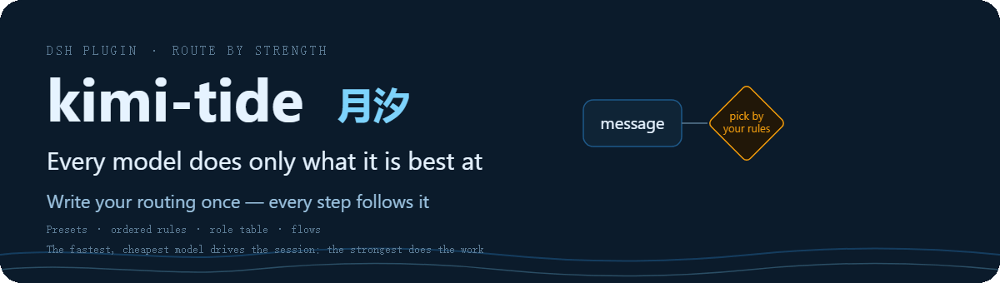
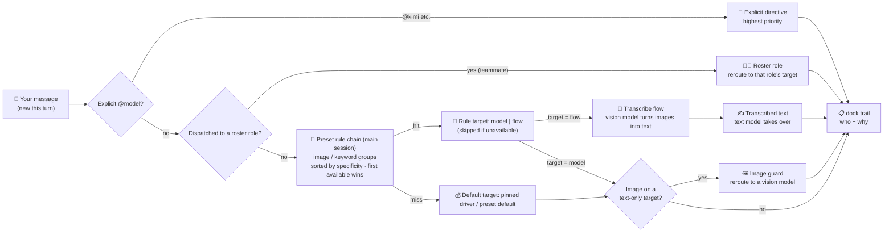

<p align="center">
  English ｜ <a href="README.md">简体中文</a>
</p>

<p align="center">
  
</p>
<p align="center">
  <a href="https://awesome-dsh-plugin.com"></a>
  <a href="https://github.com/tafcear/kimi-tide/releases"></a>
  <a href="https://github.com/tafcear/kimi-tide/actions/workflows/ci.yml"></a>
  <a href="https://github.com/tafcear/kimi-tide/blob/main/LICENSE"></a>
  <a href="https://github.com/tafcear/kimi-tide/graphs/contributors"></a>
</p>

**kimi-tide (MoonTide) is a small plugin you install into DSH — the tool you use to work and write code together with an AI (open-sourced by DeepSeek).**

**It does one job: it swaps in a better-suited AI for you, automatically.** You usually have several AIs connected — one cheap, one smart, one that can read screenshots. Until now you had to switch by hand, and often forgot to switch back; with kimi-tide it picks for you on every turn: **everyday work goes to the cheap one first, the important work goes to the smarter one, images go to the one that can see them.**

**Three things you get:**

- **Save money** — don't pay where you don't need to. Chat, translation, copy edits and tidying up keep using your cheapest AI; **the good steel goes only where the blade is**.
- **No weak links** — the critical parts are backed by a strong model: coding, code review and math each go to the stronger one, and output that matters can be checked by a strong model first (issues by severity + advice + a pass/fail verdict) before it reaches you.
- **No more switching back** — after a screenshot, only that turn moves to a vision AI; the next turn returns to the one you were using. **The pricey AI is billed by the slice, not by the whole session.**
- **English UI built in** — when the host language is English, the settings card, dock and decision panel, review and send-back cards, and the help tab all render in English; the Chinese UI stays byte-identical. The Plugin Manager and the plugin row in Settings also gain a title and description (previously absent).

(In the rest of this document, "AI" and "model" mean the same thing — DSH calls them models.)

**For you if**: you use DSH with more than one model connected.
**Not for you if**: you use a single model, or haven't set up DSH yet (set up DSH first, then come back).

---

## What problem it solves

**Scenario 1: you paste a screenshot, and the model says it can't see images**

- Before: switch to a vision model by hand → paste → ask → remember to switch back.
- After: just paste. Image-bearing messages go to a model that can see; the next text-only message returns to your default model automatically.

**Scenario 2: you switched models and forgot to switch back**

- Before: one screenshot moved you to the expensive model — and the rest of the session kept burning it.
- After: kimi-tide decides **per step**, not per session — once the image is handled, your next message is back on the default model.

**Scenario 3: your quota burns faster than expected**

- Before: every message — including "hello" and "translate this" — runs on the most expensive model.
- After: pick the "saving" preset (a ready-made bundle of default model + rules) — small talk, translation, and daily chores go to the cheap model; only code and images touch the expensive ones. The panel shows your plan's remaining quota in real time (Kimi/GLM plans; models without a plan stay greyed out).

---

## Routing logic in 30 seconds

When a message arrives, kimi-tide decides in this order (**five tiers**, aligned tier by tier with the decision chain in the settings page):

1. **Explicit pick**: the message says `@kimi` (provider level: the model you configured in the preset) or `@kimi/k3` (pins that exact model) → highest priority.
2. **The caller's pick**: a subagent's caller already named a model (different from the default target) → it is kept, not overridden.
3. **Roster role (teammates only)**: the request comes from a teammate claimed by the roster → rerouted to that role's target model (see "Team dispatch" below).
4. **Keyword rules (main session only)**: score the preset's rules — has an image? how many keyword-group words matched? → rules are sorted by **specificity** (more matched words first, image always first, ties keep list order) and the **first rule with an available target** wins (unavailable targets fall through to the next rule). Child agents skip keyword rules by default (switchable in Settings).
5. **Default target**: nothing fires → the main session uses the "pinned driver" target (or the preset default when that is off); a child agent keeps the model it inherited.
6. **Image guard**: even if a text-only model was picked, an image-bearing message is rerouted to a model that can see — no crashes.


```mermaid
flowchart LR
    A["💬 Your message<br>(new this turn)"] --> B{"Explicit @model?"}
    B -- "@kimi etc." --> H["🎯 Explicit directive<br>highest priority"]
    B -- no --> R{"Dispatched to a roster role?"}
    R -- "yes (teammate)" --> S["🧑🔧 Roster role<br>reroute to that role's target"]
    R -- no --> C["📏 Preset rule chain (main session)<br>image / keyword groups<br>sorted by specificity · first available wins"]
    C -- hit --> D["🌙 Rule target: model | flow<br>(skipped if unavailable)"]
    C -- miss --> E["💰 Default target: pinned driver / preset default"]
    H --> J
    S --> J
    D -- "target = flow" --> T["🌊 Transcribe flow<br>vision model turns images into text"]
    D -- "target = model" --> F
    E --> F{"Image on a<br>text-only target?"}
    T --> K["✍️ Transcribed text<br>text model takes over"]
    F -- yes --> G["🖼️ Image guard<br>reroute to a vision model"]
    F -- no --> J["📋 dock trail<br>who + why"]
    G --> J
    K --> J
```

> A "flow" is a small automation pipeline (e.g.: images are turned into text first, then a cheap text model takes over); "vision" means a model that can read images; the "dock panel" is the "🌙 MoonTide" panel below the input box.

## How to read the Settings page (Route tab)

Open "Settings → 月汐 → Route": from top to bottom it *is* a **five-tier decision chain** — who gets to decide which model runs this step, the higher the stronger:

At the very top of the card sits an **interface-language row**: it lists every language registered with the host (current one selected); switching applies to the **whole interface** (including the Kimi Tide card itself) immediately and is remembered by the host. On older hosts that provide no language list, the row is not rendered.

1. **Summary line**: one plain-language sentence about the current state, like this — main session uses flash as the default target, a 「code」 hit switches to k3 ｜ dispatch: frontend→k3, backend→glm-5.3 ｜ images: latch to the vision model. With no rules configured at all it still says so: the main session has no rule that can match, everything uses the default target (…); several more keyword groups are not wired into any rule, so none takes effect for now — **an empty table is not broken, it is not wired yet**.
2. **The five tiers**: explicit @ > caller's pick > roster role > keyword rules > default target. Each tier shows three lines — trigger / current value / when disabled. The **roster** is inlined in tier 3 and the **rule editor** in tier 4. Every tier carries a state badge — **ready** (it really participates now) / **on demand** (only when you type `@` or a caller names a model; not dimmed) / **not enabled** (nothing configured; dimmed) — so you can tell at a glance who decides this turn.
3. **Scope badges**: rule rows read "**main session**", roster rows read "**on dispatch**" — two configurations, two halves, and the badges are the dividing line. In the config file they are two kinds of rows in **one routing table**, `routes` (`scope: session` / `scope: dispatch`):

   ```yaml
   routes:
     - { id: code-kfc, scope: session, preset: capability, when: { kind: keywords, group: code }, target: { provider: kimi-coding, model: kimi-for-coding } }
     - { id: backend,  scope: dispatch, when: { kind: role }, label: 后端, target: { provider: zai-coding-cn, model: glm-5.3 } }
   ```

   `session` rows serve the main session only, `dispatch` rows serve teammates only; **once `routes` exists it is the single source of truth**, and the legacy fields (`presets[*].rules` / `roles`) stay as a mirror — delete the `routes` block and the old-field reading applies again, nothing breaks.
4. **Overlap notes**: when one word (say "code") is both the subject of a keyword rule and a role's identity word, both sides show a note: "by design: saying 'code' in the main session goes to A; delegating 'code' work to 'backend' goes to B" — **not a conflict, a division of labour**. Two one-click actions sit next to it: **make the rule follow that role** / **merge the word into that role's aliases**. (Rules claimed by a collaboration flow are left out of these notes — they are suppressed, so explaining them would be a lie.)
5. **The playground's "dispatch to" box**: type a role or teammate name and see which model it will be rerouted to and on what basis (`role` / `unclaimed`). It is a **different scope** from "try a sentence": "try a sentence" predicts the main session's keyword rules, "dispatch to" predicts the roster reroute at delegation time.

> For the config shape, ordering and migration rules (`scope` semantics and conflict validation included), see the [router architecture](packages/dsh-kimi-tide/docs/router.md) "2.1.0 unified routing table (v7)" section.

## What it looks like

[](docs/assets/readme/kimi-tide-architecture.html)

*Click for full size; download the linked HTML and open it in a browser for the interactive diagram (pan/zoom/search, light & dark themes).*

---

## Quick Start

### 1. Prerequisites

- Node.js ≥ 22
- DSH `@deepseek-ai/dsh@0.1.2-rc.1` or newer (this release is verified on `0.1.5-rc.1`)
- The models you want to route among are connected in DSH — **any provider works**. To use Kimi, grab a **Kimi Code Console API key** (the quota panel rides the same key)

### 2. Connect candidate models (DSH "Settings → Models" page)

Add a model source (example: **`kimi-coding`** with `apiKeyEnv` set to `KIMI_API_KEY`, then paste your key in the credential area — the 4 Kimi models appear in the catalog automatically). **Mount as many providers as you like**: kimi-tide's candidate pool is the full Models-page catalog. Keys live in DSH's managed credential store, **never in any plugin config file**.

### 3. Install the plugin

```bash
cd packages/dsh-kimi-tide
npm install && npm run build && npm pack
dsh plugin --profile web add ./dsh-kimi-tide-<version>.tgz
```

### 4. Use it

Restart `dsh web`:

- **Settings → 月汐**: pick the "saving" or "capability" preset — the router is on duty;
- Type **`@kimi`** for an explicit pick, or let the built-in keyword groups reroute automatically (a message mentioning "code" goes to the coding model);
- The "🌙 MoonTide" dock panel below the input box shows who was picked and why, for every step;
- ✅ **30-second smoke check**: send "write a function for me" — the panel should show the code rule firing and rerouting to the coding model. No reason chip = the router isn't on duty; go back to "Settings → 月汐" and confirm a preset is selected.

---

## Presets & Rules

A preset is a bundle of "default model + rules" you can switch globally in one click. Two ship built in:

| Preset | Default model (used when no rule fires) | Rules | Best for |
|---|---|---|---|
| Off | — | — | full manual control |
| Saving (省钱) | `deepseek-v4-flash` | image → `k3`; code keywords → `kimi-for-coding`; translate keywords → `deepseek-v4-flash` | quota-sensitive daily work |
| Capability (能力) | `k3` | image → `k3`; review → `k3`; code → `kimi-for-coding`; math → `deepseek-v4-pro`; longdoc → `k3`; writing → `deepseek-v4-pro`; translate → `deepseek-v4-flash`; chitchat → `deepseek-v4-flash` | best output quality |

Seven built-in keyword groups (word lists editable, custom groups allowed):

| Group | Direction | Built-in word list (editable) |
|---|---|---|
| `code` | coding | 代码, code, bug, 重构, refactor, 实现, 函数, 测试, 接口, 联调, 部署, 性能, 报错, 日志, 编译, 命令, 脚本 |
| `review` | review | 审查, review, 评审, 挑毛病, 复检, 检查, audit, 意见, 打分 |
| `writing` | writing | 写作, 文案, 润色, 改写, 扩写, 标题, 推文, 周报, 演讲稿, 总结 |
| `translate` | translation | 翻译, 译成, 中译英, 英译中, translate, 本地化 |
| `longdoc` | long documents | 长文档, 通读, 逐段, 全文, 上万字, 大文档 |
| `math` | math | 数学, 证明, 推导, 求解, 公式, 数论, 概率, 逻辑题 |
| `chitchat` | small talk | 你好, 谢谢, 怎么样, 随便, 聊聊, 天气 |

> The `review` group serves the **collaborative review flow** by default (a strong model reviews this turn's output) — see "Multi-model collaborative review" below for the mechanism, the four switches and today's limits.

Two common tweaks (a few clicks in "Settings → 月汐"):

- **Minimum keyword hits**: set a threshold (e.g. 2) so a rule fires only when at least 2 distinct words from the group appear — "make a plan" no longer trips the plan-related words by accident.
- **Reasoning effort**: give a rule target or the default model a "thinking depth" tier (deeper is slower and pricier); the transcription flow's vision model and the review flow's reviewer take one too (Settings → 月汐 → Collaboration flows). The dropdown lists **only the tiers that model declares** — "跟随默认（该模型未声明档位）" means it declares none; unsupported tiers are dropped automatically — no errors.

### Usage & balance (follows the model that actually got picked)

The quota slots on the panel's second row **follow the current routed target** and adapt their shape: subscription plans (code plans) show usage windows (weekly / 5h — the bar draws the **remaining** share), while API-billed providers show a **balance** (with an explicit "insufficient balance" note when that is what the endpoint reports). Next to them a **Overview** button lists every registered source in one screen, including *why* a source has no data: "no public API for this plan" / "key not configured" / "fetch failed" — three distinct states, spelled out per row.

> Credentials are resolved by the **`apiKeyEnv` name configured for that provider in `settings.yaml`** (built-in aliases as fallback), so **the panel still gets data when your key name differs from the plugin's default**.

### Help tab & semantic hit confirmation

- **"Settings → 月汐 → Help"** explains every panel element and every settings field across its sections (with a "what's new" section on top covering this release's five-tier chain, scopes and unified routing table), with key entries carrying the **current value** (e.g. "trigger: manual ⇒ keyword hits will not fire a review"), plus a **symptom → cause** table.
- **Semantic hit confirmation** (off by default, needs config): with it enabled a keyword hit no longer reroutes immediately — the **preset's own default model** first confirms "is this really this turn's intent?", and an "omit" verdict skips that rule and keeps matching the rest. Timeout / unavailable judge / unparseable output all **fall back to the plain keyword result**; explicit `@` turns and turns where an image rule already leads make **no judge call at all**. Config knob: `preset.hitConfirm`.
- **The verdict lands in the decision reason**: omit / hit / no-verdict is prepended to the panel's decision reason (e.g. "semantic gate: no verdict 1200ms (code-kfc)"). Because an omit drops the rule from the chain and therefore lands on the default route, **default-route decisions carrying a verdict note are now surfaced too** — otherwise the omit itself, the one outcome you most need to see, would stay invisible.
- **The judge's thinking is turned off when the target allows it**: the judge is a reasoning model but this gate gives it a 64-token budget — left thinking, it spends the whole budget on reasoning, returns **not a single character of output**, and the verdict becomes unparseable (the gate then fails open and changes nothing). So when the judge target declares an "off" effort level, the plugin disables thinking explicitly; targets that do not (k3, for instance) get no effort sent at all — never an enum they would reject.

### Two ways to write an explicit @

- `@kimi` (provider level): the model is **the one you configured in the preset**, not whatever happens to be first in the catalog — and the decision reason says which basis was used.
- `@kimi/k3` (exact model): pins that model directly, regardless of pool order; if it is unavailable you are **told what it fell back to** instead of being silently switched.
- **Only a real provider counts as a directive**: if the token after `@` is not a provider this plugin knows — a workspace path reference like `@README.md`, a scoped package name like `node_modules/@deepseek-ai/...`, or an `@xxx` inside a path — it is **not treated as an explicit directive**; the turn goes through the keyword rules as usual and the decision reason says "`@x` is not a known provider (ignored)".

Matching details (word boundaries, specificity ranking, degradation), image behavior, and the full config reference: [router architecture](packages/dsh-kimi-tide/docs/router.md). The candidate pool is the full Models-page catalog — any model can be a default or a rule target.

## Multi-model collaborative review (a strong model signs off)

Routing decides *who runs this step*; review decides *whether this step is good enough*. They work separately or together.

**What it does**: when a turn closes, kimi-tide sends "your request for this turn + the main model's output" to **the reviewer you configured** (usually the stronger, pricier one) and gets back a structured review — issues graded by severity (blocking / suggested / optional) → improvement advice → a verdict (pass / conditional pass / fail) — rendered as a **review card** under that turn.

**Four switches** (Settings → 月汐 → collaboration flows):

| Switch | What it actually does today |
|---|---|
| Trigger | `keywords`: review only when the message hits the chosen keyword group; `manual`: run `/kimi-tide review` on the last turn at any time |
| Rounds | 1–3, bounding how many review passes happen — **and the per-session cap on "send it back"** |
| Auto-revise | When the verdict is "fail / conditional pass", the review is sent back to the main model to rework (off by default) |
| Re-check after revise | **Review the rework once more** (on by default) — to confirm the issues were really fixed |

**How sending it back works**: it does not edit your code for you; it injects one "revise per this feedback" message into that turn, so the **main model fixes only what was flagged** (no rewriting of unrelated parts), and the next turn starts normally. The original output stays in the session log, always reviewable.

- **Automatic**: with auto-revise on, a "fail / conditional pass" verdict triggers it; a "pass" verdict — or a verdict that cannot be parsed — never does (no guessing).
- **Manual**: every review card carries a "**let it redo**" button (or type `/kimi-tide revise`), and it works **without auto-revise** — you can ask for a rework even when the verdict was "pass".
- **It cannot run away**: at most `rounds` (1–3) sends per session; after that the card reads "stopped (cap reached)" and nothing is sent again. A failed review (timeout / empty output) never triggers a send-back.

**What it does not do today**: it does not edit your code, and it never bypasses the main model to write anything itself — the rework is still the main model's job.

**Cost**: review only runs on **matching turns**, and only this turn's output slice is sent to the reviewer (12,000 characters per section, 60-second timeout, failures never interrupt the turn). With send-back enabled, each send costs **one extra main-model turn**, and re-check adds **one extra review call** on top. In the industry data the research repo cites, adversarial review loops commonly cost 2–3× a single model's tokens — **this plugin has not measured its own numbers yet**.

**Evidence grade**: the mechanism and the three rounds of practice are documented in [kimi-tide-research](https://github.com/tafcear/kimi-tide-research). Whether review actually *improves a weaker model's output* is **not measured yet** (no acceptance rate, no baseline against the strong model working alone, no regression rate), so this section quotes no effect numbers; the transfer-efficiency experiment was originally slated for v1.4.0 — **v1.4.0 ships the mechanism itself (send-back for rework) only**, and the experiment moves to the next version, whose testbed (the product running its own review loop) is exactly what v1.4.0 puts in place.

---

## Team dispatch (hand focused work to specialist models)

Routing decides "who runs this step" and the review flow decides "was this step good enough"; the **roster** decides "who owns this kind of work from now on". Kimi Tide ships the roster as a **skill card the model reads** — the main model follows it when delegating, so you never hand-copy model names into a prompt.

- **Write a roster** (Settings → Kimi Tide → Roster): one row per role — id (also the teammate-name claim key), label and target model, e.g. "frontend → `kimi-coding/k3`", "backend → `zai-coding-cn/glm-5.3`". Two roles claiming the same teammate name are **rejected at save time**. Two buttons fill in **example roles** in bulk — "**Fill in engineering examples**" (Frontend / Backend / DevOps / QA / Data / Security) and "**Fill in business examples**" (Writing / Marketing / Sales / Support / Finance / Legal), six each; targets start at the active preset's default model (change them in the dropdowns), and **an existing role with the same id is never overwritten**.
- **The teammate name is the claim**: create a teammate named after the role id (or its alias) and every request from it is re-routed to the target model; unknown names are left untouched (they keep the model they were created with), and child-agent turns are never re-routed by keywords in the task text.
- **The model can read the roster**: while routing is on and the roster is non-empty, the plugin registers a runtime skill (`kimi-tide-team`) — read before delegating, then follow one of two recipes: a **one-shot task** (`workflow`, naming the model) or a **persistent teammate** (`spawn_teammate`, name taken from the claim column). Edit the roster and the card in live sessions is replaced on the next turn; empty the roster and the card disappears.
- **Pinned driver**: if you want the main session's **default target** to always be one model instead of the preset default, turn on "pin the driver" and name the target — keyword rules and explicit `@kimi` still win. Leave it empty to follow the host's default model.
- **Every dispatch leaves a trace**: the decision panel's "recent dispatches" lists the basis (`role` / `unclaimed` / `explicit` / `keep`), the teammate, the role label and the **effective** model (latest 20 per parent session); when a role target is unavailable the plugin **never swaps anyone silently** — the panel states, word for word, "「<role>」target unavailable → keeping the inherited model (<effective target>)".

Config fields (`roles` / `driver` / `driverSticky` / `rulesApplyToChildren`), the five-step decision priority and the migration rules live in the [router architecture](packages/dsh-kimi-tide/docs/router.md) "2.0.0 team dispatch" and "2.1.0 unified routing table (v7)" sections; the live acceptance criteria and results are in [team-dispatch-acceptance.md](packages/dsh-kimi-tide/docs/team-dispatch-acceptance.md).

---

## FAQ

**Q: Where did the old OAuth access go?**
A: Retired. The official DSH ecosystem natively supports Kimi now, so the self-built layer was removed wholesale. Archive: [`docs/legacy-setup.md`](docs/legacy-setup.md).

**Q: Do I still need the Kimi CLI and `kimi login`?**
A: No. One Console API key + the official Models page.

**Q: Any limitations with image sessions?**
A: With the default "latch" behavior, a session that has seen an image stays locked to the vision-capable model — if its quota fails, that session can't fall back to text; open a new one. To avoid this: set the preset's image fallback to "lazy transcribe" (images become text, the text model takes over) or "blind" (treat images as absent). Transcriptions are cached and never retried.

**Q: I heard about a "capability scoring engine"?**
A: Retired. Scoring by machine was a black box; routing now follows rules you can read and edit — a hit routes, a miss falls to the default target. Old scoring configs migrate into presets automatically on upgrade.

**Q: Where is the router config stored? Will upgrades lose it?**
A: In DSH settings (edited via "Settings → 月汐", restart-safe). Upgrades migrate automatically and archive the old config; details in the "migration chain" section of the [router architecture](packages/dsh-kimi-tide/docs/router.md).

---

## Version & Roadmap

> Current version: **v2.1.1 (2026-10-08)**

- What every version gives you: [CHANGELOG.md](CHANGELOG.md)
- Maintainer evidence chain (commit anchors / acceptance records): [docs/release-evidence.md](docs/release-evidence.md)
- Planned: live acceptance for v2.1.0 (the Route-page A/B checks plus the v7 write channel landing on disk, see [routing-ia-acceptance.md](packages/dsh-kimi-tide/docs/routing-ia-acceptance.md)); live re-verification of the v2.0.0 "role × image" combination (once the host GUI allows image attachments in teammate sessions), subagent transcription, the 0.8.5 "hardening & packaging" release — tracked in the [evidence doc](docs/release-evidence.md).

---

## Documentation Index

> Three principles of this project: **official first · transparent rules · observable decisions** — routing follows rules you can write, and every automatic pick has a reason and a trail.

**I just want to use it**

- Quick Start (this page)
- FAQ (this page)
- [Changelog](CHANGELOG.md)

**I want to dig deeper**

- [Router architecture](packages/dsh-kimi-tide/docs/router.md): presets / rules / degradation / migration chain / full config reference
- [Interactive architecture diagram](docs/assets/readme/kimi-tide-architecture.html) (open in a browser after download; static version above)
- [DSH host-platform contract research](docs/host-platform-map.md)
- [Project positioning & maintenance strategy](docs/positioning.md)
- [The dual-model collaboration loop](docs/agent-collaboration-loop.md) (how this project itself is built; independent study: [kimi-tide-research](https://github.com/tafcear/kimi-tide-research))

**I want to contribute**

- Report issues, send fixes, or say hi in [Discussions](https://github.com/tafcear/kimi-tide/discussions)

---

## Development & Testing

```bash
cd packages/dsh-kimi-tide
npm install
npm run typecheck   # tsc --noEmit
npm test            # vitest
npm run build       # tsc host build + esbuild browser bundle
```

Quality bar: full test suite green + zero typecheck errors + successful build before committing. This repository practices an "implement → independent review → fix → re-check" dual-model loop (see [`docs/agent-collaboration-loop.md`](docs/agent-collaboration-loop.md)).

**Doc gates**: `npm run check` runs five machine gates — CHANGELOG / README / package version consistency, no broken doc links, README pair parity (version line / section skeleton / badges / local doc-link set; rules: [`docs/agents/readme-pair.md`](docs/agents/readme-pair.md)), terminology banned-word scan ([`docs/agents/terminology.md`](docs/agents/terminology.md)), and client hardcoded-copy plus locale-table structure validation ([`scripts/check-client-i18n.mjs`](scripts/check-client-i18n.mjs)). Any user-visible change must update both READMEs (Chinese and English) in the same commit. Copy register follows the gold-standard samples in [`docs/agents/style-samples.md`](docs/agents/style-samples.md) (samples outrank prose descriptions).

**Bilingual four-section release page**: every new version's Release body (= the annotated tag message) must be **bilingual** — a 简体中文 block first, an English block below — with four sections inside each language: ① one-line positioning ② `本次更新` / `What's new` ③ `安装与升级` / `Install & upgrade` ④ `验证与验收` / `Verification & acceptance`. Self-check with `node scripts/check-release-notes.mjs --file <draft>` before tagging; Actions enforces it again before `gh release create` (template and rules: [`docs/agents/release-notes.md`](docs/agents/release-notes.md)).

**Release gate**: before any release (tagging / triggering the Actions release), that version's live-acceptance checklist must pass in full on the real host, and the maintainer approves the tag — "unit tests green" is not "runs in the host". Per-version acceptance records: [docs/release-evidence.md](docs/release-evidence.md).

> **Release rule (maintainers)**: a DSH plugin must declare `dsh.bundle.patch` (pointing at `cordis.patch.yml`) to load as a profile layer. This plugin follows the official spec — do not remove the field when bumping versions.

---

## Contributors

- Thanks to [@dracpet](https://github.com/dracpet) for live-verified diagnosis and community contributions: [PR #1](https://github.com/tafcear/kimi-tide/pull/1) (OAuth expiry refresh), [PR #2](https://github.com/tafcear/kimi-tide/pull/2) (`commands/execute` across host contract versions), [PR #3](https://github.com/tafcear/kimi-tide/pull/3) (YAML-null config normalization), and [Issue #4](https://github.com/tafcear/kimi-tide/issues/4) (rc.2 projection wire-contract diagnosis).
- Thanks to [@pandashere](https://github.com/pandashere) for [dsh-kimi-bridge](https://github.com/pandashere/dsh-kimi-bridge) (MIT): it bootstrapped the early Kimi CLI bridging and validated the panel path kimi-tide later took; retired and archived (history preserved in git) as the official integration matured — thank you.
- Contributions of any form are welcome: report issues, send fixes, or share how you use it in [Discussions](https://github.com/tafcear/kimi-tide/discussions).

---

<p align="center">
  <a href="https://github.com/oil-oil/beautify-github-readme"></a>
</p>

## License & Compliance

- **kimi-tide itself**: [MIT](LICENSE) (Copyright 2026 kimi-tide contributors)
- **Third-party components**: `@earendil-works/pi-ai` (MIT), `@deepseek-ai/dsh-llm-pi-ai` (MIT, DeepSeek), `schemastery` (MIT), `zod` (MIT), `yaml` (MIT), `dsh-kimi-bridge` (MIT, historical credit — archived)
- **Compliance**: the default path is the **official Console API key**, safe for personal use; Kimi Code subscription terms still apply as officially stated — no high-frequency batch calls or key sharing.
- This repository contains **no credentials**; never commit `~/.dsh/.credentials.yaml` or any key from your environment.
