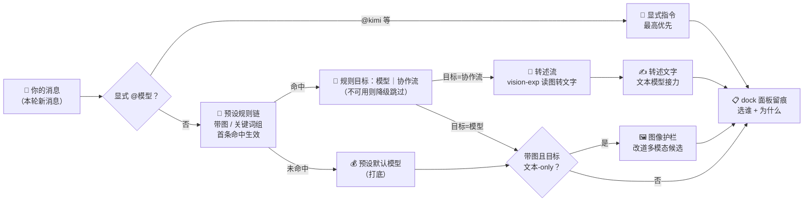
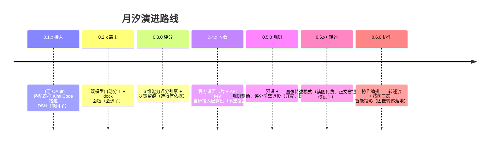
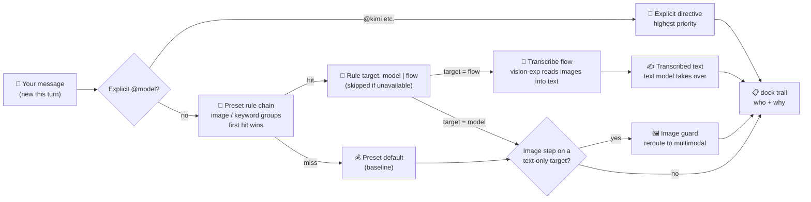
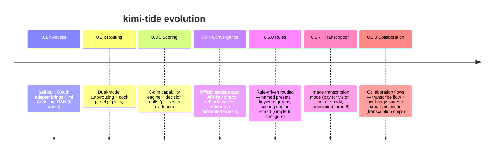

<details open>
<summary><b>🇨🇳 中文</b></summary>

<p align="center">
  
</p>

DSH 里一个会话从头到尾只用一个模型：**DeepSeek V4** 主力文本模型便宜、快，但**看不懂图片**；**Kimi K3** 多模态、1M 超长上下文、编码强，但**有额度与成本**。写代码到一半想贴张截图，得手动切模型；切完又忘了切回来，额度哗哗流走。**月汐就是这笔账的自动交警**：你只管干活，它按任务类型、预算和模型长板，在每个步骤自动选路——选谁、为什么选，全都摆在面板上。

---

## 架构

[](docs/assets/readme/kimi-tide-architecture.html)

> 点击查看大图；`docs/assets/readme/kimi-tide-architecture.html` 下载后用浏览器打开，是可平移缩放/搜索/导出的**交互式架构图**（含明暗双主题；节点证据链指向源码锚点）。

一次请求的决策流：



---

## 特性一览

- 🚦 **预设路由**：内置「省钱」「能力」两种预设，也可自建命名预设，设置卡片一键全局切换；按**每个步骤**决策，不是一会话绑定到死。
- 🎯 **规则引擎**（0.5.0）：规则 = `带图` / 命名关键词组（内置「代码」「闲聊」两组，词表可改、可自建）；首条命中生效，未命中走预设打底，不可用目标自动降级跳过。
- 🌊 **协作编排**（0.6.0）：规则目标可指向**协作流**——预置图像转述流（vision-exp 读图转文字，eager/lazy 双时态，缓存+超时+失败不重打）与评审流（预置注册，P2 命令式触发）；预设级带图兜底三态（锁存/盲答/懒转述）；`llm/stream` 智能投影让文本模型凭转述文字接力看图。
- 🖼️ **图像护栏**：带图消息自动改道多模态模型；按图三态状态表（native/transcribed/blind）防止历史含图后文本模型崩溃（`UNSUPPORTED_CONTENT`）。
- 👁️ **决策可观测**：dock 面板实时显示「这步选了谁、为什么」，会话日志留痕可复查——不黑箱。
- ⚙️ **官方设置卡片**：路由配置就在 DSH「设置 → 月汐」里编辑，原生分层持久化，重启保持。
- 🔌 **官方接入层**（0.4.x）：Kimi 模型经 pi-ai 原生 `kimi-coding` 路由接入，**一把 Console API Key 即可**，不再需要 Kimi CLI 登录与令牌刷新。
- 📊 **官方配额显示**：dock 面板轮询 Kimi Code 用量接口，周配额 / 5h 窗口一目了然。
- ⌨️ **`/kimi-tide` 命令族**：`preset` / `show` / `set` / `export-config` / `import-config` / `refresh`，配置可导出备份、可导入恢复。

---

## 快速开始

> 旧 OAuth 方案已退役，历史存档见 [`docs/legacy-setup.md`](docs/legacy-setup.md)。

### 1. 前置条件

- Node.js ≥ 22
- DSH `@deepseek-ai/dsh@0.1.1-rc.2` 及以上（0.6.0 起 dsh-* 组件 peer 依赖锁定 `^0.1.1-rc.2`；设置卡片依赖 `dsh-settings`）
- 一把 **Kimi Code Console API Key**（Kimi 控制台获取）

### 2. 配置 Kimi 路由（官方 Models 页）

DSH「设置 → Models」添加 provider **`kimi-coding`**，`apiKeyEnv` 填 `KIMI_API_KEY`（或自建引用名），在凭据区粘贴你的 Key。模型目录（k3 / k3-256k / kimi-for-coding / kimi-for-coding-highspeed）自动就位——密钥由 DSH 托管凭据存储，**不落任何插件配置文件**。

### 3. 安装插件

```bash
cd packages/dsh-kimi-tide
npm install && npm run build && npm pack
dsh plugin --profile web add ./dsh-kimi-tide-<version>.tgz
```

### 4. 用起来

重启 `dsh web`：

- **设置 → 月汐**：在预设行选「省钱」或「能力」，路由器即刻上岗；
- 消息里 **`@kimi`** 显式点将，或靠内置关键词组（如「代码」）自动改道；
- dock 面板的 chip 实时显示每一步选了谁、为什么。

> **发布规范（重要）**：DSH 插件必须声明 `dsh.bundle.patch`（指向 `cordis.patch.yml`）才能作为 profile 层加载。本插件已按官方规范声明，升级版本时请勿移除该字段。

---

## 项目思路

> 为什么做这个插件、以及它往哪里去——三段演进，三条原则。



- **第一段（自研接入）**：当初 DSH 没有 Kimi 通道，我们自研了 OAuth 适配器把订阅接进来。
- **第二段（路由与评分）**：接进来之后发现真正的痛点是「哪个任务该用谁」——于是有了双模型路由、能力评分和图像护栏。
- **第三段（收敛聚焦）**：宿主平台调研实锤 pi-ai 已**原生内置** kimi-coding 路由（API key + 订阅 OAuth 双凭据）。自研接入层成了重复造轮，果断退役——**月汐只做官方没有的事：路由、护栏、观测**。0.5.0 更进一步：六维评分引擎整体退役，换成你能读懂、能改动的**预设 + 规则**；0.6.0 再把规则目标泛化到**协作流**——转述流让文本模型凭文字接力看图，读图只付视觉模型的账。

三条原则：

1. **官方优先**：动手前先查官方生态；官方已提供的（适配器/设置页/模型选择器），坚决不重造。
2. **规则透明**：路由依据是人能读懂的预设与关键词组，不经黑箱打分；每条规则都可改、可排序、可删除。
3. **决策可观测**：每一次自动选路都有理由、有留痕、可复盘。

---

## 路由器详解

### 内置预设

| 预设 | 默认模型（打底） | 规则 | 适合谁 |
|---|---|---|---|
| 关闭 | — | — | 想完全手动选模型的人 |
| 省钱 | `deepseek-v4-flash` | 带图 → `k3`；代码关键词 → `kimi-for-coding` | 额度敏感、日常杂活多 |
| 能力 | `k3` | 闲聊关键词 → `deepseek-v4-flash`；代码关键词 → `kimi-for-coding` | 追求最佳产出质量 |

预设即数据：内置预设与自定义预设同构，可在设置卡片新建/复制/删除命名预设、编辑规则与关键词组；`activePreset` 一键全局切换。

### 规则引擎（0.5.0）

- **规则条件**：`带图` / 命名关键词组（内置「代码」「闲聊」两组，词表可改、可自建组）。
- **决策流**：显式 `@provider`（最高优先）→ 预设规则链（列表顺序、首条目标可用者命中）→ 打底（预设默认模型）——未命中 ≠ 不动，而是路由到打底。
- **降级**：规则目标未接入（不在全量枚举池）→ 自动跳过该规则，继续匹配/落打底；面板标灰提示。
- **候选枚举**：从 `ctx.llm` 实时目录**全量**枚举所有 provider 的模型并解析模态（0.5.0 起无白名单）；配了但未接入的模型在面板标灰，不参与路由。

> 0.5.0 起能力评分引擎（六维评分/评分基线/预算窗口）整体退役——路由依据从「分数」变为「你写的规则」。v3 评分配置升级时自动迁移为预设（留档 `.pre-v4`），架构细节见 [`packages/dsh-kimi-tide/docs/router.md`](packages/dsh-kimi-tide/docs/router.md)。

### 图像护栏与按图三态（0.6.0）

- **per-step 护栏**：带图步骤命中文本-only 路由时按模态改道多模态候选（正确性护栏）。
- **宿主准入声明**（`agent/image-admission`，配合宿主补丁）：新会话默认模型为文本-only 时，入口层先放行「会改道」的声明，带图轮才进得了 agent 循环。
- **按图三态**（退役布尔锁存）：每张图单独标记 native（视觉模型原生处理）/ transcribed（已转文字）/ blind（当无图）；转述过的图块以文字接力，无需整会话锁死。行为由预设级 `imageFallback` 决定——latch 锁存 / blind 当无图 / transcribe-lazy 懒转述，缺省 latch 维持 0.5.x 行为。

### 已知限制

1. **默认锁存下的死锁**：`imageFallback=latch`（缺省）时整会话走多模态模型；若 Kimi 额度/Key 失效，会话**无法切回文本模型**（历史含图片）→ 只能新开会话。**0.6.0 根解已落地**：切 `transcribe-lazy` 或把规则指向 transcribe 流——图片转文字后正文由文本模型接力（转述调用经 LRU 缓存、失败不重打；`blind` 另有当无图语义）。

---

## 可用模型

> 候选池自 0.5.0 起**全量枚举**宿主目录中所有 provider 的模型（无白名单），不限于下表；未接入的模型面板标灰、不参与路由。下表只列内置预设与预置流直接引用的模型。

| 来源 | 模型 ID | 模态 | 上下文 | 角色 |
|---|---|---|---|---|
| `kimi-coding` | `k3` | 多模态 | 1M | 能力预设打底 / 带图规则目标 |
| `kimi-coding` | `k3-256k` | 多模态 | 256K | 候选 |
| `kimi-coding` | `kimi-for-coding` | 多模态 | 256K | 代码规则目标 |
| `kimi-coding` | `kimi-for-coding-highspeed` | 多模态 | 256K | 候选 |
| `deepseek-official` | `deepseek-v4-flash` | 文本-only | 1M | 省钱预设打底 / 闲聊规则目标 |
| `deepseek-official` | `deepseek-v4-pro` | 文本-only | 1M | 候选 |
| `deepseek-official` | `deepseek-v4-flash-vision-exp` | 多模态 | 1M | 预置转述流 vision 目标（0.6.0） |

> 模态与上下文窗均实读自 pi-ai / dsh-llm-deepseek 模型目录（`inputModalities` + `contextWindow`）——多模态正是路由器要补偿的核心缺口。

---

## 配置

### 路由配置（设置 → 月汐，命名空间 `kimi-tide-router`，v5）

| 键 | 默认 | 说明 |
|---|---|---|
| `activePreset` | `null` | 激活预设 id（`saving` / `capability` / 自定义）；`null` = 关闭 |
| `presets` | 内置「省钱」「能力」 | 预设表：显示名 + 默认模型 + 有序规则表 |
| `presets.<id>.default` | — | 打底模型（未命中规则时的路由目标） |
| `presets.<id>.rules` | — | 规则表：条件（`带图` / 关键词组）+ 目标（模型｜协作流），首条命中生效 |
| `presets.<id>.imageFallback` | 缺省 `latch` | 预设级带图兜底：latch 锁存 / blind 当无图 / transcribe-lazy 懒转述 |
| `flows` | 预置 transcribe/review | 协作流注册表（规则目标可引用）；预置流注册但不绑定 |
| `keywordGroups` | 内置 `code` / `chitchat` | 命名关键词组词表（用户可增删改） |

> **持久化**：设置命名空间（base 层 = 部署基座 / user 层 = 用户编辑，revision 冲突检测）→ 无设置服务的宿主回退 sidecar 文件 → 旧 sidecar 迁移后留档 `.legacy-imported`；0.4.x 时代升级的用户走 `kimi-tide/*` → `kimi-coding/*` 改名 + `.pre-v3` 留档（历史路径，0.5.0 起并入 `.pre-v4`）；**0.5.0 升级时 v1-v3 评分配置自动迁移为预设/规则（v4）并留档 `.pre-v4`**（scores/预算参数不迁移）；**0.6.0 升级时 v4 存量自动迁移为 v5（flows 注册表 + imageFallback）并留档 `.pre-v5`**。

### 插件级配置（`cordis.patch.yml`，0.4.x 起大幅精简）

| 键 | 默认 | 说明 |
|---|---|---|
| `usagePollMs` | `60000` | dock 配额轮询周期（毫秒） |
| `usagePollOnStart` | `true` | 启动时立即轮询配额 |
| `patchFile` | `$DSH_HOME/profiles/web/cordis.patch.yml` | legacy 静态种子的部署基座（仅 base 层） |
| `sidecarFile` | `<patch 目录>/kimi-tide-router.yml` | 无设置服务宿主的回退存储 |

---

## 文档索引

- [`docs/superpowers/specs/2026-08-20-api-key-direct-design.md`](docs/superpowers/specs/2026-08-20-api-key-direct-design.md)：0.4.x API key 直连设计稿（已定稿）。
- [`docs/host-platform-map.md`](docs/host-platform-map.md)：DSH 宿主平台契约调研（0.4.x/rc.2 升级的认知基线）。
- [`docs/positioning.md`](docs/positioning.md)：项目定位与维护策略。
- [`docs/development-plan-router.md`](docs/development-plan-router.md)：路由器开发计划（M1-M7）。
- [`packages/dsh-kimi-tide/docs/router.md`](packages/dsh-kimi-tide/docs/router.md)：0.5.0 规则驱动路由架构（预设/规则/打底/降级/迁移链）。
- [`docs/agent-collaboration-loop.md`](docs/agent-collaboration-loop.md)：双模型协作闭环方法论（本项目自己的开发方式）。
- [`docs/legacy-setup.md`](docs/legacy-setup.md)：旧接入方案存档（0.4.x 起被官方路由取代）。

---

## 开发与测试

```bash
cd packages/dsh-kimi-tide
npm install
npm run typecheck   # tsc --noEmit
npm test            # vitest（当前 337/337 通过，24 个测试文件）
npm run build       # tsc 宿主 + esbuild 浏览器 half
```

质量基线：全量测试绿 + typecheck 0 错误 + build 通过方可提交。本仓库实践「实施 → 独立审查（Kimi 真身）→ 修复 → 复检验收」双模型协作闭环（见 [`docs/agent-collaboration-loop.md`](docs/agent-collaboration-loop.md)）。

---

## 路线图

> 当前版本：**v0.6.1（2026-08-23 发布）**——协作编排 + 评审修复波。[Release](https://github.com/tafcear/kimi-tide/releases/tag/v0.6.1) · [Actions 流水线](https://github.com/tafcear/kimi-tide/actions)（tag 触发全自动）

| 版本线 | 状态 | 证据锚点 |
|---|---|---|
| v0.1.3 | ✅ 已发布（仅凭据门控 + OAuth 加固） | tag `e2a2eb4`，[Release 页](https://github.com/tafcear/kimi-tide/releases/tag/v0.1.3) |
| 0.2.x 双模型路由器 | ✅ 已随 v0.4.0 发布 | `71b1d18` / `16a75d0` / `fcbf421`，M5 双探针 + 带图闭环 |
| 0.3.0 能力评分路由 | ✅ 已随 v0.4.0 发布 | `86da918`（203/203 绿） |
| 0.4.0 设置界面迁移 + API key 直连 | ✅ 已发布（2026-08-20） | tag `v0.4.0`，[Release](https://github.com/tafcear/kimi-tide/releases/tag/v0.4.0)，216/216 绿 |
| 0.5.0 规则驱动路由 | ✅ 已发布（2026-08-21） | tag `v0.5.0`，[Release](https://github.com/tafcear/kimi-tide/releases/tag/v0.5.0)，209/209 绿 |
| 0.6.0 协作编排 | ✅ 已发布（2026-08-23） | tag `v0.6.0`，[Release](https://github.com/tafcear/kimi-tide/releases/tag/v0.6.0)，337/337 绿 + typecheck 0 + build 过；实机验收 10 项全过（含 T4 门）；验收修复 `e2d3c68`（rc.2 宿主 model-selection 覆盖） |
| 0.6.1 评审修复波 | ✅ 已发布（2026-08-23） | tag `v0.6.1`，[Release](https://github.com/tafcear/kimi-tide/releases/tag/v0.6.1)，354/354 绿 + typecheck 0 + build 过；转述并发 / 轮询有界 / 面板去重 / LRU 对账 / 空转述裁决 / 决策按会话隔离（`13ede6e`）+ CI 版本窗修正（`f4fde04`） |

- **0.1.x**：DSH 原生 Kimi provider，v0.1.3（凭据门控 + OAuth 加固）。
- **0.2.x**：双模型路由器 + dock 面板 + 用量显示；失效修复闭环与 M5 实机验证 ✅。
- **0.3.0**：能力评分路由（11 任务 TDD，`86da918`），手工验收 7/7 ✅。
- **0.4.0**：设置界面迁移（`bc31b69`）+ **API key 直连**（pi-ai 原生 `kimi-coding` 路由，自研 OAuth 接入层退役，provider 改名自动迁移，[设计稿](docs/superpowers/specs/2026-08-20-api-key-direct-design.md)）；配套 GitHub Actions Release 流水线 ✅（tag 触发全自动）；滑杆步进修 ✅（a45d722）。
- **0.5.0**：**规则驱动路由**——命名预设（省钱/能力/可自建）+ 有序规则（带图 / 关键词组）+ 打底语义 + 不可用降级，一键全局切换；能力评分引擎整体退役（scores/classify/预算窗/评分滑杆全删），候选池改全量枚举，v1-v3 存量配置自动迁移留档 `.pre-v4`（[设计稿](docs/superpowers/specs/2026-08-20-rule-driven-routing-design.md)，发布版 209/209 绿 + typecheck 0 + build 过；实机验收含迁移缺陷修复）。
- **0.6.0**：**协作编排**——规则目标泛化为「模型 | 协作流」，预置图像转述流（vision-exp，eager/lazy）与评审流（P2 触发）注册但不绑定；按图三态状态表退役布尔锁存；预设级 `imageFallback` 三态（锁存/盲答/懒转述）；`llm/stream` 智能投影（已转述图块 → 转述文字）；面板 v6 图像上下文行 + 流事件；v4 存量配置自动迁移留档 `.pre-v5`（[设计稿](docs/superpowers/specs/2026-08-22-collaboration-flows-design.md)，发布版 337/337 绿 + typecheck 0 + build 过；实机验收 10 项全过含 T4 门，验收中修复 rc.2 宿主 model-selection 覆盖路由缺陷 `e2d3c68`）。
- **0.6.1**：**评审修复波**——eager/lazy 转述 `Promise.all` 并发（多图延迟不再按图数叠加）；配额轮询 fetch 有界超时 + in-flight 去重（端点挂起不再泄漏 socket）；面板推送语义签名去重（会话日志不再按分钟膨胀）；转述 LRU 逐出对账降级回 native 重转述；空白转述视同失败进失败集；决策/流事件观测按会话隔离（不再串台）；`@指令` 前导锚定（邮箱不误判）；settings v1 写入面冻结；新增 CI（push/PR 触发，Node 22/24 双腿）。354/354 绿 + typecheck 0 + build 过。
- **规划中**：review 流命令式触发（P2，`/kimi-tide review`）、子代理转述机制（P3，S2 契约 GO）；0.6.x 跟进池——面板图像上下文行客户端渲染、M-3 校验加固、lazy 失败直测、建流 UI 等 18 条。~~模式预设~~（现有设置卡片已满足，不立项）、~~子代理图片外包~~（官方子代理仅文本，裁撤）、~~kimi 子代理后端~~（经路由已实现，关闭）。

---

## FAQ

**Q：v0.4.0 之前 README 说的 OAuth 接入去哪了？**  
A：退役了。宿主调研实锤 pi-ai 原生内置 `kimi-coding` 路由（API key + 订阅 OAuth 双凭据），自研接入层属于重复造轮，0.4.x 整体删除（约 740 行），插件只保留路由/护栏/观测这些官方没有的能力。旧方案存档见 [`docs/legacy-setup.md`](docs/legacy-setup.md)。

**Q：我还需要装 Kimi CLI 并 `kimi login` 吗？**  
A：v0.4.0 起不需要。一把 Console API Key + 官方 Models 页配置即可。

**Q：带图会话有什么限制？**  
A：默认 `imageFallback=latch` 时整会话锁多模态模型；若 Kimi 额度/Key 失效，会话无法切回文本模型 → 死锁，只能新开。0.6.0 起可选 `transcribe-lazy`（图片转文字、文本模型接力）或 `blind`（当无图）规避；转述调用经 LRU 缓存、失败不重打。重要带图任务仍建议保持 Kimi 侧额度健康。

**Q：0.5.0 的能力评分引擎去哪了？**  
A：退役了。规则驱动取代六维评分：预设（默认模型 + 有序规则）+ 关键词组，命中即路由、未命中走打底——每个决策你都能读懂、改得动。v3 评分配置升级时自动迁移为预设（`.pre-v4` 留档），评分表本身不迁移。

**Q：路由配置存在哪里？**  
A：DSH 设置命名空间 `kimi-tide-router`（设置 → 月汐编辑）；无设置服务的宿主回退 sidecar 文件；0.4.x 升级自动把 `kimi-tide/*` 改名为 `kimi-coding/*`（留档 `.pre-v3`），0.5.0 升级自动迁移为 v4 预设/规则形状（留档 `.pre-v4`），0.6.0 升级再迁 v5（flows 注册表 + imageFallback，留档 `.pre-v5`）。

---

## 贡献者

- 感谢 [@dracpet](https://github.com/dracpet) 的实机诊断与社区贡献：[PR #1](https://github.com/tafcear/kimi-tide/pull/1)（OAuth 过期刷新）、[PR #2](https://github.com/tafcear/kimi-tide/pull/2)（`commands/execute` 跨宿主契约容错）、[PR #3](https://github.com/tafcear/kimi-tide/pull/3)（YAML null 配置归一化）与 [Issue #4](https://github.com/tafcear/kimi-tide/issues/4)（rc.2 投影 wire 契约诊断）——你的反馈直接加固了 0.5.x–0.6.0 的发布质量。
- 也欢迎任何形式的贡献：报告问题、提交修复，或来 [Discussions](https://github.com/tafcear/kimi-tide/discussions) 聊聊使用体验。

---

<p align="center">
  <a href="https://github.com/oil-oil/beautify-github-readme"></a>
</p>

## 许可证与合规提示

- **kimi-tide 本体**：[MIT](LICENSE)（Copyright 2026 kimi-tide contributors）
- **第三方组件**：`@earendil-works/pi-ai`（MIT）、`@deepseek-ai/dsh-llm-pi-ai`（MIT, DeepSeek）、`schemastery`（MIT）、`yaml`（MIT）、`dsh-kimi-bridge`（MIT）
- **合规**：0.4.x 起默认走 **Console API Key 官方路径**，个人使用安心；Kimi Code 订阅条款仍以官方表述为准，请勿高频批量调用或共享密钥。
- 本仓库**不含任何凭据**；请勿将 `~/.dsh/.credentials.yaml`、环境变量中的密钥提交到仓库。

</details>

<details>
<summary><b>🇬🇧 English</b></summary>

<p align="center">
  
</p>

In DSH, a session sticks to one model from start to finish. But in reality: **DeepSeek V4**'s text models are cheap and fast, but **cannot see images**; **Kimi K3** is multimodal with a 1M context window and strong coding, but it **costs quota and money**. Mid-task you want to paste a screenshot — switch models by hand; then you forget to switch back and quota burns away. **kimi-tide is the automatic traffic controller for that trade-off**: you just do the work; it picks the route per step based on task type, budget, and each model's strengths — and shows you who it picked and why, right on the panel.

---

## Architecture

[](docs/assets/readme/kimi-tide-architecture.html)

> Click for the full-size image; open `docs/assets/readme/kimi-tide-architecture.html` in a browser for the **interactive diagram** (pan/zoom/search/export, light & dark themes; node evidence links point at source anchors).

The decision flow of one request:



---

## Features

- 🚦 **Preset-based routing**: built-in "saving" and "capability" presets, plus your own named presets, switched globally from the settings card; decisions are made **per step**, not per session.
- 🎯 **Rule-driven routing** (0.5.0): a rule is *image-bearing* or a *named keyword group* (built-in "code" and "chitchat", custom groups allowed); first hit in list order wins; a miss routes to the preset default (baseline), and unavailable rule targets are skipped automatically.
- 🌊 **Collaboration flows** (0.6.0): rule targets may point at a **collaboration flow** — the built-in image-transcribe flow (vision-exp reads images into text, eager/lazy timing, cache + timeout + no-retry-on-failure) and a review flow (registered, P2 command trigger); per-preset image fallback (latch/blind/transcribe-lazy); `llm/stream` smart projection lets text models pick up image context from the transcription.
- 🖼️ **Image guard**: image-bearing steps reroute to multimodal candidates automatically; the per-image three-state table (native/transcribed/blind) prevents text-model crashes (`UNSUPPORTED_CONTENT`) once images enter history.
- 👁️ **Observable decisions**: the dock panel shows "who was picked and why" for every step, with session-log traceability — no black box.
- ⚙️ **Official settings card**: router config lives in DSH "Settings → 月汐", natively persisted with layered overrides and restart-safe storage.
- 🔌 **Official access layer** (0.4.x): Kimi models arrive via the pi-ai native `kimi-coding` route — **one Console API key is all you need**; no Kimi CLI login or token refresh anymore.
- 📊 **Official quota display**: the dock polls the Kimi Code usage endpoint — weekly quota and 5h window at a glance.
- ⌨️ **`/kimi-tide` command family**: `preset` / `show` / `set` / `export-config` / `import-config` / `refresh` — export, back up, and restore your config.

---

## Quick Start

> The old OAuth form is retired; archived in [`docs/legacy-setup.md`](docs/legacy-setup.md).

### 1. Prerequisites

- Node.js ≥ 22
- DSH `@deepseek-ai/dsh@0.1.1-rc.2` or newer (since 0.6.0 the dsh-* component peer deps pin `^0.1.1-rc.2`; the settings card needs `dsh-settings`)
- A **Kimi Code Console API key** (from the Kimi console)

### 2. Configure the Kimi route (official Models page)

In DSH "Settings → Models", add provider **`kimi-coding`**, set `apiKeyEnv` to `KIMI_API_KEY` (or your own reference name), and paste your key into the credential area. The model catalog (k3 / k3-256k / kimi-for-coding / kimi-for-coding-highspeed) appears automatically — the secret lives in the DSH managed credential store, **never in any plugin config file**.

### 3. Install the plugin

```bash
cd packages/dsh-kimi-tide
npm install && npm run build && npm pack
dsh plugin --profile web add ./dsh-kimi-tide-<version>.tgz
```

### 4. Use it

Restart `dsh web`:

- **Settings → 月汐**: pick the "saving" or "capability" preset — the router is on duty;
- Type **`@kimi`** in a message for an explicit pick, or let the built-in keyword groups (e.g. "code") reroute automatically;
- The dock chip shows who was picked and why, for every step.

> **Release rule (important)**: a DSH plugin must declare `dsh.bundle.patch` (pointing at `cordis.patch.yml`) to load as a profile layer. This plugin follows the official spec — do not remove the field when bumping versions.

---

## Project Story

> Why this plugin exists and where it is heading — three phases, three principles.



- **Phase 1 (self-built access)**: DSH had no Kimi channel, so we built an OAuth adapter to bring the subscription in.
- **Phase 2 (routing & scoring)**: once connected, the real pain became "which model should take which task" — hence the dual-model router, capability scoring, and the image guard.
- **Phase 3 (convergence)**: host-platform research proved pi-ai **natively ships** the `kimi-coding` route (API key + subscription OAuth). The self-built access layer became a reinvented wheel and was retired — **kimi-tide now does only what the official ecosystem lacks: routing, guarding, and observability**. In 0.5.0 we went one step further: the six-dimension scoring engine is retired in favor of **presets + rules** you can read and edit. In 0.6.0 rule targets generalize to **collaboration flows** — the transcribe flow lets text models pick up images from transcribed text, so vision is paid only where it is actually used.

Three principles:

1. **Official first**: check the official ecosystem before writing code; never rebuild what it already provides (adapters / settings pages / model pickers).
2. **Transparent rules**: routing decisions come from presets and keyword groups a human can read — no black-box scoring; every rule is editable, reorderable, deletable.
3. **Observable decisions**: every automatic routing choice has a reason, a trail, and a replay path.

---

## Router in Detail

### Built-in Presets

| Preset | Default model (baseline) | Rules | Best for |
|---|---|---|---|
| Off | — | — | full manual control |
| Saving (省钱) | `deepseek-v4-flash` | image → `k3`; code keywords → `kimi-for-coding` | quota-sensitive daily work |
| Capability (能力) | `k3` | chitchat keywords → `deepseek-v4-flash`; code keywords → `kimi-for-coding` | best output quality |

Presets are data: built-ins and custom presets share one shape — create/duplicate/delete named presets and edit rules and keyword groups in the settings card; `activePreset` switches globally in one click.

### Rule Engine (0.5.0)

- **Rule conditions**: `image` / a named keyword group (built-in "code" and "chitchat"; editable word lists, custom groups allowed).
- **Decision flow**: explicit `@provider` (highest priority) → preset rule chain (list order, first hit with an available target wins) → baseline (preset default) — a miss is not "do nothing", it routes to the baseline.
- **Degradation**: a rule target absent from the full enumeration pool is skipped automatically (fall through to later rules / baseline) and greyed out in the panel.
- **Candidate enumeration**: models are enumerated live from the `ctx.llm` catalog across **all** providers (no whitelist since 0.5.0), with modalities resolved; configured-but-unavailable models render greyed out and are skipped when routing.

> Since 0.5.0 the capability scoring engine (six dimensions / score baselines / budget window) is fully retired — routing now follows "rules you wrote", not scores. v3 scoring configs auto-migrate into presets on upgrade (`.pre-v4` backup); architecture details: [`packages/dsh-kimi-tide/docs/router.md`](packages/dsh-kimi-tide/docs/router.md).

### Image Guard and Per-Image States (0.6.0)

- **Per-step guard**: an image step hitting a text-only route is rerouted to a multimodal candidate by modality (a correctness guard).
- **Host admission claim** (`agent/image-admission`, with a host hotfix): on a fresh session whose default model is text-only, the router claims "will reroute" at the entry gate so the image step reaches the agent loop.
- **Per-image states** (retires the boolean latch): every image is marked native (handled by a vision model) / transcribed (converted to text) / blind (treated as absent); transcribed blocks ride along as text, no whole-session lock-in. Behavior follows the per-preset `imageFallback` — latch / blind / transcribe-lazy — defaulting to latch for 0.5.x compatibility.

### Known Limitations

1. **Deadlock under the default latch**: with `imageFallback=latch` (the default) the whole session runs on the multimodal model; if the Kimi quota/key fails, the session **cannot switch back to a text model** (history contains images) → open a new session. **The root fix ships in 0.6.0**: switch to `transcribe-lazy` or point a rule at the transcribe flow — images become text and the text model takes over (transcription calls are LRU-cached and never retried on failure; `blind` offers a treat-as-absent semantic).

---

## Available Models

> Since 0.5.0 the candidate pool **enumerates every provider** in the host catalog (no whitelist) — not just the table below; unavailable models render greyed out and never route. The table lists only the models directly referenced by the built-in presets and flows.

| Source | Model ID | Modality | Context | Role |
|---|---|---|---|---|
| `kimi-coding` | `k3` | multimodal | 1M | capability default / image rule target |
| `kimi-coding` | `k3-256k` | multimodal | 256K | candidate |
| `kimi-coding` | `kimi-for-coding` | multimodal | 256K | code rule target |
| `kimi-coding` | `kimi-for-coding-highspeed` | multimodal | 256K | candidate |
| `deepseek-official` | `deepseek-v4-flash` | text-only | 1M | saving default / chitchat rule target |
| `deepseek-official` | `deepseek-v4-pro` | text-only | 1M | candidate |
| `deepseek-official` | `deepseek-v4-flash-vision-exp` | multimodal | 1M | built-in transcribe flow vision target (0.6.0) |

> Modalities and context windows are read from the pi-ai / dsh-llm-deepseek model catalogs (`inputModalities` + `contextWindow`) — multimodality is the router's core gap to compensate.

---

## Configuration

### Router config (Settings → 月汐, namespace `kimi-tide-router`, v5)

| Key | Default | Description |
|---|---|---|
| `activePreset` | `null` | active preset id (`saving` / `capability` / custom); `null` = off |
| `presets` | built-in saving/capability | preset table: display name + default model + ordered rules |
| `presets.<id>.default` | — | baseline model (route target when no rule hits) |
| `presets.<id>.rules` | — | rule table: condition (`image` / keyword group) + target (model | flow), first hit wins |
| `presets.<id>.imageFallback` | `latch` by default | per-preset image fallback: latch / blind / transcribe-lazy |
| `flows` | built-in transcribe/review | collaboration-flow registry (referenced by rule targets); built-ins ship registered but unbound |
| `keywordGroups` | built-in `code` / `chitchat` | named keyword-group word lists (user-editable) |

> **Persistence**: settings namespace (base layer = deployment seed / user layer = edits, revision conflict detection) → sidecar fallback on hosts without a settings service → the old sidecar is archived as `.legacy-imported`; users who upgraded at 0.4.x got the `kimi-tide/*` → `kimi-coding/*` rename with a `.pre-v3` backup (historical path — from 0.5.0 it folds into `.pre-v4`); **on 0.5.0 upgrade, v1-v3 scoring configs auto-migrate into the v4 preset/rule shape with a `.pre-v4` backup** (scores/budget knobs are not migrated); **on 0.6.0 upgrade, v4 configs auto-migrate to v5 (flows registry + imageFallback) with a `.pre-v5` backup**.

### Plugin-level (`cordis.patch.yml`, greatly slimmed since 0.4.x)

| Key | Default | Description |
|---|---|---|
| `usagePollMs` | `60000` | dock quota poll period (ms) |
| `usagePollOnStart` | `true` | poll quota at startup |
| `patchFile` | `$DSH_HOME/profiles/web/cordis.patch.yml` | legacy static seed, base layer only |
| `sidecarFile` | `<patch dir>/kimi-tide-router.yml` | fallback store without a settings service |

---

## Documentation Index

- [`docs/superpowers/specs/2026-08-20-api-key-direct-design.md`](docs/superpowers/specs/2026-08-20-api-key-direct-design.md): 0.4.x API-key direct-connection design (finalized).
- [`docs/host-platform-map.md`](docs/host-platform-map.md): DSH host-platform contract research (the cognitive baseline for 0.4.x and the rc.2 upgrade).
- [`docs/positioning.md`](docs/positioning.md): project positioning & maintenance strategy.
- [`docs/development-plan-router.md`](docs/development-plan-router.md): router development plan (M1-M7).
- [`packages/dsh-kimi-tide/docs/router.md`](packages/dsh-kimi-tide/docs/router.md): 0.5.0 rule-driven routing architecture (presets / rules / baseline / degradation / migration chain).
- [`docs/agent-collaboration-loop.md`](docs/agent-collaboration-loop.md): the dual-model collaboration loop this project itself is built with.
- [`docs/legacy-setup.md`](docs/legacy-setup.md): legacy access paths archive (superseded by the official route in 0.4.x).

---

## Development & Testing

```bash
cd packages/dsh-kimi-tide
npm install
npm run typecheck   # tsc --noEmit
npm test            # vitest (currently 337/337 passing across 24 test files)
npm run build       # tsc host build + esbuild browser bundle
```

Quality bar: full test suite green + zero typecheck errors + successful build before committing. This repository practices an "implement → independent review (real Kimi) → fix → re-check" dual-model loop (see [`docs/agent-collaboration-loop.md`](docs/agent-collaboration-loop.md)).

---

## Roadmap

> Current version: **v0.6.1 (released 2026-08-23)** — collaboration flows + review fix wave. [Release](https://github.com/tafcear/kimi-tide/releases/tag/v0.6.1) · [Actions pipeline](https://github.com/tafcear/kimi-tide/actions) (tag-triggered, fully automated)

| Line | Status | Evidence |
|---|---|---|
| v0.1.3 | ✅ Released (credential gating + OAuth hardening only) | tag `e2a2eb4`, [Release page](https://github.com/tafcear/kimi-tide/releases/tag/v0.1.3) |
| 0.2.x dual-model router | ✅ Shipped with v0.4.0 | `71b1d18` / `16a75d0` / `fcbf421`, M5 dual-probe + image roundtrip |
| 0.3.0 capability-scored routing | ✅ Shipped with v0.4.0 | `86da918` (203/203 green) |
| 0.4.0 settings migration + API-key direct | ✅ Released (2026-08-20) | tag `v0.4.0`, [Release](https://github.com/tafcear/kimi-tide/releases/tag/v0.4.0), 216/216 green |
| 0.5.0 rule-driven routing | ✅ Released (2026-08-21) | tag `v0.5.0`, [Release](https://github.com/tafcear/kimi-tide/releases/tag/v0.5.0), 209/209 green |
| 0.6.0 collaboration flows | ✅ Released (2026-08-23) | tag `v0.6.0`, [Release](https://github.com/tafcear/kimi-tide/releases/tag/v0.6.0), 337/337 green + typecheck 0 + build ok; 10-item live acceptance all passed (incl. T4 gate); acceptance fix `e2d3c68` (rc.2 host model-selection override) |
| 0.6.1 review fix wave | ✅ Released (2026-08-23) | tag `v0.6.1`, [Release](https://github.com/tafcear/kimi-tide/releases/tag/v0.6.1), 354/354 green + typecheck 0 + build ok; parallel transcription / bounded quota polling / panel dedup / LRU reconciliation / empty-transcription adjudication / per-session decision observability (`13ede6e`) + CI window fix (`f4fde04`) |

- **0.1.x**: native DSH Kimi provider, v0.1.3 (credential gating + OAuth hardening).
- **0.2.x**: dual-model router + dock panel + usage display; failure-fix loop closed and M5 live verification ✅.
- **0.3.0**: capability-scored routing (11 TDD tasks, `86da918`), manual acceptance 7/7 ✅.
- **0.4.0**: settings migration (`bc31b69`) plus **API-key direct connection** (pi-ai native `kimi-coding` route, self-built OAuth access retired, provider-rename auto-migration — [design spec](docs/superpowers/specs/2026-08-20-api-key-direct-design.md)); GitHub Actions release pipeline ✅ (fully automatic on tag); slider step fix ✅ (a45d722).
- **0.5.0**: **rule-driven routing** — named presets (saving/capability/custom) + ordered rules (image / keyword groups) + baseline semantics + unavailable-target degradation, one-click global switch; the capability scoring engine is fully retired (scores/classify/budget window/score sliders all removed), the candidate pool is now a full enumeration, and v1-v3 stored configs auto-migrate with a `.pre-v4` backup ([design spec](docs/superpowers/specs/2026-08-20-rule-driven-routing-design.md); release version: 209/209 green + typecheck 0 + build ok; live acceptance included a migration-defect fix).
- **0.6.0**: **collaboration flows** — rule targets generalize to "model | collaboration flow"; the built-in image-transcribe flow (vision-exp, eager/lazy) and review flow (P2 trigger) ship registered but unbound; the per-image three-state table retires the boolean latch; per-preset `imageFallback` (latch/blind/transcribe-lazy); `llm/stream` smart projection (transcribed blocks → transcription text); panel v6 gains the image-context line + flow events; v4 stored configs auto-migrate with a `.pre-v5` backup ([design spec](docs/superpowers/specs/2026-08-22-collaboration-flows-design.md); release version: 337/337 green + typecheck 0 + build ok; 10-item live acceptance all passed incl. the T4 gate; fixed the rc.2 host model-selection override during acceptance — `e2d3c68`).
- **0.6.1**: **review fix wave** — eager/lazy transcription now runs via `Promise.all` (multi-image latency no longer stacks per image); quota-polling fetches are time-bounded with in-flight dedup (a hung endpoint no longer leaks sockets); panel pushes carry a semantic signature (session logs no longer grow every minute); evicted transcription-LRU entries are demoted back to native and re-transcribed; blank transcriptions count as failures (failure set, no empty-string projection); decision/flow observability is per-session (no more cross-session bleed); the `@directive` gains a predecessor anchor (emails no longer misfire); the settings v1 write surface is frozen; new CI on push/PR (Node 22/24 legs). 354/354 green + typecheck 0 + build ok.
- **Planned**: review-flow command trigger (P2, `/kimi-tide review`), subagent transcription (P3, S2 contract GO); the 0.6.x pool — panel image-context client rendering, M-3 validation hardening, lazy-failure direct tests, flow-creation UI, and 14 more items. ~~Mode presets~~ (the existing settings card suffices — not planned), ~~subagent image outsourcing~~ (official subagents are text-only — dropped), ~~kimi subagent backend~~ (achieved via routing — closed). ~~Mode presets~~ (the existing settings card suffices — not planned), ~~subagent image outsourcing~~ (official subagents are text-only — dropped), ~~kimi subagent backend~~ (achieved via routing — closed).

---

## FAQ

**Q: Where did the OAuth access described in the old README go?**  
A: Retired. Host research proved pi-ai natively ships the `kimi-coding` route (API key + subscription OAuth), so the self-built access layer was a reinvented wheel — removed wholesale in 0.4.x (~740 lines). The plugin keeps only what the official ecosystem lacks: routing, guarding, observability. Legacy paths: [`docs/legacy-setup.md`](docs/legacy-setup.md).

**Q: Do I still need the Kimi CLI and `kimi login`?**  
A: Not since v0.4.0. One Console API key + the official Models page is all it takes.

**Q: What are the image-session limitations?**  
A: With the default `imageFallback=latch`, the session latches onto the multimodal model; if the Kimi quota/key fails, the session cannot switch back → deadlock; open a new session. Since 0.6.0 you can pick `transcribe-lazy` (images become text, the text model takes over) or `blind` (treat images as absent) instead; transcription calls are LRU-cached and never retried on failure. Keep the Kimi quota healthy for important image work.

**Q: Where did the capability scoring engine go in 0.5.0?**  
A: Retired. Rule-driven routing replaces six-dimension scoring: a preset (default model + ordered rules) plus keyword groups — a hit routes, a miss falls to the baseline, and every decision is readable and editable. v3 scoring configs auto-migrate into presets on upgrade (`.pre-v4` backup); the score tables themselves are not migrated.

**Q: Where is the router configuration stored?**  
A: In the DSH settings namespace `kimi-tide-router` (edited via Settings → 月汐); hosts without a settings service fall back to the sidecar file; on 0.4.x upgrade, `kimi-tide/*` names auto-migrate to `kimi-coding/*` (`.pre-v3` backup), on 0.5.0 upgrade configs auto-migrate into the v4 preset/rule shape (`.pre-v4` backup), and on 0.6.0 upgrade they migrate to v5 (flows registry + imageFallback, `.pre-v5` backup).

---

## Contributors

- Thanks to [@dracpet](https://github.com/dracpet) for live-verified diagnosis and community contributions: [PR #1](https://github.com/tafcear/kimi-tide/pull/1) (OAuth expiry refresh), [PR #2](https://github.com/tafcear/kimi-tide/pull/2) (`commands/execute` across host contract versions), [PR #3](https://github.com/tafcear/kimi-tide/pull/3) (YAML-null config normalization), and [Issue #4](https://github.com/tafcear/kimi-tide/issues/4) (rc.2 projection wire-contract diagnosis) — your feedback hardened the 0.5.x–0.6.0 releases.
- Contributions of any form are welcome: report issues, send fixes, or share how you use it in [Discussions](https://github.com/tafcear/kimi-tide/discussions).

---

<p align="center">
  <a href="https://github.com/oil-oil/beautify-github-readme"></a>
</p>

## License & Compliance

- **kimi-tide itself**: [MIT](LICENSE) (Copyright 2026 kimi-tide contributors)
- **Third-party components**: `@earendil-works/pi-ai` (MIT), `@deepseek-ai/dsh-llm-pi-ai` (MIT, DeepSeek), `schemastery` (MIT), `yaml` (MIT), `dsh-kimi-bridge` (MIT)
- **Compliance**: since 0.4.x the default path is the **official Console API key**, which is safe for personal use; Kimi Code subscription terms still apply as officially stated — no high-frequency batch calls or key sharing.
- This repository contains **no credentials**; never commit `~/.dsh/.credentials.yaml` or any key from your environment.

</details>
