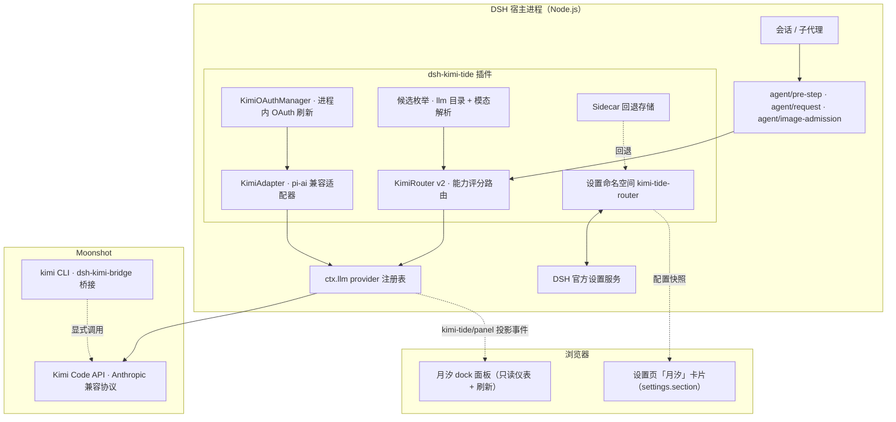
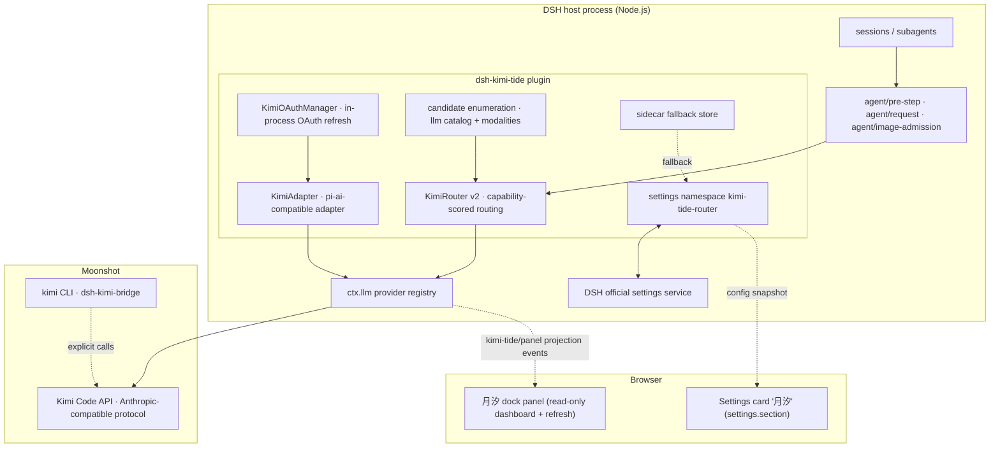

<details open>
<summary><b>🇨🇳 中文</b></summary>

<p align="center">
  <h1 align="center">🌊 kimi-tide（月汐）</h1>
  <p align="center"><em>月亮（Moonshot / Kimi）牵引深海（DeepSeek / DSH）的潮汐。</em></p>
  <p align="center">把 <b>Kimi Code（Moonshot）订阅</b> 接入 <b>DeepSeek Harness（DSH）</b> 的原生 LLM provider 方案，并自动按能力与预算在双模型间分工。</p>
  <p align="center">
    
    
    
    
    
  </p>
</p>

---

## 现状快照（2026-08-19）

> **读我前先看这里**：GitHub Release 上的 `v0.1.3` 仅包含「凭据门控 + OAuth 加固」（tarball 实检）——**路由器 / 月汐面板 / 能力评分 / 设置卡片全部在 v0.1.3 之后的 main 提交中，尚未发布**。本机安装 main 构建即可使用全部特性；下一目标版本为 **v0.4.0**（随 GitHub Actions 发布流水线落地）。

| 版本线 | 状态 | 证据锚点 |
|---|---|---|
| v0.1.3 | ✅ 已发布（仅凭据门控 + OAuth 加固） | tag `e2a2eb4`，[Release 页](https://github.com/tafcear/kimi-tide/releases/tag/v0.1.3) |
| 0.2.x 双模型路由器 | ✅ main 已落地 + 实机验证 | `71b1d18`（step 门控修复）、`16a75d0`（模态护栏）、M5 双探针 + 带图闭环 |
| 0.3.0 能力评分路由 | ✅ main 已实施 + 手工验收 7/7 | `86da918`（154/154 → 现 203/203） |
| 0.4.0 设置界面迁移 | ✅ main 已合并（203/203 全绿） | `bc31b69`；验收 ①-③ 通过 |
| 下一发布 | ⏳ v0.4.0（待 Release 流水线） | 见[路线图](#路线图) |

⚠️ **已知限制**：带图会话会锁存多模态模型（`fcbf421`）；若 k3 额度/Key 失效（AUTH 报错），会话无法切回文本模型继续（死锁）。正解 =「图像转述 / 子代理图片外包」（图片不进主历史，规划中）。详见[已知限制](#已知限制)。

---

## 特性一览

- **原生 DSH 插件**：`dsh-kimi-tide` 作为标准 `dsh-plugin` 注册 provider 路由（`kimi-tide`），无需外部脚本或计划任务。
- **OAuth 进程内刷新**：与 `kimi login` 共享登录态，默认每 10 分钟自动刷新 access token（凭据锁串行化，与旧方案可安全共存）。
- **双模型自动分工路由器**：`off` / `cost`（省着用）/ `capability`（谁厉害谁上）三种模式；0.3.0 起由**能力评分引擎**决策（6 维评分 + 预算窗口 + 显式 `@provider` 指令）。
- **能力缺口自动补偿**：图像护栏按真实模态元数据把带图步骤改道多模态模型；宿主准入探针（`agent/image-admission`）在入口层放行；带图会话锁存防止后续文本轮崩溃。
- **官方设置面板「月汐」卡片**（0.4.0）：路由配置在 DSH 设置页原生编辑，持久化到设置命名空间 `kimi-tide-router`（base/user 分层 + revision 冲突检测）。
- **月汐 dock 面板**（0.4.0 起为只读仪表）：周配额 / 5h 窗口用量 / 本地 token 统计 / 路由决策 chip，保留刷新按钮。
- **`/kimi-tide` 命令族**：`mode` / `set` / `export-config` / `import-config` / `refresh`，读写设置命名空间（无设置服务的宿主回退 sidecar）。
- **跨平台**：零 Windows 计划任务依赖，Linux / macOS / Windows 均可运行；配套能力验证脚本套件（`scripts/`）。

---

## 快速开始

### 1. 前置条件

- Node.js ≥ 22
- DSH `@deepseek-ai/dsh@0.1.0-rc.6` 及以上（插件 peerDependencies 为 `^0.1.0-rc.6`；**rc.6 起可用，已在 rc.7 实机验证**；0.4.0 设置卡片需要 rc.7+ 的 `dsh-settings`）
- 已安装 Kimi Code CLI 并完成登录（一次即可）：

  ```powershell
  # Windows PowerShell（macOS/Linux 见官方文档 https://moonshotai.github.io/kimi-code/）
  irm https://code.kimi.com/kimi-code/install.ps1 | iex
  kimi login   # 浏览器完成设备码授权
  ```

### 2. 安装插件

#### 方式 A：安装发布版（只有 v0.1.3 核心 provider，无路由器）

```bash
dsh plugin --profile web add ./dsh-kimi-tide-0.1.3.tgz
```

#### 方式 B：从源码构建（推荐，含全部 0.2.x / 0.3.0 / 0.4.0 特性）

```bash
cd packages/dsh-kimi-tide
npm install && npm run build && npm pack
dsh plugin --profile web add ./dsh-kimi-tide-0.1.3.tgz   # 文件名随构建产物
```

### 3. 重启并使用

重启 `dsh web`，模型选择器将出现 `kimi-tide` 组；「设置 → 月汐」卡片可配置路由。

> **发布规范（重要）**：DSH 插件必须声明 `dsh.bundle.patch`（指向 `cordis.patch.yml`）才能作为 profile 层加载；缺声明时 `dsh plugin add` 只会把它装成普通依赖，手动加进 bundles 会导致 web 启动崩溃。本插件已按官方规范声明，升级版本时请勿移除该字段。

---

## 可用模型

| 模型 ID | 说明 | 上下文 |
|---|---|---|
| `kimi-for-coding` | Kimi K2.7 Code（默认，多模态） | 256K |
| `kimi-for-coding-highspeed` | K2.7 Code 高速版（多模态） | 256K |
| `k3` | Kimi K3 旗舰（多模态，1M 长窗） | 1M |
| `k3-256k` | Kimi K3 256K 版（多模态） | 256K |

> 模态说明：以上 4 个模型在 pi-ai 目录中均声明 `input: ["text", "image"]`（多模态）；`k3` 额外提供 1M 超长上下文窗。DeepSeek 侧（`deepseek-v4-flash` / `deepseek-v4-pro`）为**文本-only**（适配器对 image 块抛 `UNSUPPORTED_CONTENT`），上下文窗同为 1M（pi-ai 目录实读，2026-08-18）——多模态是路由器的核心补偿缺口。

---

## 路由器：双模型自动分工

### 三种模式

| 模式 | 语义 | 决策方式 |
|---|---|---|
| `off` | 关闭（默认，行为与 0.1.x 一致） | 不挂载路由器 |
| `cost` | 省着用：默认便宜主力，必要时才升级 | 评分选择 + 预算窗口约束（Kimi 占比 ≤ `premiumBudget`） |
| `capability` | 谁厉害谁上：按任务类型选最优 | 评分选择 + 路由阈值（`routeThreshold`） |

### 能力评分引擎（0.3.0）

- **6 维评分**：`code` / `reasoning` / `writing` / `tooluse` / `vision` / `longctx`，用户可在设置卡片覆盖任意维度。
- **决策流**：`classify(messages)`（关键词 / 长度估算 → 权重）→ 显式 `@provider` 指令（最高优先）→ `selectCandidate` 按「加权能力分 − λ × 成本档」选最优；平局/不达标回退默认路由（keep）。
- **候选枚举**：从 `ctx.llm` 真实目录枚举白名单 provider 的模型，解析 `inputModalities` 驱动图像护栏与可用性（枚举失败降级不中断，配置目标不在目录中时面板标灰）。
- **评分基线 v2**（`src/scores.ts`，`SCORES_VERSION = 2`，证据分级标注）：

| 模型 | code | reasoning | 其余维度 |
|---|---|---|---|
| `kimi-tide/k3` | 4.7（一级：SWE-bench 93.4%） | 4.5（推断） | 中性 2.5；vision 0（由模态决定） |
| `kimi-tide/kimi-for-coding` | 4.5（推断） | 3.5（推断） | 同上 |
| `deepseek-v4-pro` | 4.0（一级：SWE-bench 80.6%） | 4.5（一级：GPQA 90.1%） | 同上 |
| `deepseek-v4-flash` | 3.0（推断） | 3.0（推断） | 同上 |

> 出处锚点见 `src/scores.ts` 注释与 [`docs/router-v3.md`](packages/dsh-kimi-tide/docs/router-v3.md)；「推断」格待 0.4.0 A 方案全维取证替换。

### 图像护栏与准入

- **per-step 护栏**（`applyImageGuard`）：带图步骤命中文本-only 路由时，按模态改道多模态候选（premium → 默认 → 任一多模态），不记预算窗口；方向于 `71b1d18` 修正（文本-only → 多模态，而非反向）。
- **宿主准入声明**（`agent/image-admission`，配合宿主补丁）：新会话默认模型为文本-only 时，入口层拦截在 agent 循环之前——路由器声明「会改道」以放行，带图轮才进得了循环。
- **会话锁存**（`fcbf421`）：图片一旦进入会话历史，该会话所有后续轮次强制按 vision 评分（多模态候选必胜出），防止文本模型序列化历史时抛 `UNSUPPORTED_CONTENT`。

### 已知限制

> 实机验证：带图轮 request/header = `kimi-tide/k3`（ctxWindow=1048576），无 UNSUPPORTED_CONTENT（2026-08-18/19 会话日志解码实锤）。

1. **带图会话锁存死锁**（2026-08-19 用户实测）：锁存后整会话走多模态模型；若 k3 额度/Key 失效（AUTH 报错），会话**无法切回文本模型继续**（`model-unavailable`：历史含图片）→ 整会话死锁，存量会话不可救（历史图片不可逆）。**根解 = 图片不进主历史**：「图像转述模式」（模型级 pre-step 转述）与「子代理图片外包」（子代理级读图回传文字，前置 kimi 子代理后端）——规划中。
2. **设置卡片评分滑杆步进 0.5 且无手动输入**（2026-08-19 实机发现）：无法设 4.6 这类细粒度值，待修（0.1 步进 + 数字输入框）。

---

## 配置

### 插件级配置（`cordis.patch.yml`）

| 键 | 默认 | 说明 |
|---|---|---|
| `providerName` | `kimi-tide` | 注册进 `ctx.llm` 的路由名 |
| `kimiHome` | `''` | Kimi home（空 = `KIMI_CODE_HOME`，再回退 `~/.kimi-code`） |
| `refreshIntervalMs` | `600000` | access token 刷新周期（毫秒） |
| `refreshOnStart` | `true` | 启动时立即刷新一次 |
| `usagePollMs` | `60000` | 月汐 dock 配额轮询周期（毫秒） |
| `usagePollOnStart` | `true` | 启动时立即轮询配额 |
| `patchFile` | `$DSH_HOME/profiles/web/cordis.patch.yml` | legacy 静态种子的部署基座（0.4.0 起仅作 base 层，不再回写） |
| `sidecarFile` | `<patch 目录>/kimi-tide-router.yml` | 无设置服务宿主的回退存储 + 一次性迁移来源 |

### 路由配置（0.4.0 起持久化在 设置 → 月汐，命名空间 `kimi-tide-router`）

| 键 | 默认 | 说明 |
|---|---|---|
| `mode` | `off` | `off` / `cost` / `capability` |
| `default` | `deepseek-official/deepseek-v4-flash` | 默认主力路由（便宜/快） |
| `candidates` | `[kimi-tide/kimi-for-coding]` | 候选路由表（评分 + 面板下拉） |
| `scores` | `{}` | 用户覆盖分（未覆盖用基线） |
| `classify.patterns` | `{}` | 关键词 → 维度权重（如 `审查` → reasoning） |
| `allowedProviders` | `[kimi-tide, deepseek-official]` | 候选枚举白名单 |
| `costTiers` | `{}` | 每候选成本档（`cheap`/`mid`/`expensive`；缺省 mid） |
| `routeThreshold` | `0.75` | capability 模式路由阈值 |
| `lambda` | `0.5` | 成本惩罚系数（分 − λ×成本档） |
| `premiumBudget` | `0.2` | cost 模式滑动窗口内 Kimi 占比上限 |
| `budgetWindow` | `20` | 预算滑动窗口大小（决策次数） |
| `charsPerToken` | `2` | token 估算字符折算（token ≈ chars / ratio） |

> **持久化路径**：设置命名空间 `kimi-tide-router`（base 层 = 部署基座，user 层 = 用户编辑，revision 冲突检测）→ 无设置服务的宿主回退 sidecar → 一次性迁移后旧 sidecar 留档为 `.legacy-imported`。

---

## 架构



> 三条接入路径：**`dsh-kimi-tide` 插件**（首选，原生 provider + 路由器）／ `dsh-llm-pi-ai` + `settings.yaml`（旧配置方案，依赖 Windows 计划任务，见 [`docs/legacy-setup.md`](docs/legacy-setup.md)）／ **`dsh-kimi-bridge`**（互补，把 `kimi` CLI 暴露为 DSH 工具，见 [`vendor/dsh-kimi-bridge/README.md`](vendor/dsh-kimi-bridge/README.md)）。

---

## 能力验证摘要

已通过 `scripts/kimi-capabilities.mjs` 与 `scripts/e2e-kimi.mjs` 验证：

| 能力 | 验证模型 | 状态 |
|---|---|---|
| 推理（thinking + 文本） | `kimi-for-coding` / `k3` | ✅ 正常 |
| 代码生成 | `kimi-for-coding` | ✅ 正常 |
| 工具调用 | `kimi-for-coding` / `k3` | ✅ 正常 |
| 工具调用闭环 | `kimi-for-coding` | ✅ 正常 |
| 多模态图片识别 | `kimi-for-coding`（脚本实测）/ `k3`（目录声明 `text+image`） | ✅ 正常 |
| 端到端流式调用 | `kimi-for-coding` | ✅ 正常 |

---

## 项目结构

```
kimi-tide/
├── packages/dsh-kimi-tide/    # 推荐：DSH 原生插件（宿主 half + 浏览器 half）
│   ├── src/index.ts           # 装配：provider + 路由器 + 面板 + 设置命名空间
│   ├── src/router.ts          # KimiRouter v2 引擎 + installRouter（pre-step/request/image-admission 接线）
│   ├── src/scoring.ts         # 评分选择（selectCandidate / scoreCandidate）
│   ├── src/scores.ts          # 评分基线 v2（SWE-bench / GPQA 一级证据 + 推断标注）
│   ├── src/classify.ts        # 消息分类 → 维度权重
│   ├── src/usage.ts           # 用量显示（官方 usages 轮询 + 本地 token 桶）
│   ├── src/settings.ts        # patch 文件读写（legacy 静态种子）
│   ├── src/settings-schema.ts # RouterConfigV2 的 wire schema（schemastery）
│   ├── src/settings-migration.ts # 一次性 sidecar → 设置命名空间迁移（.legacy-imported 留档）
│   ├── src/sidecar.ts         # sidecar 持久化（损坏回退链）
│   ├── src/client/            # TideDock（只读仪表）+ SettingsCard（官方设置卡片）
│   ├── src/commands.ts        # /kimi-tide 命令族
│   └── docs/router-v3.md      # 0.3.0 路由引擎架构文档
├── scripts/                   # 验证与辅助脚本（能力矩阵 / e2e / 冒烟 / 令牌维护）
├── vendor/dsh-kimi-bridge/    # CLI 工具桥接插件（维护 fork）
├── docs/                      # 详细文档与协作模板
│   ├── positioning.md         # 项目定位与维护策略
│   ├── development-plan-router.md  # 路由器开发计划（M1-M7 里程碑）
│   ├── agent-collaboration-loop.md # 双模型协作闭环方法论
│   ├── legacy-setup.md        # 旧配置方案安装步骤
│   ├── audit/  ·  superpowers/  ·  templates/
└── LICENSE
```

---

## 开发与测试

```bash
cd packages/dsh-kimi-tide
npm install
npm run typecheck   # tsc --noEmit
npm test            # vitest（当前 203/203 通过，23 个测试文件）
npm run build       # tsc 构建宿主 + esbuild 打包浏览器 half
```

质量基线：全量测试绿 + typecheck 0 错误 + build 通过方可提交；本仓库实践「实施 → 独立审查（Kimi 真身）→ 修复 → 复检验收」双模型协作闭环（见 [`docs/agent-collaboration-loop.md`](docs/agent-collaboration-loop.md)）。

---

## 文档索引

- [`docs/positioning.md`](docs/positioning.md)：项目定位、三层价值拆解与退役计划。
- [`docs/development-plan-router.md`](docs/development-plan-router.md)：路由器开发计划（M1-M7、能力缺口补偿、带图锁存 §2.3.1）。
- [`packages/dsh-kimi-tide/docs/router-v3.md`](packages/dsh-kimi-tide/docs/router-v3.md)：0.3.0 能力评分路由引擎架构。
- [`docs/superpowers/specs/2026-08-19-settings-migration-design.md`](docs/superpowers/specs/2026-08-19-settings-migration-design.md)：设置界面迁移设计稿（0.4.0）。
- [`docs/superpowers/plans/2026-08-17-capability-routing-implementation.md`](docs/superpowers/plans/2026-08-17-capability-routing-implementation.md)：0.3.0 实施计划（11 任务 TDD）。
- [`docs/superpowers/reviews/`](docs/superpowers/reviews/)：0.3.0 三轮审查闭环档案（R1 13 条 / R2 7 条 / R3 终审）。
- [`docs/legacy-setup.md`](docs/legacy-setup.md)：旧配置方案（`dsh-llm-pi-ai`）安装步骤。
- [`release-notes-v0.1.x.md`](release-notes-v0.1.1.md)：历史发布说明。

---

## 路线图

- **0.1.x（已发布）**：DSH 原生 Kimi provider，v0.1.3（凭据门控 + OAuth 加固）。
- **0.2.x（main 已落地，未发布）**：双模型路由器（`cost` / `capability`）+ 月汐 dock 面板 + 用量显示；失效修复闭环（`71b1d18` / `16a75d0` / `fcbf421`）与 M5 实机验证 ✅。
- **0.3.0（main 已实施，未发布）**：能力评分路由（11 任务 TDD，`86da918`），手工验收 7/7 ✅；已知限制：评分滑杆步进 0.5（待修）。
- **0.4.0（下一发布）**：设置界面迁移（`bc31b69`，设置卡片 + 命名空间持久化 + dock 只读化）随版本发布；配套 GitHub Actions Release 流水线；评分基线 A 方案全维取证；滑杆步进修。
- **规划中**：图像转述模式 / 子代理图片外包（图片不入主历史，根解带图锁存死锁）；kimi 子代理后端（subagents 命名注册表 + host plane 挂载）。

---

## 许可证与合规提示

- **kimi-tide 本体**：[MIT](LICENSE)（Copyright 2026 kimi-tide contributors）
- **第三方组件**：`@earendil-works/pi-ai`（MIT）、`@deepseek-ai/dsh-llm-pi-ai`（MIT, DeepSeek）、`js-yaml`（MIT）、`schemastery`（MIT）、`dsh-kimi-bridge`（MIT）

**Kimi Code 订阅合规提示**：

- ✅ **允许**：个人使用，在自有工具里调用 Kimi Code 能力。
- ⚠️ **风险提示**：Kimi Code 订阅"仅限个人交互式使用"。本方案以非官方客户端 + 自动刷新令牌调用，属于条款灰色地带。个人量级使用风险低，但请勿高频批量调用、多账号共享或将 token 分发他人。
- ✅ **完全合规的替代路径**：需要长期、稳定的 API 集成时，请使用 [Kimi 开放平台](https://platform.kimi.ai) 的 API key。

本仓库**不含任何凭据**；请勿将 `~/.dsh/.credentials.yaml`、`~/.kimi-code/credentials/` 中的内容提交到仓库。

---

## FAQ

**Q: 为什么 README 说 main 已含 0.2.x/0.3.0/0.4.0，但 Release 只有 v0.1.3？**  
A: v0.1.3 发布于路由器接线之前（tarball 实检仅含凭据门控 + OAuth 加固）；后续所有特性均为 v0.1.3 之后的 main 提交，尚未打 tag。需要完整特性请按「方式 B：从源码构建」安装。

**Q: 为什么需要把 OAuth access token 当作 apiKey 使用？**  
A: DSH 的适配器当前只支持 apiKey 鉴权，而 Kimi Code 订阅后端采用 OAuth。插件方案在**进程内**管理 OAuth 令牌并以 Bearer 形式注入请求；旧配置方案则通过定时脚本刷新 token 填充 `KIMI_API_KEY`。

**Q: 带图会话有什么限制？**  
A: 图片进入会话历史后，会话锁存多模态模型（文本模型无法序列化图片历史）。若多模态模型额度/Key 失效，会话无法切换 → 死锁，只能新开会话。正解（图像转述 / 子代理图片外包）规划中；在落地前，重要带图任务建议保持 k3 额度健康。

**Q: 能力评分从哪里来？**  
A: `src/scores.ts` 基线 v2：`code` / `reasoning` 两维有 SWE-bench / GPQA 一级证据或强相对推断，其余维度中性 2.5（vision 由模态决定）。每个分数标注证据分级（一级 / 推断 / 待核实）；0.4.0 计划做全维取证（A 方案）替换全部推断格。你可以在设置卡片覆盖任意分数。

**Q: 路由配置存在哪里？**  
A: 0.4.0 起存在 DSH 设置命名空间 `kimi-tide-router`（设置 → 月汐 卡片编辑）；无设置服务的宿主回退 sidecar 文件；旧 sidecar 迁移后留档 `.legacy-imported`。patch.yml 中的 `router` 静态块仅作部署基座（base 层）。

**Q: 插件（进程内刷新）和旧方案的计划任务能同时开吗？**  
A: 可以安全共存——两者共用凭据锁（`<kimi-home>/credentials/kimi-code.json.lock`），刷新被串行化，refresh token 轮换不会互踩。但仍建议只保留一条路径：首选插件（零计划任务）。

**Q: refresh token 过期怎么办？**  
A: Kimi Code 的 refresh token 约 30 天过期。到期前插件会告警；到期后只需重新执行 `kimi login` 获取新的 refresh token。

</details>

<details>
<summary><b>🇬🇧 English</b></summary>

<p align="center">
  <h1 align="center">🌊 kimi-tide（月汐）</h1>
  <p align="center"><em>The moon (Moonshot / Kimi) drives the tide of the deep sea (DeepSeek / DSH).</em></p>
  <p align="center">Integrate your <b>Kimi Code (Moonshot) subscription</b> into <b>DeepSeek Harness (DSH)</b> as a native LLM provider, with automatic capability- and budget-aware routing between the two model families.</p>
  <p align="center">
    
    
    
    
    
  </p>
</p>

---

## Current Status (2026-08-19)

> **Read this first**: the `v0.1.3` GitHub Release contains only "credential gating + OAuth hardening" (verified from the tarball) — **the router / 月汐 dock panel / capability scoring / settings card all live in main-branch commits after v0.1.3 and are NOT yet released**. Install a main build for the full feature set; the next release target is **v0.4.0** (landing together with the GitHub Actions release pipeline).

| Line | Status | Evidence |
|---|---|---|
| v0.1.3 | ✅ Released (credential gating + OAuth hardening only) | tag `e2a2eb4`, [Release page](https://github.com/tafcear/kimi-tide/releases/tag/v0.1.3) |
| 0.2.x dual-model router | ✅ Landed on main + verified on a real harness | `71b1d18` (step-gate fix), `16a75d0` (modality guard), M5 dual-probe + image roundtrip |
| 0.3.0 capability-scored routing | ✅ Implemented on main + manual acceptance 7/7 | `86da918` (154/154 → now 203/203) |
| 0.4.0 settings migration | ✅ Merged on main (203/203 green) | `bc31b69`; acceptance items ①-③ passed |
| Next release | ⏳ v0.4.0 (pending release pipeline) | see [Roadmap](#roadmap) |

⚠️ **Known limitation**: image-bearing sessions latch onto the multimodal model (`fcbf421`); if the k3 quota/key fails (AUTH error), the session cannot switch back to a text model (deadlock). The root fix — "image transcription / subagent image outsourcing" (images never enter the main history) — is planned. See [Known Limitations](#known-limitations).

---

## Features

- **Native DSH plugin**: `dsh-kimi-tide` registers a provider route (`kimi-tide`) as a standard `dsh-plugin` — no external scripts or scheduled tasks.
- **In-process OAuth refresh**: shares the login state with `kimi login`, refreshing the access token every 10 minutes by default (serialized via a shared credential lock, safe to coexist with the legacy path).
- **Automatic dual-model router**: `off` / `cost` (save money) / `capability` (best model for the job); since 0.3.0 decisions come from a **capability scoring engine** (6-dimension scores + budget window + explicit `@provider` directives).
- **Capability-gap compensation**: the image guard reroutes image steps to multimodal candidates based on real modality metadata; a host admission probe (`agent/image-admission`) lets them through at the entry gate; session image latching keeps later text turns from crashing.
- **Official settings card "月汐"** (0.4.0): edit the router configuration on the DSH settings page, persisted in the `kimi-tide-router` settings namespace (base/user layers + revision conflict detection).
- **月汐 dock panel** (read-only dashboard since 0.4.0): weekly quota / 5h-window usage / local token stats / route-decision chip, with a refresh button.
- **`/kimi-tide` command family**: `mode` / `set` / `export-config` / `import-config` / `refresh`, reading and writing the settings namespace (sidecar fallback on hosts without a settings service).
- **Cross-platform**: no Windows scheduled-task dependency — runs on Linux / macOS / Windows; ships a capability-verification script suite (`scripts/`).

---

## Quick Start

### 1. Prerequisites

- Node.js ≥ 22
- DSH `@deepseek-ai/dsh@0.1.0-rc.6` or newer (plugin peerDependencies `^0.1.0-rc.6`; verified on rc.7; the 0.4.0 settings card needs rc.7+ `dsh-settings`)
- Kimi Code CLI installed and logged in once:

  ```powershell
  # Windows PowerShell (macOS/Linux: https://moonshotai.github.io/kimi-code/)
  irm https://code.kimi.com/kimi-code/install.ps1 | iex
  kimi login   # complete the device-code authorization in the browser
  ```

### 2. Install

#### Option A: released tarball (v0.1.3 core provider only — no router)

```bash
dsh plugin --profile web add ./dsh-kimi-tide-0.1.3.tgz
```

#### Option B: build from source (recommended — all 0.2.x / 0.3.0 / 0.4.0 features)

```bash
cd packages/dsh-kimi-tide
npm install && npm run build && npm pack
dsh plugin --profile web add ./dsh-kimi-tide-0.1.3.tgz   # name follows the packed artifact
```

### 3. Restart and use

Restart `dsh web`; the `kimi-tide` group appears in the model selector, and "Settings → 月汐" configures the router.

> **Release rule (important)**: a DSH plugin must declare `dsh.bundle.patch` (pointing at `cordis.patch.yml`) to load as a profile layer; without it `dsh plugin add` installs it as an ordinary dependency, and adding it to bundles manually crashes the web app at startup. This plugin follows the official spec — do not remove the field when bumping versions.

---

## Available Models

| Model ID | Description | Context |
|---|---|---|
| `kimi-for-coding` | Kimi K2.7 Code (default, multimodal) | 256K |
| `kimi-for-coding-highspeed` | K2.7 Code high-speed (multimodal) | 256K |
| `k3` | Kimi K3 flagship (multimodal, 1M window) | 1M |
| `k3-256k` | Kimi K3 256K (multimodal) | 256K |

> Modalities: all 4 models declare `input: ["text", "image"]` in the pi-ai catalog (multimodal); `k3` adds a 1M context window. The DeepSeek side (`deepseek-v4-flash` / `deepseek-v4-pro`) is **text-only** (the adapter throws `UNSUPPORTED_CONTENT` on image blocks), with the same 1M context window (pi-ai catalog, verified 2026-08-18) — multimodality is the router's core capability gap to compensate.

---

## Router: Automatic Dual-Model Division of Labor

### Modes

| Mode | Semantics | Decision method |
|---|---|---|
| `off` | Disabled (default; behavior identical to 0.1.x) | Router not mounted |
| `cost` | Save money: cheap default, upgrade only when needed | Score-based pick + budget window (Kimi share ≤ `premiumBudget`) |
| `capability` | Best model for the job | Score-based pick + route threshold (`routeThreshold`) |

### Capability Scoring Engine (0.3.0)

- **6 dimensions**: `code` / `reasoning` / `writing` / `tooluse` / `vision` / `longctx`; any dimension can be overridden in the settings card.
- **Decision flow**: `classify(messages)` (keywords / length estimate → weights) → explicit `@provider` directive (highest priority) → `selectCandidate` picks the best by "weighted capability score − λ × cost tier"; ties/shortfalls fall back to the default route (keep).
- **Candidate enumeration**: models are enumerated from the real `ctx.llm` catalog for whitelisted providers, resolving `inputModalities` to drive the image guard and availability (enumeration failures degrade without aborting; configured targets missing from the catalog render greyed out in the panel).
- **Baseline scores v2** (`src/scores.ts`, `SCORES_VERSION = 2`, evidence-graded):

| Model | code | reasoning | other dims |
|---|---|---|---|
| `kimi-tide/k3` | 4.7 (primary: SWE-bench 93.4%) | 4.5 (inferred) | neutral 2.5; vision 0 (modality-driven) |
| `kimi-tide/kimi-for-coding` | 4.5 (inferred) | 3.5 (inferred) | same |
| `deepseek-v4-pro` | 4.0 (primary: SWE-bench 80.6%) | 4.5 (primary: GPQA 90.1%) | same |
| `deepseek-v4-flash` | 3.0 (inferred) | 3.0 (inferred) | same |

> Provenance anchors live in `src/scores.ts` comments and [`docs/router-v3.md`](packages/dsh-kimi-tide/docs/router-v3.md); "inferred" cells are planned to be replaced by fully-sourced values (plan A) in 0.4.0.

### Image Guard and Admission

- **Per-step guard** (`applyImageGuard`): when an image step hits a text-only route, it is rerouted to a multimodal candidate by modality (premium → default → any multimodal), not counted in the budget window; direction fixed in `71b1d18`.
- **Host admission claim** (`agent/image-admission`, with a host hotfix): on a fresh session whose default model is text-only, the host rejects images before the agent loop runs — the router claims "will reroute" to let the image step in.
- **Session latching** (`fcbf421`): once an image enters the session history, all later turns are scored with vision forced on (a multimodal candidate must win), preventing text-only serialization from throwing `UNSUPPORTED_CONTENT`.

### Known Limitations

> Verified live: image turns show `request/header = kimi-tide/k3` (ctxWindow=1048576) with no `UNSUPPORTED_CONTENT` (session-log decode, 2026-08-18/19).

1. **Image-latch deadlock** (user-verified 2026-08-19): after latching, the whole session runs on the multimodal model; if the k3 quota/key fails (AUTH error), the session **cannot switch back to a text model** (`model-unavailable`: history contains images) → the session is deadlocked and cannot be recovered (image history is irreversible). **Root fix = images never enter the main history**: "image transcription mode" (model-level pre-step transcription) and "subagent image outsourcing" (a subagent reads images and returns text; depends on the kimi subagent backend) — both planned.
2. **Settings-card score slider steps by 0.5 with no manual input** (found 2026-08-19): fine-grained values like 4.6 cannot be set; fix pending (0.1 steps + numeric input).

---

## Configuration

### Plugin-level (`cordis.patch.yml`)

| Key | Default | Description |
|---|---|---|
| `providerName` | `kimi-tide` | LLM provider route registered into `ctx.llm` |
| `kimiHome` | `''` | Kimi home (empty = `KIMI_CODE_HOME`, else `~/.kimi-code`) |
| `refreshIntervalMs` | `600000` | access-token refresh period (ms) |
| `refreshOnStart` | `true` | refresh once at startup |
| `usagePollMs` | `60000` | dock quota poll period (ms) |
| `usagePollOnStart` | `true` | poll quota at startup |
| `patchFile` | `$DSH_HOME/profiles/web/cordis.patch.yml` | legacy static seed, deployment base only since 0.4.0 (no longer written back) |
| `sidecarFile` | `<patch dir>/kimi-tide-router.yml` | fallback store on hosts without a settings service + one-shot migration source |

### Router config (persisted in Settings → 月汐, namespace `kimi-tide-router` since 0.4.0)

| Key | Default | Description |
|---|---|---|
| `mode` | `off` | `off` / `cost` / `capability` |
| `default` | `deepseek-official/deepseek-v4-flash` | default route (cheap/fast) |
| `candidates` | `[kimi-tide/kimi-for-coding]` | candidate routes (scoring + panel dropdown) |
| `scores` | `{}` | user overrides (baseline used where absent) |
| `classify.patterns` | `{}` | keyword → dimension weights (e.g. `审查` → reasoning) |
| `allowedProviders` | `[kimi-tide, deepseek-official]` | candidate-enumeration whitelist |
| `costTiers` | `{}` | per-candidate cost tier (`cheap`/`mid`/`expensive`; default mid) |
| `routeThreshold` | `0.75` | capability-mode route threshold |
| `lambda` | `0.5` | cost penalty coefficient (score − λ×tier) |
| `premiumBudget` | `0.2` | max Kimi share in the sliding budget window (cost mode) |
| `budgetWindow` | `20` | budget window size (decisions) |
| `charsPerToken` | `2` | token-estimation ratio (token ≈ chars / ratio) |

> **Persistence chain**: settings namespace `kimi-tide-router` (base layer = deployment seed, user layer = edits, revision conflict detection) → sidecar fallback on hosts without a settings service → after the one-shot migration the old sidecar is archived as `.legacy-imported`.

---

## Architecture



> Three integration paths: **`dsh-kimi-tide` plugin** (recommended: native provider + router) / `dsh-llm-pi-ai` + `settings.yaml` (legacy config path, Windows scheduled task, see [`docs/legacy-setup.md`](docs/legacy-setup.md)) / **`dsh-kimi-bridge`** (complementary: exposes the `kimi` CLI as DSH tools, see [`vendor/dsh-kimi-bridge/README.md`](vendor/dsh-kimi-bridge/README.md)).

---

## Verified Capabilities

Verified with `scripts/kimi-capabilities.mjs` and `scripts/e2e-kimi.mjs`:

| Capability | Verified models | Status |
|---|---|---|
| Reasoning (thinking + text) | `kimi-for-coding` / `k3` | ✅ OK |
| Code generation | `kimi-for-coding` | ✅ OK |
| Tool calling | `kimi-for-coding` / `k3` | ✅ OK |
| Tool-call loop | `kimi-for-coding` | ✅ OK |
| Multimodal image recognition | `kimi-for-coding` (script-tested) / `k3` (catalog: `text+image`) | ✅ OK |
| End-to-end streaming | `kimi-for-coding` | ✅ OK |

---

## Project Structure

```
kimi-tide/
├── packages/dsh-kimi-tide/    # recommended: native DSH plugin (host + browser halves)
│   ├── src/index.ts           # assembly: provider + router + panels + settings namespace
│   ├── src/router.ts          # KimiRouter v2 engine + installRouter (pre-step/request/image-admission)
│   ├── src/scoring.ts         # score-based selection (selectCandidate / scoreCandidate)
│   ├── src/scores.ts          # baseline scores v2 (SWE-bench / GPQA primary evidence + inferred tags)
│   ├── src/classify.ts        # message classification → dimension weights
│   ├── src/usage.ts           # usage display (official usages polling + local token bucket)
│   ├── src/settings.ts        # patch-file read/write (legacy static seed)
│   ├── src/settings-schema.ts # RouterConfigV2 wire schema (schemastery)
│   ├── src/settings-migration.ts # one-shot sidecar → namespace migration (.legacy-imported)
│   ├── src/sidecar.ts         # sidecar persistence (corruption fallback chain)
│   ├── src/client/            # TideDock (read-only dashboard) + SettingsCard (official settings)
│   ├── src/commands.ts        # /kimi-tide command family
│   └── docs/router-v3.md      # 0.3.0 routing-engine architecture doc
├── scripts/                   # verification & helper scripts (capabilities / e2e / smoke / token maintenance)
├── vendor/dsh-kimi-bridge/    # CLI bridge plugin (maintained fork)
├── docs/                      # detailed docs & collaboration templates
│   ├── positioning.md         # project positioning & maintenance strategy
│   ├── development-plan-router.md  # router development plan (milestones M1-M7)
│   ├── agent-collaboration-loop.md # dual-model collaboration-loop methodology
│   ├── legacy-setup.md        # legacy config-path installation
│   ├── audit/  ·  superpowers/  ·  templates/
└── LICENSE
```

---

## Development & Testing

```bash
cd packages/dsh-kimi-tide
npm install
npm run typecheck   # tsc --noEmit
npm test            # vitest (currently 203/203 passing across 23 test files)
npm run build       # tsc host build + esbuild browser bundle
```

Quality bar: full test suite green + zero typecheck errors + successful build before committing. This repository practices an "implement → independent review (real Kimi) → fix → re-check acceptance" dual-model loop (see [`docs/agent-collaboration-loop.md`](docs/agent-collaboration-loop.md)).

---

## Documentation Index

- [`docs/positioning.md`](docs/positioning.md): project positioning, three-layer value breakdown, retirement plan.
- [`docs/development-plan-router.md`](docs/development-plan-router.md): router development plan (M1-M7, capability-gap compensation, image-latch §2.3.1).
- [`packages/dsh-kimi-tide/docs/router-v3.md`](packages/dsh-kimi-tide/docs/router-v3.md): 0.3.0 capability-scored routing engine architecture.
- [`docs/superpowers/specs/2026-08-19-settings-migration-design.md`](docs/superpowers/specs/2026-08-19-settings-migration-design.md): settings-migration design (0.4.0).
- [`docs/superpowers/plans/2026-08-17-capability-routing-implementation.md`](docs/superpowers/plans/2026-08-17-capability-routing-implementation.md): 0.3.0 implementation plan (11 TDD tasks).
- [`docs/superpowers/reviews/`](docs/superpowers/reviews/): 0.3.0 three-round review archive (R1 13 / R2 7 / R3 final).
- [`docs/legacy-setup.md`](docs/legacy-setup.md): legacy config path (`dsh-llm-pi-ai`) installation.
- [`release-notes-v0.1.x.md`](release-notes-v0.1.1.md): historical release notes.

---

## Roadmap

- **0.1.x (released)**: native DSH Kimi provider, v0.1.3 (credential gating + OAuth hardening).
- **0.2.x (landed on main, unreleased)**: dual-model router (`cost` / `capability`) + 月汐 dock panel + usage display; failure-fix loop closed (`71b1d18` / `16a75d0` / `fcbf421`) and M5 live verification ✅.
- **0.3.0 (implemented on main, unreleased)**: capability-scored routing (11 TDD tasks, `86da918`), manual acceptance 7/7 ✅; known limitation: score-slider step 0.5 (fix pending).
- **0.4.0 (next release)**: settings migration (`bc31b69` — settings card + namespace persistence + read-only dock) ships with this release; GitHub Actions release pipeline; plan-A full scoring provenance; slider step fix.
- **Planned**: image transcription mode / subagent image outsourcing (images never enter the main history — root fix for the image-latch deadlock); kimi subagent backend (subagents named registry + host-plane mount).

---

## License & Compliance

- **kimi-tide itself**: [MIT](LICENSE) (Copyright 2026 kimi-tide contributors)
- **Third-party components**: `@earendil-works/pi-ai` (MIT), `@deepseek-ai/dsh-llm-pi-ai` (MIT, DeepSeek), `js-yaml` (MIT), `schemastery` (MIT), `dsh-kimi-bridge` (MIT)

**Kimi Code subscription compliance notes**:

- ✅ **Allowed**: personal use, calling Kimi Code capabilities from your own tools.
- ⚠️ **Risk note**: the Kimi Code subscription is "for personal interactive use only". This project calls it from a non-official client with auto-refreshed tokens — a gray area of the terms. Personal-scale usage is low risk, but avoid high-frequency batch calls, multi-account sharing, or distributing tokens to others.
- ✅ **Fully compliant alternative**: for long-term, stable API integration, use a [Kimi Open Platform](https://platform.kimi.ai) API key.

This repository contains **no credentials**; never commit contents of `~/.dsh/.credentials.yaml` or `~/.kimi-code/credentials/`.

---

## FAQ

**Q: Why does the README say main contains 0.2.x/0.3.0/0.4.0 while the Release only has v0.1.3?**  
A: v0.1.3 was released before the router wiring (tarball inspection shows only credential gating + OAuth hardening); every later feature is a post-v0.1.3 main commit, not yet tagged. Use "Option B: build from source" for the full feature set.

**Q: Why use the OAuth access token as an apiKey?**  
A: DSH adapters currently only support apiKey auth, while the Kimi Code subscription backend uses OAuth. The plugin manages the OAuth token **in-process** and injects it as a Bearer; the legacy path refreshes a token via a scheduled script into `KIMI_API_KEY`.

**Q: What are the image-session limitations?**  
A: Once an image enters the session history, the session latches onto the multimodal model (text models cannot serialize image history). If the multimodal quota/key fails, the session cannot switch → deadlock; open a new session. The root fix (image transcription / subagent image outsourcing) is planned; until then keep the k3 quota healthy for important image tasks.

**Q: Where do the capability scores come from?**  
A: `src/scores.ts` baseline v2: `code` / `reasoning` carry SWE-bench / GPQA primary evidence or strong relative inference; the other dims are neutral 2.5 (vision is modality-driven). Every cell is tagged with an evidence grade (primary / inferred / pending); plan A (full provenance) is scheduled for 0.4.0. Any score can be overridden in the settings card.

**Q: Where is the router configuration stored?**  
A: Since 0.4.0, in the DSH settings namespace `kimi-tide-router` (edited via Settings → 月汐); hosts without a settings service fall back to the sidecar file; the old sidecar is archived as `.legacy-imported` after the one-shot migration. The `router` block in `cordis.patch.yml` is only the deployment base layer.

**Q: Can the plugin and the legacy scheduled-task path run together?**  
A: Yes, safely — both share the credential lock (`<kimi-home>/credentials/kimi-code.json.lock`), so refreshes are serialized and refresh-token rotation never collides. Still, keep only one path: prefer the plugin (zero scheduled tasks).

**Q: What if the refresh token expires?**  
A: Kimi Code refresh tokens expire after ~30 days. The plugin warns before expiry; afterwards simply run `kimi login` again to obtain a new refresh token.

</details>
