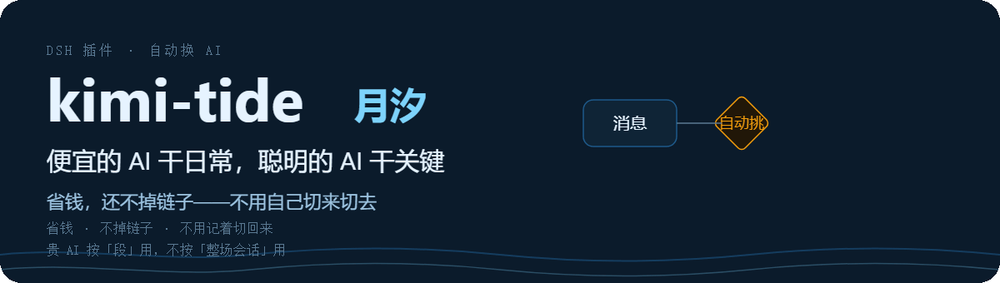
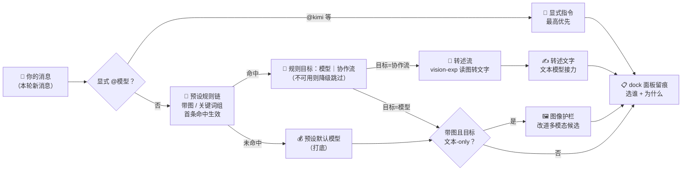

<p align="center">
  <a href="README.en.md">English</a> ｜ 简体中文
</p>

<p align="center">
  
</p>
<p align="center">
  <a href="https://github.com/tafcear/kimi-tide/releases"></a>
  <a href="https://github.com/tafcear/kimi-tide/actions/workflows/ci.yml"></a>
  <a href="https://github.com/tafcear/kimi-tide/blob/main/LICENSE"></a>
</p>

**月汐（kimi-tide）是 DSH 的「每一步自动选模型」插件。**

DSH（DeepSeek Harness）是 DeepSeek 官方开源的 AI 编程智能体框架——在网页里跟 AI 助手对话干活，模型、工具、界面都以插件形式装卸（官方口号：Everything is a Plugin）。你可以在 DSH 里接入多个模型：有的看得懂截图，有的写代码特别强，有的便宜又快。但 DSH 默认**一个会话从头到尾只用一个模型**——想换模型得手动切，切完还得记着切回来。

装上月汐后：**贴截图自动切到能看图的模型，写代码自动切到编码模型，闲聊翻译自动走便宜的模型**——每次选了谁、为什么，输入框下方的「🌙 月汐」面板写得清清楚楚；规则是你自己定的，随时改。Kimi 和 DeepSeek 只是开箱示例，**任何接入的模型都能按你的规则路由**。

**适合谁**：在用 DSH、且接了不止一个模型的人。
**不适合**：只用一个模型，或还没跑起 DSH 的人（先把 DSH 用起来，再回来装这个）。

---

## 它解决什么问题

**场景一：贴了张截图，模型说看不了**

- 以前：手动切到能看图的模型 → 贴图 → 问完 → 记得切回来。
- 装后：直接贴。带图的消息自动交给能看图的模型，下一条纯文字消息自动回到默认模型。

**场景二：切完模型，忘了切回来**

- 以前：为一张图切到贵的模型，之后整场会话都在烧贵的额度。
- 装后：月汐按「每一步」决策，一会话不绑死——图处理完，下一条消息就回到你的默认模型。

**场景三：额度总比预期烧得快**

- 以前：所有消息——包括「你好」和「帮我看下这句翻译」——都走最贵的模型。
- 装后：选「省钱」预设，闲聊、翻译、日常杂活自动走便宜模型，代码和图才动用贵的模型；面板实时显示剩余额度。

---

## 30 秒看懂路由逻辑

一条消息进来，月汐按这个顺序决定用哪个模型：

1. **显式点名**：消息里写了 `@kimi` 这类指令 → 直接用它（最高优先）。
2. **规则命中**：按预设里的规则逐条检查——带图？命中哪组关键词？→ 首条命中的规则说了算。
3. **默认打底**：都没命中 → 用预设的默认模型。
4. **带图保险**：就算选了纯文本模型，消息带图也会被强制改道给能看图的模型——不会崩。



> 图中「协作流」= 一条「先 A 后 B」的自动流程（比如：图先转成文字，再交给便宜模型作答）；「多模态」= 能看懂图片的模型。

## 它长什么样

[](docs/assets/readme/kimi-tide-architecture.html)

*点图看大图。`docs/assets/readme/kimi-tide-architecture.html` 下载后用浏览器打开，是可平移缩放/搜索的交互式架构图（明暗双主题，节点可溯源到源码）。*

---

## 快速开始

### 1. 前置条件

- Node.js ≥ 22
- DSH `@deepseek-ai/dsh@0.1.1-rc.2` 及以上
- 你想互相调度的模型已接入 DSH——**不限哪一家**。想用 Kimi，就准备一把 **Kimi Code Console API Key**（在 Kimi 控制台生成的密钥；配额面板也用这把 key）

### 2. 接入候选模型（DSH「设置 → Models」页）

「设置 → Models」里添加模型来源（示例：**`kimi-coding`**，`apiKeyEnv` 填 `KIMI_API_KEY`，然后在凭据区粘贴你的 Key——k3 等 4 个 Kimi 模型会自动出现在目录里）。**接几家都行**：月汐的候选池就是这页的全部模型。密钥由 DSH 托管保存，**不会写进任何插件配置文件**。

### 3. 安装插件

```bash
cd packages/dsh-kimi-tide
npm install && npm run build && npm pack
dsh plugin --profile web add ./dsh-kimi-tide-<version>.tgz
```

### 4. 用起来

重启 `dsh web`：

- **设置 → 月汐**：预设行选「省钱」或「能力」，路由器即刻上岗；
- 消息里 **`@kimi`** 可以显式点名，或者靠内置关键词组自动改道（比如消息里出现「代码」就走编码模型）；
- 输入框下方的「🌙 月汐」面板实时显示每一步选了谁、为什么；
- ✅ **30 秒验收**：发一句「帮我写个函数」——面板应显示命中 code 规则并改道到编码模型。看不到理由条 = 路由器没上岗，回「设置 → 月汐」确认已选预设。

---

## 预设与规则

预设 = 一套「默认模型 + 规则」方案，一键全局切换；月汐自带两套：

| 预设 | 默认模型（没规则命中时用它） | 规则 | 适合谁 |
|---|---|---|---|
| 关闭 | — | — | 想完全手动选模型的人 |
| 省钱 | `deepseek-v4-flash` | 带图 → `k3`；代码关键词 → `kimi-for-coding`；翻译关键词 → `deepseek-v4-flash` | 额度敏感、日常杂活多 |
| 能力 | `k3` | 带图 → `k3`；审查 → `k3`；代码 → `kimi-for-coding`；数学 → `deepseek-v4-pro`；长文 → `k3`；写作 → `deepseek-v4-pro`；翻译 → `deepseek-v4-flash`；闲聊 → `deepseek-v4-flash` | 追求最佳产出质量 |

内置 7 组关键词（词表可改，也可自建新组）：

| 组 | 方向 | 内置词表（可改） |
|---|---|---|
| `code` | 编码 | 代码, code, bug, 重构, refactor, 实现, 函数, 测试, 接口, 联调, 部署, 性能, 报错, 日志, 编译, 命令, 脚本 |
| `review` | 审查 | 审查, review, 评审, 挑毛病, 复检, 检查, audit, 意见, 打分 |
| `writing` | 写作 | 写作, 文案, 润色, 改写, 扩写, 标题, 推文, 周报, 演讲稿, 总结 |
| `translate` | 翻译 | 翻译, 译成, 中译英, 英译中, translate, 本地化 |
| `longdoc` | 长文 | 长文档, 通读, 逐段, 全文, 上万字, 大文档 |
| `math` | 数学 | 数学, 证明, 推导, 求解, 公式, 数论, 概率, 逻辑题 |
| `chitchat` | 寒暄 | 你好, 谢谢, 怎么样, 随便, 聊聊, 天气 |

两个常用微调（都在「设置 → 月汐」里点几下就能配）：

- **最少命中词数**：给规则配一个下限（比如 2），一句话里至少命中这个词组的 2 个词才触发——避免「做个方案」这种顺带提到关键词的普通句子误触发。
- **推理力度（effort）**：给规则目标或默认模型指定「思考深度」档位（想得越深越慢越贵）；模型不支持你配的档位时自动忽略，不会报错。

匹配细节（词边界、特异度排序、降级语义）、带图行为、配置全字段：见[路由器架构详解](packages/dsh-kimi-tide/docs/router.md)。候选池 = Models 页全量目录，任何模型都能当默认或规则目标。

---

## 常见问题

**Q：以前的 OAuth 接入方式去哪了？**
A：退役了。DSH 官方生态已原生支持 Kimi 接入，自研的那层属于重复造轮，已整体删除。现在一把 Console API Key + 官方 Models 页配置即可。历史存档见 [`docs/legacy-setup.md`](docs/legacy-setup.md)。

**Q：还需要装 Kimi CLI 并 `kimi login` 吗？**
A：不需要。一把 Console API Key + 官方 Models 页配置即可。

**Q：带图会话有什么限制？**
A：默认「锁存」姿态下，会话一旦带过图就锁定在能看图的模型上——如果它的额度/Key 失效，这个会话切不回文本模型，只能新开。想避免：把预设的带图兜底改成「懒转述」（图片先转成文字，文本模型接力）或「盲答」（当没图处理）。转述结果有缓存，失败不会反复重试。重要的带图任务，保持模型额度健康即可。

**Q：之前听说有个「能力评分引擎」？**
A：退役了。以前靠机器打分选模型，黑箱难懂；现在改成你写得出的规则——命中即路由，未命中走默认，每个决策你都能读懂、改得动。旧评分配置升级时自动转成预设。

**Q：路由配置存在哪里？升级会丢吗？**
A：存在 DSH 设置里（「设置 → 月汐」编辑，重启保持）。跨版本升级自动迁移，旧配置自动留档；细节见[路由器架构详解](packages/dsh-kimi-tide/docs/router.md)的「迁移链」节。

---

## 版本与路线

> 当前版本：**v1.0.0（2026-08-29）**

- 每个版本你得到了什么：[CHANGELOG.md](CHANGELOG.md)
- 维护者证据链（commit 锚点 / 验收记录）：[docs/release-evidence.md](docs/release-evidence.md)
- 规划中：评审流自动触发、子代理转述、0.8.5「强化与包装」小版本——详见[证据链文档](docs/release-evidence.md)「规划中」条。

---

## 文档索引

> 这个项目的三条原则：**官方优先 · 规则透明 · 决策可观测**——路由依据是你写得出的规则，每次自动选路都有理由、有留痕。

**我想用**

- 快速开始（本页）
- 常见问题（本页）
- [更新日志](CHANGELOG.md)

**我想深挖**

- [路由器架构详解](packages/dsh-kimi-tide/docs/router.md)：预设/规则/降级/迁移链/配置全字段
- [交互式架构图](docs/assets/readme/kimi-tide-architecture.html)（下载后浏览器打开；静态版见上文「它长什么样」）
- [DSH 宿主平台契约调研](docs/host-platform-map.md)
- [项目定位与维护策略](docs/positioning.md)
- [双模型协作闭环方法论](docs/agent-collaboration-loop.md)（本项目自己的开发方式；独立研究见 [kimi-tide-research](https://github.com/tafcear/kimi-tide-research)）

**我想参与**

- 来 [Discussions](https://github.com/tafcear/kimi-tide/discussions) 聊使用体验
- 报告问题、提交修复（欢迎任何形式的贡献，见下方贡献者）

---

## 开发与测试

```bash
cd packages/dsh-kimi-tide
npm install
npm run typecheck   # tsc --noEmit
npm test            # vitest
npm run build       # tsc 宿主 + esbuild 浏览器
```

质量基线：全量测试绿 + typecheck 0 错误 + build 通过方可提交。本仓库实践「实施 → 独立审查 → 修复 → 复检验收」双模型协作闭环（见 [`docs/agent-collaboration-loop.md`](docs/agent-collaboration-loop.md)）。

**发布门禁**：任何版本发版（打 tag / 触发 Actions Release）前，必须在真实宿主上跑通该版本的实机验收清单并全绿，且由维护者裁定 tag——「单元测试绿」不等于「宿主里能跑」。各版本验收记录见 [docs/release-evidence.md](docs/release-evidence.md)。

> **发布规范（维护者）**：DSH 插件必须声明 `dsh.bundle.patch`（指向 `cordis.patch.yml`）才能作为 profile 层加载。本插件已按官方规范声明，升级版本时请勿移除该字段。

---

## 贡献者

- 感谢 [@dracpet](https://github.com/dracpet) 的实机诊断与社区贡献：[PR #1](https://github.com/tafcear/kimi-tide/pull/1)（OAuth 过期刷新）、[PR #2](https://github.com/tafcear/kimi-tide/pull/2)（`commands/execute` 跨宿主契约容错）、[PR #3](https://github.com/tafcear/kimi-tide/pull/3)（YAML null 配置归一化）与 [Issue #4](https://github.com/tafcear/kimi-tide/issues/4)（rc.2 投影 wire 契约诊断）——你的反馈直接加固了 0.5.x–0.6.0 的发布质量。
- 感谢 [@pandashere](https://github.com/pandashere) 的 [dsh-kimi-bridge](https://github.com/pandashere/dsh-kimi-bridge)（MIT）：项目初期的 Kimi CLI 桥接由此起步，早期审查轮与双面插件/投影机制为月汐的面板链路提供了先行验证；该组件已随官方接入路径成熟而退役归档（git 历史保留），特此致谢。
- 也欢迎任何形式的贡献：报告问题、提交修复，或来 [Discussions](https://github.com/tafcear/kimi-tide/discussions) 聊聊使用体验。

---

<p align="center">
  <a href="https://github.com/oil-oil/beautify-github-readme"></a>
</p>

## 许可证与合规提示

- **kimi-tide 本体**：[MIT](LICENSE)（Copyright 2026 kimi-tide contributors）
- **第三方组件**：`@earendil-works/pi-ai`（MIT）、`@deepseek-ai/dsh-llm-pi-ai`（MIT, DeepSeek）、`schemastery`（MIT）、`zod`（MIT）、`yaml`（MIT）、`dsh-kimi-bridge`（MIT，历史致谢，已归档）
- **合规**：默认走 **Console API Key 官方路径**，个人使用安心；Kimi Code 订阅条款仍以官方表述为准，请勿高频批量调用或共享密钥。
- 本仓库**不含任何凭据**；请勿将 `~/.dsh/.credentials.yaml`、环境变量中的密钥提交到仓库。
