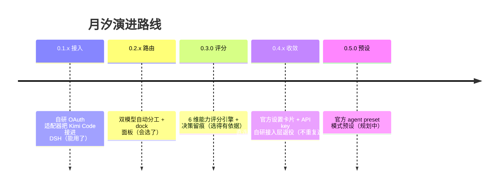
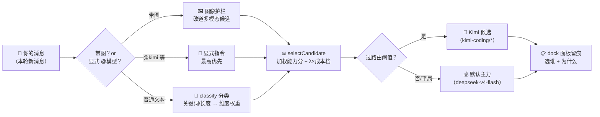
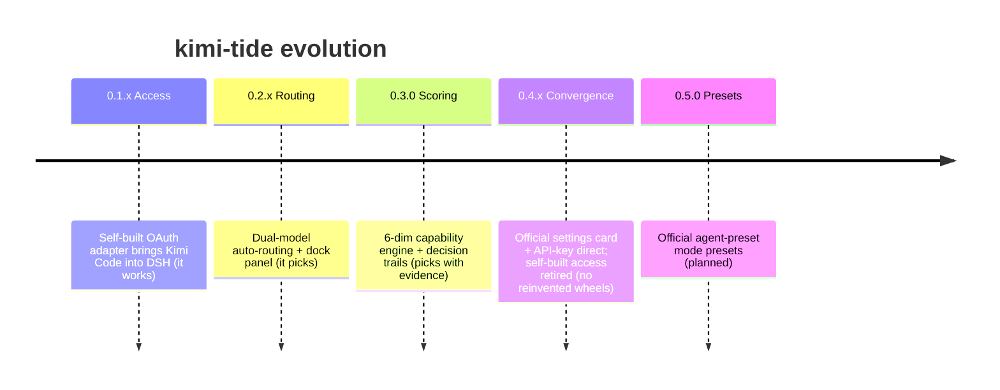
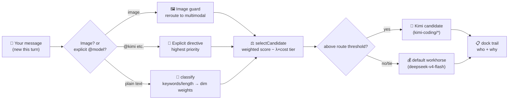

<details open>
<summary><b>🇨🇳 中文</b></summary>

<p align="center">
  <h1 align="center">🌊 kimi-tide（月汐）</h1>
  <p align="center"><em>月亮（Moonshot / Kimi）牵引深海（DeepSeek / DSH）的潮汐。</em></p>
  <p align="center">让 <b>Kimi</b> 与 <b>DeepSeek</b> 在 <b>DeepSeek Harness（DSH）</b> 里各司其职：<br><b>按任务自动选模型的路由插件</b>——便宜的跑日常，厉害的攻难关，每一次选择都看得见。</p>
  <p align="center">
    
    
    
    
    
  </p>
</p>

---

## 现状快照（2026-08-20）

> **📌 开发计划（重要）**：**v0.4.0 预计 2026-08-21 发布**，内容 = 设置界面迁移（`bc31b69`）+ **「API key 直连」**——接入层切换为官方 pi-ai 原生 `kimi-coding` 路由 + Console API Key，自研 OAuth 接入层退役（约 740 行删除），provider 命名 `kimi-tide/*` → `kimi-coding/*` 自动迁移存量配置。设计稿：[`docs/superpowers/specs/2026-08-20-api-key-direct-design.md`](docs/superpowers/specs/2026-08-20-api-key-direct-design.md)。

| 版本线 | 状态 | 证据锚点 |
|---|---|---|
| v0.1.3 | ✅ 已发布（仅凭据门控 + OAuth 加固） | tag `e2a2eb4`，[Release 页](https://github.com/tafcear/kimi-tide/releases/tag/v0.1.3) |
| 0.2.x 双模型路由器 | ✅ main 已落地 + 实机验证 | `71b1d18` / `16a75d0` / `fcbf421`，M5 双探针 + 带图闭环 |
| 0.3.0 能力评分路由 | ✅ main 已实施 + 手工验收 7/7 | `86da918`（203/203 绿） |
| 0.4.0 设置界面迁移 | ✅ main 已合并 | `bc31b69`；验收 ①-③ 通过 |
| 0.4.x API key 直连 | 📐 设计定稿，2026-08-21 实施并随 v0.4.0 发布 | [设计稿](docs/superpowers/specs/2026-08-20-api-key-direct-design.md) |

⚠️ **已知限制**：带图会话会锁存多模态模型；若 Kimi 侧额度/Key 失效，该会话无法切回文本模型（死锁，只能新开会话）。根解「图像转述 / 子代理图片外包」规划中，详见[已知限制](#已知限制)。

---

## 它解决什么问题？

DSH 里一个会话从头到尾只用一个模型。可现实是：

- 💰 **DeepSeek V4** 便宜、快，但**看不懂图片**；
- 🌙 **Kimi K3** 多模态、1M 超长上下文、编码强，但**有额度与成本**。

写代码到一半想贴张截图，得手动切模型；切完又忘了切回来，额度哗哗流走。**月汐就是这笔账的自动交警**：你只管干活，它按任务类型、预算和模型长板，在每个步骤自动选路——选谁、为什么选，全都摆在面板上。

---

## 特性一览

- 🚦 **双模型自动分工**：`off` / `cost`（省着用）/ `capability`（谁厉害谁上）三种模式；按**每个步骤**决策，不是一会话绑定到死。
- 🎯 **能力评分引擎**：6 维评分（代码/推理/写作/工具/视觉/长上下文），每个分数标注**证据等级**（一级基准 / 推断 / 待核实），可在设置卡片里用滑杆覆盖。
- 🖼️ **图像护栏**：带图消息自动改道多模态模型；会话锁存防止历史含图后文本模型崩溃（`UNSUPPORTED_CONTENT`）。
- 👁️ **决策可观测**：dock 面板实时显示「这步选了谁、为什么」，会话日志留痕可复查——不黑箱。
- ⚙️ **官方设置卡片**：路由配置就在 DSH「设置 → 月汐」里编辑，原生分层持久化，重启保持。
- 🔌 **官方接入层**（0.4.x）：Kimi 模型经 pi-ai 原生 `kimi-coding` 路由接入，**一把 Console API Key 即可**，不再需要 Kimi CLI 登录与令牌刷新。
- 📊 **官方配额显示**：dock 面板轮询 Kimi Code 用量接口，周配额 / 5h 窗口一目了然。
- ⌨️ **`/kimi-tide` 命令族**：`mode` / `set` / `export-config` / `import-config` / `refresh`，配置可导出备份、可导入恢复。

---

## 项目思路

> 为什么做这个插件、以及它往哪里去——三段演进，三条原则。



- **第一段（自研接入）**：当初 DSH 没有 Kimi 通道，我们自研了 OAuth 适配器把订阅接进来。
- **第二段（路由与评分）**：接进来之后发现真正的痛点是「哪个任务该用谁」——于是有了双模型路由、能力评分和图像护栏。
- **第三段（收敛聚焦）**：宿主平台调研实锤 pi-ai 已**原生内置** kimi-coding 路由（API key + 订阅 OAuth 双凭据）。自研接入层成了重复造轮，果断退役——**月汐只做官方没有的事：路由、护栏、观测**。

三条原则：

1. **官方优先**：动手前先查官方生态；官方已提供的（适配器/设置页/模型选择器），坚决不重造。
2. **证据分级**：每个能力分数都标出处（一级基准 / 推断 / 待核实），推断永不冒充事实。
3. **决策可观测**：每一次自动选路都有理由、有留痕、可复盘。

---

## 架构

[](docs/assets/readme/kimi-tide-architecture.html)

> 点击查看大图；`docs/assets/readme/kimi-tide-architecture.html` 下载后用浏览器打开，是可平移缩放/搜索/导出的**交互式架构图**（含明暗双主题）。

一次请求的决策流：



---

## 快速开始（v0.4.0 形态）

> v0.4.0 于 2026-08-21 发布。在此之前，源码构建仍是 0.1.x 的 OAuth 接入形态（旧路径见 [`docs/legacy-setup.md`](docs/legacy-setup.md)）。

### 1. 前置条件

- Node.js ≥ 22
- DSH `@deepseek-ai/dsh@0.1.0-rc.7` 及以上（设置卡片依赖 rc.7 的 `dsh-settings`）
- 一把 **Kimi Code Console API Key**（Kimi 控制台获取）

### 2. 配置 Kimi 路由（官方 Models 页）

DSH「设置 → Models」添加 provider **`kimi-coding`**，`apiKeyEnv` 填 `KIMI_API_KEY`（或自建引用名），在凭据区粘贴你的 Key。模型目录（k3 / k3-256k / kimi-for-coding / kimi-for-coding-highspeed）自动就位——密钥由 DSH 托管凭据存储，**不落任何插件配置文件**。

### 3. 安装插件

```bash
cd packages/dsh-kimi-tide
npm install && npm run build && npm pack
dsh plugin --profile web add ./dsh-kimi-tide-<version>.tgz
```

### 4. 用起来

重启 `dsh web`：

- **设置 → 月汐**：把 `mode` 调到 `cost` 或 `capability`，路由器即刻上岗；
- 消息里 **`@kimi`** 显式点将，或配置关键词（如「审查」）自动升级；
- dock 面板的 chip 实时显示每一步选了谁、为什么。

> **发布规范（重要）**：DSH 插件必须声明 `dsh.bundle.patch`（指向 `cordis.patch.yml`）才能作为 profile 层加载。本插件已按官方规范声明，升级版本时请勿移除该字段。

---

## 路由器详解

### 三种模式

| 模式 | 一句话 | 适合谁 |
|---|---|---|
| `off` | 不挂载路由器，DSH 原生行为 | 想完全手动选模型的人 |
| `cost` | 默认便宜主力，必要时才升级 Kimi（占比 ≤ `premiumBudget`） | 额度敏感、日常杂活多 |
| `capability` | 按任务类型选评分最高者（过 `routeThreshold` 才切换） | 追求最佳产出质量 |

### 能力评分引擎

- **6 维评分**：`code` / `reasoning` / `writing` / `tooluse` / `vision` / `longctx`；设置卡片滑杆可覆盖任意维度。
- **决策流**：`classify`（关键词/长度 → 维度权重）→ 显式 `@provider`（最高优先）→ `selectCandidate`（加权分 − λ×成本档）；平局/不达标回退默认路由。
- **候选枚举**：从 `ctx.llm` 实时目录枚举白名单 provider 的模型并解析模态；配了但未接入的模型在面板标灰，不参与评分。
- **评分基线 v2**（`src/scores.ts`，`SCORES_VERSION = 2`，证据分级标注）：

| 模型 | code | reasoning | 其余维度 |
|---|---|---|---|
| `kimi-coding/k3` | 4.7（一级：SWE-bench 93.4%） | 4.5（推断） | 中性 2.5；vision 由模态决定 |
| `kimi-coding/kimi-for-coding` | 4.5（推断） | 3.5（推断） | 同上 |
| `deepseek-v4-pro` | 4.0（一级：SWE-bench 80.6%） | 4.5（一级：GPQA 90.1%） | 同上 |
| `deepseek-v4-flash` | 3.0（推断） | 3.0（推断） | 同上 |

> 出处锚点见 `src/scores.ts` 注释与 [`docs/router-v3.md`](packages/dsh-kimi-tide/docs/router-v3.md)；「推断」格计划由 A 方案全维取证替换。（0.4.x 迁移后基线键改为 `kimi-coding/*`。）

### 图像护栏与锁存

- **per-step 护栏**：带图步骤命中文本-only 路由时按模态改道多模态候选，不占预算窗口。
- **宿主准入声明**（`agent/image-admission`，配合宿主补丁）：新会话默认模型为文本-only 时，入口层先放行「会改道」的声明，带图轮才进得了 agent 循环。
- **会话锁存**：图片一旦进入会话历史，该会话后续轮次强制按 vision 评分（多模态必胜出），防止文本模型序列化图片历史时崩溃。

### 已知限制

1. **带图会话锁存死锁**：锁存后整会话走多模态模型；若 Kimi 额度/Key 失效，会话**无法切回文本模型**（历史含图片）→ 只能新开会话。**根解 = 图片不进主历史**：「图像转述模式」与「子代理图片外包」规划中。
2. **设置卡片评分滑杆步进 0.5 且无手动输入**：无法设 4.6 这类细粒度值，待修（0.1 步进 + 数字输入框）。

---

## 可用模型（经 kimi-coding 路由）

| 模型 ID | 说明 | 上下文 |
|---|---|---|
| `k3` | Kimi K3 旗舰（多模态，1M 长窗） | 1M |
| `k3-256k` | Kimi K3 256K 版（多模态） | 256K |
| `kimi-for-coding` | Kimi K2.7 Code（多模态） | 256K |
| `kimi-for-coding-highspeed` | K2.7 Code 高速版（多模态） | 256K |

> 模态：4 模型在 pi-ai 目录均声明 `input: ["text", "image"]`；DeepSeek 侧（`deepseek-v4-flash` / `deepseek-v4-pro`）为文本-only、1M 窗（pi-ai 目录实读）——多模态正是路由器要补偿的核心缺口。

---

## 配置

### 路由配置（设置 → 月汐，命名空间 `kimi-tide-router`）

| 键 | 默认 | 说明 |
|---|---|---|
| `mode` | `off` | `off` / `cost` / `capability` |
| `default` | `deepseek-official/deepseek-v4-flash` | 默认主力路由（便宜/快） |
| `candidates` | `[kimi-coding/kimi-for-coding]` | 候选路由表（0.4.x 迁移后） |
| `scores` | `{}` | 用户覆盖分（未覆盖用基线） |
| `classify.patterns` | `{}` | 关键词 → 维度权重 |
| `allowedProviders` | `[kimi-coding, deepseek-official]` | 候选枚举白名单 |
| `costTiers` | `{}` | 每候选成本档（`cheap`/`mid`/`expensive`，缺省 mid） |
| `routeThreshold` | `0.75` | capability 模式路由阈值 |
| `lambda` | `0.5` | 成本惩罚系数 |
| `premiumBudget` | `0.2` | cost 模式 Kimi 占比上限（滑动窗口） |
| `budgetWindow` | `20` | 预算窗口大小（决策次数） |
| `charsPerToken` | `2` | token 估算字符折算 |

> **持久化**：设置命名空间（base 层 = 部署基座 / user 层 = 用户编辑，revision 冲突检测）→ 无设置服务的宿主回退 sidecar 文件 → 旧 sidecar 迁移后留档 `.legacy-imported`；0.4.x 升级时 `kimi-tide/*` 命名自动迁移为 `kimi-coding/*` 并留档 `.pre-v3`。

### 插件级配置（`cordis.patch.yml`，0.4.x 起大幅精简）

| 键 | 默认 | 说明 |
|---|---|---|
| `usagePollMs` | `60000` | dock 配额轮询周期（毫秒） |
| `usagePollOnStart` | `true` | 启动时立即轮询配额 |
| `patchFile` | `$DSH_HOME/profiles/web/cordis.patch.yml` | legacy 静态种子的部署基座（仅 base 层） |
| `sidecarFile` | `<patch 目录>/kimi-tide-router.yml` | 无设置服务宿主的回退存储 |

---

## 文档索引

- [`docs/superpowers/specs/2026-08-20-api-key-direct-design.md`](docs/superpowers/specs/2026-08-20-api-key-direct-design.md)：0.4.x API key 直连设计稿（已定稿）。
- [`docs/host-platform-map.md`](docs/host-platform-map.md)：DSH 宿主平台契约调研（0.4.x/0.5.0 的认知基线）。
- [`docs/positioning.md`](docs/positioning.md)：项目定位与维护策略。
- [`docs/development-plan-router.md`](docs/development-plan-router.md)：路由器开发计划（M1-M7）。
- [`packages/dsh-kimi-tide/docs/router-v3.md`](packages/dsh-kimi-tide/docs/router-v3.md)：0.3.0 能力评分路由引擎架构。
- [`docs/agent-collaboration-loop.md`](docs/agent-collaboration-loop.md)：双模型协作闭环方法论（本项目自己的开发方式）。
- [`docs/legacy-setup.md`](docs/legacy-setup.md)：旧接入方案存档（0.4.x 起被官方路由取代）。

---

## 开发与测试

```bash
cd packages/dsh-kimi-tide
npm install
npm run typecheck   # tsc --noEmit
npm test            # vitest（当前 203/203 通过，23 个测试文件）
npm run build       # tsc 宿主 + esbuild 浏览器 half
```

质量基线：全量测试绿 + typecheck 0 错误 + build 通过方可提交。本仓库实践「实施 → 独立审查（Kimi 真身）→ 修复 → 复检验收」双模型协作闭环（见 [`docs/agent-collaboration-loop.md`](docs/agent-collaboration-loop.md)）。

---

## 路线图

- **0.1.x（已发布）**：DSH 原生 Kimi provider，v0.1.3（凭据门控 + OAuth 加固）。
- **0.2.x（main 已落地，未发布）**：双模型路由器 + dock 面板 + 用量显示；失效修复闭环与 M5 实机验证 ✅。
- **0.3.0（main 已实施，未发布）**：能力评分路由（11 任务 TDD，`86da918`），手工验收 7/7 ✅。
- **0.4.0（2026-08-21 发布）**：设置界面迁移（`bc31b69`）+ **API key 直连**（pi-ai 原生 `kimi-coding` 路由，自研 OAuth 接入层退役，provider 改名自动迁移，[设计稿](docs/superpowers/specs/2026-08-20-api-key-direct-design.md)）；配套 GitHub Actions Release 流水线；评分基线 A 方案全维取证；滑杆步进修。
- **0.5.0（规划）**：官方 agent preset 模式预设（桥接行 + `agent-presets.default` 绑定）。
- **规划中**：图像转述模式 / 子代理图片外包（图片不入主历史，根解带图死锁）；kimi 子代理后端（subagents 命名注册表挂载）。

---

## 许可证与合规提示

- **kimi-tide 本体**：[MIT](LICENSE)（Copyright 2026 kimi-tide contributors）
- **第三方组件**：`@earendil-works/pi-ai`（MIT）、`@deepseek-ai/dsh-llm-pi-ai`（MIT, DeepSeek）、`schemastery`（MIT）、`yaml`（MIT）、`dsh-kimi-bridge`（MIT）
- **合规**：0.4.x 起默认走 **Console API Key 官方路径**，个人使用安心；Kimi Code 订阅条款仍以官方表述为准，请勿高频批量调用或共享密钥。
- 本仓库**不含任何凭据**；请勿将 `~/.dsh/.credentials.yaml`、环境变量中的密钥提交到仓库。

---

## FAQ

**Q：v0.4.0 之前 README 说的 OAuth 接入去哪了？**  
A：退役了。宿主调研实锤 pi-ai 原生内置 `kimi-coding` 路由（API key + 订阅 OAuth 双凭据），自研接入层属于重复造轮，0.4.x 整体删除（约 740 行），插件只保留路由/护栏/观测这些官方没有的能力。旧方案存档见 [`docs/legacy-setup.md`](docs/legacy-setup.md)。

**Q：我还需要装 Kimi CLI 并 `kimi login` 吗？**  
A：v0.4.0 起不需要。一把 Console API Key + 官方 Models 页配置即可。

**Q：带图会话有什么限制？**  
A：图片进入会话历史后会话锁存多模态模型；若 Kimi 额度/Key 失效，会话无法切回文本模型 → 死锁，只能新开。根解（图像转述 / 子代理图片外包）规划中；落地前重要带图任务请保持 Kimi 侧额度健康。

**Q：能力评分从哪里来？**  
A：`src/scores.ts` 基线 v2：`code` / `reasoning` 有 SWE-bench / GPQA 一级证据或强相对推断，其余维度中性 2.5（vision 由模态决定）；每格标证据等级，可在设置卡片覆盖。

**Q：路由配置存在哪里？**  
A：DSH 设置命名空间 `kimi-tide-router`（设置 → 月汐编辑）；无设置服务的宿主回退 sidecar 文件；0.4.x 升级自动把 `kimi-tide/*` 改名为 `kimi-coding/*`（留档 `.pre-v3`）。

**Q：为什么 Release 页只有 v0.1.3？**  
A：v0.1.3 发布于路由器接线之前；后续特性均在 main 未发布。v0.4.0（含设置迁移 + API key 直连）于 2026-08-21 发布。

</details>

<details>
<summary><b>🇬🇧 English</b></summary>

<p align="center">
  <h1 align="center">🌊 kimi-tide（月汐）</h1>
  <p align="center"><em>The moon (Moonshot / Kimi) drives the tide of the deep sea (DeepSeek / DSH).</em></p>
  <p align="center">Let <b>Kimi</b> and <b>DeepSeek</b> each play to their strengths inside <b>DeepSeek Harness (DSH)</b>:<br><b>a plugin that picks the right model for every step</b> — the cheap one for daily work, the strong one for hard problems — with every choice fully visible.</p>
  <p align="center">
    
    
    
    
    
  </p>
</p>

---

## Current Status (2026-08-20)

> **📌 Development plan (important)**: **v0.4.0 ships 2026-08-21**, containing the settings migration (`bc31b69`) plus **"API-key direct connection"** — the access layer switches to the official pi-ai native `kimi-coding` route + a Console API key; the self-built OAuth access layer is retired (~740 lines deleted); provider naming migrates `kimi-tide/*` → `kimi-coding/*` automatically. Design spec: [`docs/superpowers/specs/2026-08-20-api-key-direct-design.md`](docs/superpowers/specs/2026-08-20-api-key-direct-design.md).

| Line | Status | Evidence |
|---|---|---|
| v0.1.3 | ✅ Released (credential gating + OAuth hardening only) | tag `e2a2eb4`, [Release page](https://github.com/tafcear/kimi-tide/releases/tag/v0.1.3) |
| 0.2.x dual-model router | ✅ Landed on main + verified live | `71b1d18` / `16a75d0` / `fcbf421`, M5 dual-probe + image roundtrip |
| 0.3.0 capability-scored routing | ✅ Implemented on main + manual acceptance 7/7 | `86da918` (203/203 green) |
| 0.4.0 settings migration | ✅ Merged on main | `bc31b69`; acceptance ①-③ passed |
| 0.4.x API-key direct | 📐 Design finalized; ships with v0.4.0 on 2026-08-21 | [design spec](docs/superpowers/specs/2026-08-20-api-key-direct-design.md) |

⚠️ **Known limitation**: image-bearing sessions latch onto the multimodal model; if the Kimi quota/key fails, that session cannot fall back to a text model (deadlock — start a new session). The root fix ("image transcription / subagent image outsourcing") is planned. See [Known Limitations](#known-limitations).

---

## What problem does it solve?

In DSH, a session sticks to one model from start to finish. But in reality:

- 💰 **DeepSeek V4** is cheap and fast, but **cannot see images**;
- 🌙 **Kimi K3** is multimodal with a 1M context window and strong coding, but it **costs quota and money**.

Mid-task you want to paste a screenshot — switch models by hand; then you forget to switch back and quota burns away. **kimi-tide is the automatic traffic controller for that trade-off**: you just do the work; it picks the route per step based on task type, budget, and each model's strengths — and shows you who it picked and why, right on the panel.

---

## Features

- 🚦 **Automatic dual-model routing**: three modes — `off` / `cost` (frugal) / `capability` (best model for the job); decisions are made **per step**, not per session.
- 🎯 **Capability scoring engine**: 6 dimensions (code/reasoning/writing/tooluse/vision/longctx), every score tagged with an **evidence grade** (primary benchmark / inferred / pending), overridable via sliders in the settings card.
- 🖼️ **Image guard**: image-bearing steps reroute to multimodal candidates automatically; session latching prevents text-model crashes (`UNSUPPORTED_CONTENT`) once images enter history.
- 👁️ **Observable decisions**: the dock panel shows "who was picked and why" for every step, with session-log traceability — no black box.
- ⚙️ **Official settings card**: router config lives in DSH "Settings → 月汐", natively persisted with layered overrides and restart-safe storage.
- 🔌 **Official access layer** (0.4.x): Kimi models arrive via the pi-ai native `kimi-coding` route — **one Console API key is all you need**; no Kimi CLI login or token refresh anymore.
- 📊 **Official quota display**: the dock polls the Kimi Code usage endpoint — weekly quota and 5h window at a glance.
- ⌨️ **`/kimi-tide` command family**: `mode` / `set` / `export-config` / `import-config` / `refresh` — export, back up, and restore your config.

---

## Project Story

> Why this plugin exists and where it is heading — three phases, three principles.



- **Phase 1 (self-built access)**: DSH had no Kimi channel, so we built an OAuth adapter to bring the subscription in.
- **Phase 2 (routing & scoring)**: once connected, the real pain became "which model should take which task" — hence the dual-model router, capability scoring, and the image guard.
- **Phase 3 (convergence)**: host-platform research proved pi-ai **natively ships** the `kimi-coding` route (API key + subscription OAuth). The self-built access layer became a reinvented wheel and was retired — **kimi-tide now does only what the official ecosystem lacks: routing, guarding, and observability**.

Three principles:

1. **Official first**: check the official ecosystem before writing code; never rebuild what it already provides (adapters / settings pages / model pickers).
2. **Evidence-graded scores**: every capability score carries its source (primary benchmark / inferred / pending); inference never masquerades as fact.
3. **Observable decisions**: every automatic routing choice has a reason, a trail, and a replay path.

---

## Architecture

[](docs/assets/readme/kimi-tide-architecture.html)

> Click for the full-size image; open `docs/assets/readme/kimi-tide-architecture.html` in a browser for the **interactive diagram** (pan/zoom/search/export, light & dark themes).

The decision flow of one request:



---

## Quick Start (v0.4.0 form)

> v0.4.0 ships on 2026-08-21. Until then, a source build still carries the 0.1.x OAuth access form (legacy path: [`docs/legacy-setup.md`](docs/legacy-setup.md)).

### 1. Prerequisites

- Node.js ≥ 22
- DSH `@deepseek-ai/dsh@0.1.0-rc.7` or newer (the settings card needs rc.7's `dsh-settings`)
- A **Kimi Code Console API key** (from the Kimi console)

### 2. Configure the Kimi route (official Models page)

In DSH "Settings → Models", add provider **`kimi-coding`**, set `apiKeyEnv` to `KIMI_API_KEY` (or your own reference name), and paste your key into the credential area. The model catalog (k3 / k3-256k / kimi-for-coding / kimi-for-coding-highspeed) appears automatically — the secret lives in the DSH managed credential store, **never in any plugin config file**.

### 3. Install the plugin

```bash
cd packages/dsh-kimi-tide
npm install && npm run build && npm pack
dsh plugin --profile web add ./dsh-kimi-tide-<version>.tgz
```

### 4. Use it

Restart `dsh web`:

- **Settings → 月汐**: set `mode` to `cost` or `capability` — the router is on duty;
- Type **`@kimi`** in a message for an explicit pick, or configure keywords (e.g. "review") for automatic escalation;
- The dock chip shows who was picked and why, for every step.

> **Release rule (important)**: a DSH plugin must declare `dsh.bundle.patch` (pointing at `cordis.patch.yml`) to load as a profile layer. This plugin follows the official spec — do not remove the field when bumping versions.

---

## Router in Detail

### Modes

| Mode | In one line | Best for |
|---|---|---|
| `off` | Router unmounted; native DSH behavior | full manual control |
| `cost` | Cheap default, escalate to Kimi only when needed (share ≤ `premiumBudget`) | quota-sensitive daily work |
| `capability` | Pick the highest scorer per task type (switch only past `routeThreshold`) | best output quality |

### Capability Scoring Engine

- **6 dimensions**: `code` / `reasoning` / `writing` / `tooluse` / `vision` / `longctx`; sliders in the settings card override any dimension.
- **Decision flow**: `classify` (keywords/length → dimension weights) → explicit `@provider` (highest priority) → `selectCandidate` (weighted score − λ×cost tier); ties/shortfalls keep the default route.
- **Candidate enumeration**: models are enumerated live from the `ctx.llm` catalog for whitelisted providers, with modalities resolved; configured-but-unavailable models render greyed out and skip scoring.
- **Baseline scores v2** (`src/scores.ts`, `SCORES_VERSION = 2`, evidence-graded):

| Model | code | reasoning | other dims |
|---|---|---|---|
| `kimi-coding/k3` | 4.7 (primary: SWE-bench 93.4%) | 4.5 (inferred) | neutral 2.5; vision is modality-driven |
| `kimi-coding/kimi-for-coding` | 4.5 (inferred) | 3.5 (inferred) | same |
| `deepseek-v4-pro` | 4.0 (primary: SWE-bench 80.6%) | 4.5 (primary: GPQA 90.1%) | same |
| `deepseek-v4-flash` | 3.0 (inferred) | 3.0 (inferred) | same |

> Provenance anchors live in `src/scores.ts` comments and [`docs/router-v3.md`](packages/dsh-kimi-tide/docs/router-v3.md); "inferred" cells will be replaced by fully-sourced values (plan A). (After the 0.4.x migration, baseline keys become `kimi-coding/*`.)

### Image Guard and Latching

- **Per-step guard**: an image step hitting a text-only route is rerouted to a multimodal candidate by modality, without consuming the budget window.
- **Host admission claim** (`agent/image-admission`, with a host hotfix): on a fresh session whose default model is text-only, the router claims "will reroute" at the entry gate so the image step reaches the agent loop.
- **Session latching**: once an image enters history, later turns force vision scoring (a multimodal candidate must win), preventing text-only serialization from crashing on image history.

### Known Limitations

1. **Image-latch deadlock**: after latching, the whole session runs on the multimodal model; if the Kimi quota/key fails, the session **cannot switch back to a text model** (history contains images) → open a new session. **Root fix = images never enter the main history**: "image transcription mode" and "subagent image outsourcing" are planned.
2. **Settings-card slider steps by 0.5 with no manual input**: fine-grained values like 4.6 cannot be set; fix pending (0.1 steps + numeric input).

---

## Available Models (via the kimi-coding route)

| Model ID | Description | Context |
|---|---|---|
| `k3` | Kimi K3 flagship (multimodal, 1M window) | 1M |
| `k3-256k` | Kimi K3 256K (multimodal) | 256K |
| `kimi-for-coding` | Kimi K2.7 Code (multimodal) | 256K |
| `kimi-for-coding-highspeed` | K2.7 Code high-speed (multimodal) | 256K |

> Modalities: all 4 models declare `input: ["text", "image"]` in the pi-ai catalog; the DeepSeek side (`deepseek-v4-flash` / `deepseek-v4-pro`) is text-only with a 1M window (catalog verified) — multimodality is the router's core gap to compensate.

---

## Configuration

### Router config (Settings → 月汐, namespace `kimi-tide-router`)

| Key | Default | Description |
|---|---|---|
| `mode` | `off` | `off` / `cost` / `capability` |
| `default` | `deepseek-official/deepseek-v4-flash` | default route (cheap/fast) |
| `candidates` | `[kimi-coding/kimi-for-coding]` | candidate routes (after 0.4.x migration) |
| `scores` | `{}` | user overrides (baseline used where absent) |
| `classify.patterns` | `{}` | keyword → dimension weights |
| `allowedProviders` | `[kimi-coding, deepseek-official]` | candidate-enumeration whitelist |
| `costTiers` | `{}` | per-candidate cost tier (`cheap`/`mid`/`expensive`; default mid) |
| `routeThreshold` | `0.75` | capability-mode route threshold |
| `lambda` | `0.5` | cost penalty coefficient |
| `premiumBudget` | `0.2` | max Kimi share in the sliding budget window (cost mode) |
| `budgetWindow` | `20` | budget window size (decisions) |
| `charsPerToken` | `2` | token-estimation ratio |

> **Persistence**: settings namespace (base layer = deployment seed / user layer = edits, revision conflict detection) → sidecar fallback on hosts without a settings service → the old sidecar is archived as `.legacy-imported`; on 0.4.x upgrade, `kimi-tide/*` names auto-migrate to `kimi-coding/*` with a `.pre-v3` backup.

### Plugin-level (`cordis.patch.yml`, greatly slimmed since 0.4.x)

| Key | Default | Description |
|---|---|---|
| `usagePollMs` | `60000` | dock quota poll period (ms) |
| `usagePollOnStart` | `true` | poll quota at startup |
| `patchFile` | `$DSH_HOME/profiles/web/cordis.patch.yml` | legacy static seed, base layer only |
| `sidecarFile` | `<patch dir>/kimi-tide-router.yml` | fallback store without a settings service |

---

## Documentation Index

- [`docs/superpowers/specs/2026-08-20-api-key-direct-design.md`](docs/superpowers/specs/2026-08-20-api-key-direct-design.md): 0.4.x API-key direct-connection design (finalized).
- [`docs/host-platform-map.md`](docs/host-platform-map.md): DSH host-platform contract research (the cognitive baseline for 0.4.x/0.5.0).
- [`docs/positioning.md`](docs/positioning.md): project positioning & maintenance strategy.
- [`docs/development-plan-router.md`](docs/development-plan-router.md): router development plan (M1-M7).
- [`packages/dsh-kimi-tide/docs/router-v3.md`](packages/dsh-kimi-tide/docs/router-v3.md): 0.3.0 routing-engine architecture.
- [`docs/agent-collaboration-loop.md`](docs/agent-collaboration-loop.md): the dual-model collaboration loop this project itself is built with.
- [`docs/legacy-setup.md`](docs/legacy-setup.md): legacy access paths archive (superseded by the official route in 0.4.x).

---

## Development & Testing

```bash
cd packages/dsh-kimi-tide
npm install
npm run typecheck   # tsc --noEmit
npm test            # vitest (currently 203/203 passing across 23 test files)
npm run build       # tsc host build + esbuild browser bundle
```

Quality bar: full test suite green + zero typecheck errors + successful build before committing. This repository practices an "implement → independent review (real Kimi) → fix → re-check" dual-model loop (see [`docs/agent-collaboration-loop.md`](docs/agent-collaboration-loop.md)).

---

## Roadmap

- **0.1.x (released)**: native DSH Kimi provider, v0.1.3 (credential gating + OAuth hardening).
- **0.2.x (landed on main, unreleased)**: dual-model router + dock panel + usage display; failure-fix loop closed and M5 live verification ✅.
- **0.3.0 (implemented on main, unreleased)**: capability-scored routing (11 TDD tasks, `86da918`), manual acceptance 7/7 ✅.
- **0.4.0 (ships 2026-08-21)**: settings migration (`bc31b69`) plus **API-key direct connection** (pi-ai native `kimi-coding` route, self-built OAuth access retired, provider-rename auto-migration — [design spec](docs/superpowers/specs/2026-08-20-api-key-direct-design.md)); GitHub Actions release pipeline; plan-A full scoring provenance; slider step fix.
- **0.5.0 (planned)**: official agent-preset mode presets (bridge line + `agent-presets.default` binding).
- **Planned**: image transcription mode / subagent image outsourcing (images never enter the main history — root fix for the image-latch deadlock); kimi subagent backend (subagents named-registry mount).

---

## License & Compliance

- **kimi-tide itself**: [MIT](LICENSE) (Copyright 2026 kimi-tide contributors)
- **Third-party components**: `@earendil-works/pi-ai` (MIT), `@deepseek-ai/dsh-llm-pi-ai` (MIT, DeepSeek), `schemastery` (MIT), `yaml` (MIT), `dsh-kimi-bridge` (MIT)
- **Compliance**: since 0.4.x the default path is the **official Console API key**, which is safe for personal use; Kimi Code subscription terms still apply as officially stated — no high-frequency batch calls or key sharing.
- This repository contains **no credentials**; never commit `~/.dsh/.credentials.yaml` or any key from your environment.

---

## FAQ

**Q: Where did the OAuth access described in the old README go?**  
A: Retired. Host research proved pi-ai natively ships the `kimi-coding` route (API key + subscription OAuth), so the self-built access layer was a reinvented wheel — removed wholesale in 0.4.x (~740 lines). The plugin keeps only what the official ecosystem lacks: routing, guarding, observability. Legacy paths: [`docs/legacy-setup.md`](docs/legacy-setup.md).

**Q: Do I still need the Kimi CLI and `kimi login`?**  
A: Not since v0.4.0. One Console API key + the official Models page is all it takes.

**Q: What are the image-session limitations?**  
A: Once an image enters history, the session latches onto the multimodal model; if the Kimi quota/key fails, the session cannot switch back → deadlock; open a new session. The root fix (image transcription / subagent image outsourcing) is planned; until then keep the Kimi quota healthy for important image tasks.

**Q: Where do the capability scores come from?**  
A: `src/scores.ts` baseline v2: `code` / `reasoning` carry SWE-bench / GPQA primary evidence or strong relative inference; other dims are neutral 2.5 (vision is modality-driven); every cell is evidence-graded and overridable in the settings card.

**Q: Where is the router configuration stored?**  
A: In the DSH settings namespace `kimi-tide-router` (edited via Settings → 月汐); hosts without a settings service fall back to the sidecar file; on 0.4.x upgrade, `kimi-tide/*` names auto-migrate to `kimi-coding/*` (`.pre-v3` backup).

**Q: Why does the Release page only have v0.1.3?**  
A: v0.1.3 shipped before the router wiring; every later feature lives on main, unreleased. v0.4.0 (settings migration + API-key direct) ships on 2026-08-21.

</details>
