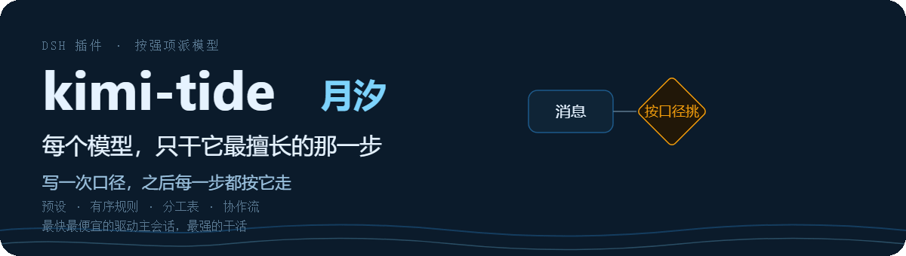
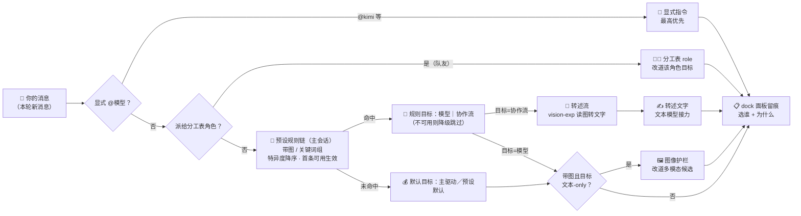
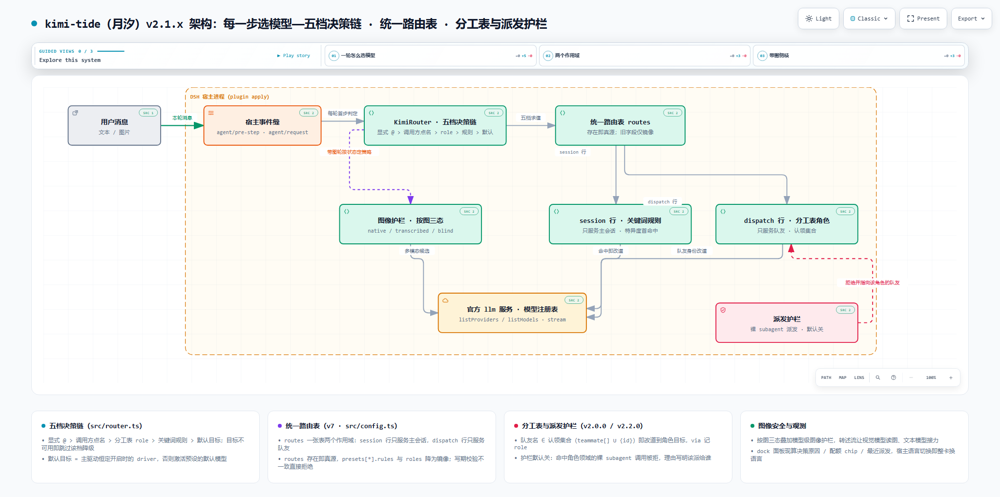

<p align="center">
  <a href="README.en.md">English</a> ｜ 简体中文
</p>

<p align="center">
  
</p>
<p align="center">
  <a href="https://awesome-dsh-plugin.com"></a>
  <a href="https://github.com/tafcear/kimi-tide/releases"></a>
  <a href="https://www.npmjs.com/package/dsh-kimi-tide"></a>
  <a href="https://github.com/tafcear/kimi-tide/actions/workflows/ci.yml"></a>
  <a href="https://github.com/tafcear/kimi-tide/blob/main/LICENSE"></a>
  <a href="https://github.com/tafcear/kimi-tide/graphs/contributors"></a>
</p>

**月汐（kimi-tide）是一个小插件，装在 DSH 上。DSH 就是你平时跟 AI 一起写代码、干活的工具（DeepSeek 官方开源）。**

**它只做一件事：把「这一步用哪个模型」变成你能编排的东西。** 你手里通常接了好几个 AI，各有所长——有的前端手感好、有的代码写得稳、有的看得懂图、有的又快又便宜。以前「用哪个」是一个**会话级的开关**，派出去的活更轮不到你安排；装上月汐，你用**预设 + 有序规则 + 分工表**把这些强项写成口径——之后每一步（含派出去的每一步）都按你的口径走。

**它给你三件事：**

- **每个模型只干它最擅长的那一步**——写前端走 `kimi-coding/k3`、写后端逻辑走 `zai-coding-cn/glm-5.3`、要推理的活走更强的那个，而**最快最便宜的那个负责驱动主会话**（读文件、跑命令、调度）。以前得手动切三次，现在写一次口径就行。
- **派出去的活也按角色走**——给队友建角色（`frontend` / `backend` / `qa` / `writer`…），分工表把角色接到模型上：**角色即路由**。它和主会话的关键词规则是两个互不串味的作用域；命中的裸子代理派发还会被护栏拦下，并告诉你该派给谁。
- **不用记着切回来**——贴完一张图，只有那一轮换到看得懂图的 AI，下一轮自动回到你原来用的。**贵 AI 是按「段」用的，不是按「整场会话」用的。**

**顺带还有：**要紧的产出能先让强模型审一遍（问题按严重度列出 + 改进建议 + 通过／不通过）；闲聊、翻译、改文案照旧走最便宜的；配额 chip 与决策面板让「这一步是谁、为什么」随时可查；宿主语言切到英文时，整个界面（设置卡、dock 与决策面板、评审卡与退回卡、说明页）也都是英文，中文界面逐字不变。

（下文里「AI」和「模型」是一回事——DSH 管它们叫模型。）

**适合谁**：在用 DSH、且接了不止一个模型的人。
**不适合**：只用一个模型，或还没跑起 DSH 的人（先把 DSH 用起来，再回来装这个）。

**遇到问题或有建议？** 三个入口任选：

- **报缺陷**：[Issues](https://github.com/tafcear/kimi-tide/issues/new/choose)（带模板）。请写清五样：kimi-tide 版本、DSH 版本、桌面端还是网页端、复现步骤、`/kimi-tide show` 的输出。
- **使用体验与建议**：置顶讨论 [Feedback](https://github.com/tafcear/kimi-tide/discussions/7)。
- **使用提问**：[Q&A](https://github.com/tafcear/kimi-tide/discussions/new?category=q-a)。

中文、English 都可以。

---

## 它解决什么问题

**场景一：一件事本来该三个模型分工**

- 以前：画页面切一次、写接口切一次、最后审查再切一次——切到第三次就忘了切回来。
- 装后：把这三条写进规则或分工表——命中「前端 / 组件 / 样式」走 `kimi-coding/k3`、命中「接口 / 数据库 / 逻辑」走 `zai-coding-cn/glm-5.3`、审查走另一个档位。规则是你自己写的：有序、按特异度排序、**首命中即停**；没命中用预设的默认目标。

**场景二：让最快的模型「驱动」，让最强的模型「干活」**

- 以前：要么整场会话都用最贵的那个（慢、贵），要么全程用快的（产出质量看运气）。
- 装后：主会话的日常动作——读文件、跑命令、整理上下文、调度子代理——交给快而便宜的那个；**真正要产出的那一步自动改道到该领域最强的模型**。手感和质量兼得。

**场景三：派活给队友，还得替它挑模型**

- 以前：派活时得想「这活给谁、它用哪个模型」——而且派出去的活到底用谁，你说了不算。
- 装后：**角色即路由**。分工表写「前端 → K3、后端 → GLM-5.3、测试 → 推理强的、写作 → 便宜的」，派活只写角色名；命中的裸子代理派发会被护栏拦下，并告诉你该派给谁。

**顺带的结果：省钱。** 闲聊、翻译、改文案走最便宜的；带图那一轮自动走能看图的模型、下一轮自动回来；面板与配额 chip 让「这一步是谁、为什么」随时可查（Kimi/GLM 等带套餐的模型显示余额，无套餐的置灰）。

---

## 30 秒看懂路由逻辑

一条消息进来，月汐按这个顺序决定用哪个模型（**五档**，与设置页那条决策链逐档对齐）：

1. **显式点名**：消息里写 `@kimi`（provider 级：模型取你预设里配过的那个）或 `@kimi/k3`（精确钉到某个模型）→ 最高优先。
2. **调用方点名**：子代理的调用方已经指定了模型（且与默认目标不同）→ 保持它不变，不抢。
3. **分工表 role（只对队友）**：请求来自被分工表认领的队友 → 改道到该角色配的目标模型（见下文「团队派发」）。
4. **关键词规则（只对主会话）**：按预设规则判定——带图？命中哪组关键词？→ 规则按**特异度**排序（命中词多者优先、带图恒第一、平手按列表序），排序后**首条目标可用、且上下文窗口装得下本会话的规则**说了算（目标不可用、或窗口装不下当前会话占用 + 预留输出，都自动降级下一条）。子代理默认不参与关键词规则（设置页可开）。
5. **默认目标**：都没命中 → 主会话用「主驱动恒定」指定的模型（没开就是预设默认模型），子代理保持它继承的模型。
6. **带图保险**：就算选了纯文本模型，消息带图也会被强制改道给能看图的模型——不会崩。


```mermaid
flowchart LR
    A["💬 你的消息<br>（本轮新消息）"] --> B{"显式 @模型？"}
    B -- "@kimi 等" --> H["🎯 显式指令<br>最高优先"]
    B -- 否 --> R{"派给分工表角色？"}
    R -- "是（队友）" --> S["🧑🔧 分工表 role<br>改道该角色目标"]
    R -- 否 --> C["📏 预设规则链（主会话）<br>带图 / 关键词组<br>特异度降序 · 首条可用生效"]
    C -- 命中 --> D["🌙 规则目标：模型｜协作流<br>（不可用则降级跳过）"]
    C -- 未命中 --> E["💰 默认目标：主驱动／预设默认"]
    H --> J
    S --> J
    D -- "目标=协作流" --> T["🌊 转述流<br>vision-exp 读图转文字"]
    D -- "目标=模型" --> F
    E --> F{"带图且目标<br>文本-only？"}
    T --> K["✍️ 转述文字<br>文本模型接力"]
    F -- 是 --> G["🖼️ 图像护栏<br>改道多模态候选"]
    F -- 否 --> J["📋 dock 面板留痕<br>选谁 + 为什么"]
    G --> J
    K --> J
```

> 图中「协作流」= 一条「先 A 后 B」的自动流程（比如：图先转成文字，再交给便宜模型作答）；「多模态」= 能看懂图片的模型；「转述」= 让能看图的模型（图中 vision-exp 是 Kimi 家一款能看图的模型名）把图里的内容写成文字；「dock 面板」= 输入框下方的「🌙 月汐」面板。

## 设置页怎么看（路由页）

打开「设置 → 月汐 → 路由」，从上往下就是**一条五档决策链**——谁有机会决定这一步用哪个模型，越靠上越优先：

卡片最上面还有一行「**界面语言**」：列出宿主注册的全部语言（当前项选中），切换后**整个界面**（含月汐卡片本身）立即换语言并由宿主记住；旧宿主未提供语言列表时这一行不渲染。

1. **顶部摘要**：一句话说清现状，长这样——主会话以 flash 为默认目标，命中「代码」时改用 k3 ｜ 派发：前端→k3、后端→glm-5.3 ｜ 带图：锁存视觉模型。一条规则都没配时也会说明：主会话没有可命中的规则，全部使用默认目标（…）；另有多组关键词组未接入任何规则，暂不生效——**空表不是坏了，是还没接入**。
2. **五档决策链**：显式 @ > 调用方点名 > 分工表 role > 关键词规则 > 默认目标。每档三行——触发条件 / 当前取值 / 关闭后的影响。**分工表**内联在第 3 档、**规则编辑器**内联在第 4 档。每档带一个状态徽标——**已就绪**（此刻真的参与裁决）/ **按需**（写 `@` 或子代理点名时才参与，不置灰）/ **未启用**（当前配置下没东西，置灰），一眼看得出谁在决定这一轮。
3. **作用域徽标**：规则行标「**主会话**」、分工角色行标「**派发时**」——两套配置各管一半，徽标就是那条分界线。配置里它们是**同一张路由表** `routes` 的两类行（`scope: session` / `scope: dispatch`）：

   ```yaml
   routes:
     - { id: code-kfc, scope: session, preset: capability, when: { kind: keywords, group: code }, target: { provider: kimi-coding, model: kimi-for-coding } }
     - { id: backend,  scope: dispatch, when: { kind: role }, label: 后端, target: { provider: zai-coding-cn, model: glm-5.3 } }
   ```

   `session` 行只服务主会话、`dispatch` 行只服务队友；**`routes` 存在即真源**，旧字段（`presets[*].rules` / `roles`）保留为镜像——删掉 `routes` 段就回到旧字段口径，功能不崩。
4. **重叠解释条**：同一个词（比如「代码」）既是某条关键词规则的对象、又是某个角色的身份词时，两侧各出现一条解释条：「设计使然：主会话说『代码』走 A；派给『后端』做走 B」——**这不是冲突，是分工**。旁边给两个一键动作：**规则跟随该角色** / **把词并入该角色的别名**。（被协作流认领的规则不参与解释——它已被抑制，解释它等于说假话。）
5. **测试场「派给谁」**：输入一个角色或队友名，看它会被改道到哪个模型、依据是什么（`role` / `unclaimed`）。它与「试一句」是**两套作用域**：「试一句」算主会话的关键词规则，「派给谁」算派发时的分工表改道。

> 配置层面的形状、排序与迁移口径（含 `scope` 语义与冲突校验）见[路由器架构详解](packages/dsh-kimi-tide/docs/router.md)的「2.1.0 统一路由表（v7）」节。

## 它长什么样

[](docs/assets/readme/kimi-tide-architecture.html)

*点图看大图。`docs/assets/readme/kimi-tide-architecture.html` 下载后用浏览器打开，是可平移缩放/搜索的交互式架构图（明暗双主题，节点可溯源到源码）。*

---

## 快速开始

### 1. 前置条件

- Node.js ≥ 22
- DSH `@deepseek-ai/dsh@0.1.2-rc.1` 及以上（本版实机验证于 `0.1.5-rc.1`）
- 你想互相调度的模型已接入 DSH——**不限哪一家**。想用 Kimi，就准备一把 **Kimi Code Console API Key**（在 Kimi 控制台生成的密钥；配额面板也用这把 key）

### 2. 接入候选模型（DSH「设置 → Models」页）

「设置 → Models」里添加模型来源（示例：**`kimi-coding`**，`apiKeyEnv` 填 `KIMI_API_KEY`，然后在凭据区粘贴你的 Key——k3 等 4 个 Kimi 模型会自动出现在目录里）。**接几家都行**：月汐的候选池就是这页的全部模型。密钥由 DSH 托管保存，**不会写进任何插件配置文件**。

### 3. 安装插件

```bash
# 方式一（推荐）：直接从 npm 装
dsh plugin --profile web add dsh-kimi-tide

# 方式二：从源码出包再装（要改代码时走这条）
cd packages/dsh-kimi-tide
npm install && npm run build && npm pack
dsh plugin --profile web add ./dsh-kimi-tide-<version>.tgz
```

### 4. 用起来

重启 `dsh web`：

- **设置 → 月汐**：预设行选「省钱」或「能力」，路由器即刻上岗；
- 消息里 **`@kimi`** 可以显式点名，或者靠内置关键词组自动改道（比如消息里出现「代码」就走编码模型）；
- 输入框下方的「🌙 月汐」面板实时显示每一步选了谁、为什么；
- ✅ **30 秒验收**：发一句「帮我写个函数」——面板应显示命中 code 规则并改道到编码模型。看不到理由条 = 路由器没上岗，回「设置 → 月汐」确认已选预设。

---

## 预设与规则

预设 = 一套「默认模型 + 规则」方案，一键全局切换；月汐自带两套：

| 预设 | 默认模型（没规则命中时用它） | 规则 | 适合谁 |
|---|---|---|---|
| 关闭 | — | — | 想完全手动选模型的人 |
| 省钱 | `deepseek-v4-flash` | 带图 → `k3`；代码关键词 → `kimi-for-coding`；翻译关键词 → `deepseek-v4-flash` | 额度敏感、日常杂活多 |
| 能力 | `k3` | 带图 → `k3`；审查 → `k3`；代码 → `kimi-for-coding`；数学 → `deepseek-v4-pro`；长文 → `k3`；写作 → `deepseek-v4-pro`；翻译 → `deepseek-v4-flash`；闲聊 → `deepseek-v4-flash` | 追求最佳产出质量 |

内置 7 组关键词（词表可改，也可自建新组）：

| 组 | 方向 | 内置词表（可改） |
|---|---|---|
| `code` | 编码 | 代码, code, bug, 重构, refactor, 实现, 函数, 测试, 接口, 联调, 部署, 性能, 报错, 日志, 编译, 命令, 脚本 |
| `review` | 审查 | 审查, review, 评审, 挑毛病, 复检, 检查, audit, 意见, 打分 |
| `writing` | 写作 | 写作, 文案, 润色, 改写, 扩写, 标题, 推文, 周报, 演讲稿, 总结 |
| `translate` | 翻译 | 翻译, 译成, 中译英, 英译中, translate, 本地化 |
| `longdoc` | 长文 | 长文档, 通读, 逐段, 全文, 上万字, 大文档 |
| `math` | 数学 | 数学, 证明, 推导, 求解, 公式, 数论, 概率, 逻辑题 |
| `chitchat` | 寒暄 | 你好, 谢谢, 怎么样, 随便, 聊聊, 天气 |

> `review` 组默认服务于**评审协作流**（请强模型评审本轮产出）——机制、四个开关与今天的边界见下文「多模型协作评审」一节。

两个常用微调（都在「设置 → 月汐」里点几下就能配）：

- **最少命中词数**：给规则配一个下限（比如 2），一句话里至少命中这个词组的 2 个词才触发——避免「做个方案」这种顺带提到关键词的普通句子误触发。
- **推理力度（effort）**：给规则目标或默认模型指定「思考深度」档位（想得越深越慢越贵）；转述流的视觉模型与评审流的评审模型同样可配（设置 → 月汐 → 协作流）。下拉里**只列该模型声明支持的档位**——「跟随默认（该模型未声明档位）」就是没声明；模型不支持你配的档位时自动忽略，不会报错。

### 用量与余额（跟着命中的目标自动切）

面板第二行的额度槽会**跟随当前命中的目标**自动换形态：订阅类（code plan）显示用量窗（周 / 5h，条画的是**剩余**比例），API 计费类显示**余额**（余额不足以调用 API 时会明确标注）。旁边还有一个**总览**按钮——一屏列出全部已注册的源，以及某个源为什么没数据：「该套餐无公开 API」/「key 未配置」/「取数失败」三态分别说清，不用你猜。

> 取数用的凭据按 **`settings.yaml` 里该 provider 配置的 `apiKeyEnv` 名字**解析（并自动兼容内置别名）——**你给 provider 起的 key 名与插件内置默认名不一致时，面板照样取得到数**。

### 说明页与语义确认闸

- **「设置 → 月汐 → 说明」**：面板每个元素是什么、设置里每个字段什么意思，分区讲清（最上面另有「本次新版」一节，讲这一版路由页的五档决策链、作用域与统一路由表），关键条目带**当前值**（如「触发方式：当前＝手动 ⇒ 关键词命中不会触发评审」），另有一张**症状 → 原因**表。
- **语义确认闸**（默认关闭，需在配置里开）：开启后关键词命中不会立刻改道——先让**本预设的默认模型**确认「这是本轮真意图吗」，判否就跳过该条规则、继续匹配后续规则。超时/模型不可用/输出解析失败一律**按原关键词结果走**；显式 `@` 轮与「带图规则已排首位」的轮不发判官调用。配置项 `preset.hitConfirm`。
- **判词写在决策原因里**：判否 / 确认 / 无结论会前置到面板的决策原因串（如「语义闸无结论 1200ms（code-kfc）」）。因为判否会让规则出链、最终落默认目标，带判词注记的**默认目标决策也会照常上报**——否则「判否」这个最该被看见的结果反而看不见。
- **判官按目标能力关掉思考**：判官是推理模型，而这道闸只给它 64 token 的预算——如果放任它先思考，预算会被思考吃光、正文一个字都不剩，判词必然不可解析（**闸门静默失效，什么都不改**）。所以判官目标声明支持「off」档位时，插件会显式关掉思考；目标不支持（例如 k3）就不下发，绝不硬塞一个它不认的档位。

### 显式 @ 的两种写法

- `@kimi`（provider 级）：模型取**你预设里配过的那个** kimi 目标（不是目录里碰巧排第一的），决策原因里会写明依据；
- `@kimi/k3`（精确到模型）：直接钉到该模型——想用哪个模型就用哪个，不受候选池顺序影响；模型不可用时会**明确告诉你回落到了谁**，不会静默换人。
- **只有真的 provider 才算指令**：`@` 后面若不是本插件认识的 provider——例如工作区路径引用 `@README.md`、scoped 包名 `node_modules/@deepseek-ai/…`、路径里的 `@xxx`——**不会被当成显式指令**，该轮照常走关键词规则，决策原因里写明「`@x` 非本路由器已知 provider（已忽略）」。

匹配细节（词边界、特异度排序、降级语义）、带图行为、配置全字段：见[路由器架构详解](packages/dsh-kimi-tide/docs/router.md)。候选池 = Models 页全量目录，任何模型都能当默认或规则目标。

## 多模型协作评审（强模型把关）

路由决定「这一步用谁」，评审决定「这一步干得够不够好」。两者可以分开用，也可以一起用。

**它做什么**：一轮结束后，月汐把「本轮你的需求 + 主模型产出」发给**你指定的评审模型**（通常是更强、更贵的那个），拿回一份结构化评审——问题（按严重度分级：阻塞／建议／可选）→ 改进建议 → 结论（通过／有条件通过／不通过），并以**评审卡**贴在那一轮下面。

**四个开关**（设置 → 月汐 → 协作流）：

| 开关 | 今天的实际行为 |
|---|---|
| 触发方式 | `关键词`：消息命中指定关键词组才评审；`手动`：随时敲 `/kimi-tide review` 评审上一轮 |
| 轮数 | 1–3，约束评审往返次数，**同时是每会话「退回重做」的次数上限** |
| 自动修订 | 评审判「不通过／有条件通过」时，自动把意见退回给主模型重做（默认关） |
| 修订后复检 | 重做完成后**再评一轮**（默认开）——用来确认问题真的修掉了 |

**退回重做怎么走**：退回不是替你改代码，而是往这一轮注入一条「按意见修订」的消息，让**主模型只改被指出的问题**（不重写无关部分），然后正常起下一轮。原产出仍在会话日志里，随时可回看。

- **自动**：勾上「自动修订」后，评审结论为「不通过／有条件通过」即触发；结论判「通过」或解析不出结论**不会**触发（不猜）。
- **手动**：任何一张评审卡上都有「**让它重做**」按钮（或敲 `/kimi-tide revise`），**不勾自动修订也能用**——评审判「通过」时你也可以让它重做。
- **不会失控**：每会话最多退回「轮数」次（1–3）；到顶后事件卡会显示「已停（达上限）」，不再自动重做。评审自身失败（超时/空输出）绝不触发退回。

**它今天不做的事**：不会替你改代码，也不会绕过主模型自己写——退回去的活仍然是主模型干的。

**成本**：评审只发生在**命中的轮**，且只把该轮产出切片发给评审模型（单段上限 12000 字符、60 秒超时、失败不打断本轮）。开启退回后每次退回**多一轮主模型调用**，开着复检再**多一次评审调用**。研究仓库引用的业界数据里，对抗式评审回路的 token 消耗常在单模型的 2–3 倍量级——**本插件自身尚未测量**。

**证据分级**：机制设计与三轮实证见 [kimi-tide-research](https://github.com/tafcear/kimi-tide-research)。其中「评审能否提升弱模型产出质量」**尚未度量**（意见接受率、与「强模型独立完成」的对照基线、修复引入新问题的比率均无数据），因此本节不写效果数字；「转移效率对照实验」原定随 v1.4.0 交付，**v1.4.0 先只交机制本身**（退回重做），对照实验顺延到下一版——它的载体（产品自身跑评审闭环）正好在 v1.4.0 就位。

---

## 团队派发（把专项活交给专家模型）

路由管「这一步用谁」，协作评审管「这一步干得够不够好」；**分工表**管「这类活以后归谁」。月汐把分工表做成一张**给模型看的技能卡**——主模型派活前自己照着办，不用你在提示词里手抄模型名。

- **配一张分工表**（设置 → 月汐 → 分工表）：一行一个角色，写明 id（也是队友名的认领键）、标签与目标模型，例如「前端 → `kimi-coding/k3`」「后端 → `zai-coding-cn/glm-5.3`」。两个角色抢同一个队友名的**认领冲突在保存时当场拦下**。表里还给**两组示例角色一键填入**——「**填入工程示例**」（前端 / 后端 / 运维部署 / 测试 / 数据 / 安全）与「**填入业务示例**」（写作 / 市场 / 销售 / 客服 / 财务 / 法务）各 6 个；目标先取当前预设的默认模型（可在下拉里改），**已有同名角色不会被覆盖**。
- **队友名就是认领**：用角色 id（或它的别名）建队友，月汐就把它的**每一步请求**改道到目标模型；不认识的队友名一律不动（保持它被创建时继承的模型），子代理轮也不会被任务描述里的关键词二次改道。
- **模型看得见这张表**：分工表非空且路由开启时，月汐自动注册一张运行时技能（`kimi-tide-team`）——派活前读它，按两种配方之一办事：**一次性任务**（`workflow` 点名目标）或**常驻队友**（`spawn_teammate`，名字取认领列）。你改表，存活会话的技能卡下一轮自动换新；表清空则整张卡退出。
- **主驱动恒定**：想让主会话的**默认目标**永远是某个模型（而不是预设默认），在设置里打开「主驱动恒定」并指定目标即可——关键词规则与 `@kimi` 指定照样优先。主驱动留空＝跟随宿主默认模型。
- **每次派发都留痕**：决策面板的「最近派发」列出依据（`role` / `unclaimed` / `explicit` / `keep`）、队友、角色标签与**最终生效**的模型（每父会话最近 20 条）；角色目标不可用时**不静默换人**，面板逐字写明「「〈角色名〉」目标不可用 → 保持继承（〈实际生效目标〉）」。
- **派发护栏（默认关）**：设置里「派发护栏」打开后，任务命中某个角色的领域、却派给**普通子代理**（`subagent` / `subagent_fork`）时，这次派发会被拒绝，拒绝理由写明「该派给哪个队友、怎么建」——因为普通子代理不参与分工表改道，会在默认模型上跑。领域判定看角色的**领域词（keywords）**，留空则回退到显示名、别名与 id（id 按词边界，`qa` 不会在 `qatar` 里误命中）。**护栏只能拒绝、不能自动改派**（改派仍要一次 `spawn_teammate`）；`workflow` 脚本里的 `agent()` 一次都没点名目标时同样会被拒绝（点过名的派发、以及队友自己的派发都不拦）。开启后护栏**是否真在岗**三处可读回：dock 的「护栏」槽（开关已开而环境给不出护栏时**警示色**显示「未在岗」与原因）、面板投影与 `/kimi-tide panel --json` 的 `guard` 字段——不会再对着「开」的开关误以为护栏在防误派。

配置字段（`roles` / `driver` / `driverSticky` / `rulesApplyToChildren` / `dispatchGuard`，角色行另有 `keywords`）、五档决策优先级与迁移口径见[路由器架构详解](packages/dsh-kimi-tide/docs/router.md)的「2.0.0 团队派发」节与「2.1.0 统一路由表（v7）」节；护栏的设计与自查见 [dispatch-guard.md](packages/dsh-kimi-tide/docs/dispatch-guard.md)；实机验收判据与结果见 [team-dispatch-acceptance.md](packages/dsh-kimi-tide/docs/team-dispatch-acceptance.md)。

---

## 常见问题

**Q：以前的 OAuth 接入方式去哪了？**
A：退役了。DSH 官方生态已原生支持 Kimi 接入，自研的那层属于重复造轮，已整体删除。现在一把 Console API Key + 官方 Models 页配置即可。历史存档见 [`docs/legacy-setup.md`](docs/legacy-setup.md)。

**Q：还需要装 Kimi CLI 并 `kimi login` 吗？**
A：不需要。一把 Console API Key + 官方 Models 页配置即可。

**Q：带图会话有什么限制？**
A：默认「锁存」姿态下，会话一旦带过图就锁定在能看图的模型上——如果它的额度/Key 失效，这个会话切不回文本模型，只能新开。想避免：把预设的带图兜底改成「懒转述」（图片先转成文字，文本模型接力）或「盲答」（当没图处理）。转述结果有缓存，失败不会反复重试。重要的带图任务，保持模型额度健康即可。

**Q：之前听说有个「能力评分引擎」？**
A：退役了。以前靠机器打分选模型，黑箱难懂；现在改成你写得出的规则——命中即路由，未命中走默认，每个决策你都能读懂、改得动。旧评分配置升级时自动转成预设。

**Q：路由配置存在哪里？升级会丢吗？**
A：存在 DSH 设置里（「设置 → 月汐」编辑，重启保持）。跨版本升级自动迁移，旧配置自动留档；细节见[路由器架构详解](packages/dsh-kimi-tide/docs/router.md)的「迁移链」节。

---

## 版本与路线

> 当前版本：**v2.2.1（2026-10-09）**

- 每个版本你得到了什么：[CHANGELOG.md](CHANGELOG.md)
- 维护者证据链（commit 锚点 / 验收记录）：[docs/release-evidence.md](docs/release-evidence.md)
- 规划中：**派发护栏的实机验收**（护栏是宿主侧接入，拒绝行为要在重启宿主后的真实会话里判读，见 [dispatch-guard.md](packages/dsh-kimi-tide/docs/dispatch-guard.md)）；v2.0.0 的「角色 × 带图」组合实机补验（等宿主 GUI 开放队友会话的图片附件）、子代理转述、0.8.5「强化与包装」小版本——详见[证据链文档](docs/release-evidence.md)「规划中」条。

---

## 文档索引

> 这个项目的三条原则：**官方优先 · 规则透明 · 决策可观测**——路由依据是你写得出的规则，每次自动选路都有理由、有留痕。

**我想用**

- 快速开始（本页）
- 常见问题（本页）
- [更新日志](CHANGELOG.md)

**我想深挖**

- [路由器架构详解](packages/dsh-kimi-tide/docs/router.md)：预设/规则/降级/迁移链/配置全字段
- [交互式架构图](docs/assets/readme/kimi-tide-architecture.html)（下载后浏览器打开；静态版见上文「它长什么样」）
- [DSH 宿主平台契约调研](docs/host-platform-map.md)
- [项目定位与维护策略](docs/positioning.md)
- [双模型协作闭环方法论](docs/agent-collaboration-loop.md)（本项目自己的开发方式；独立研究见 [kimi-tide-research](https://github.com/tafcear/kimi-tide-research)）

**我想参与**

- 来 [Discussions](https://github.com/tafcear/kimi-tide/discussions) 聊使用体验
- 报告问题、提交修复（欢迎任何形式的贡献，见下方贡献者）

---

## 开发与测试

```bash
cd packages/dsh-kimi-tide
npm install
npm run typecheck   # tsc --noEmit
npm test            # vitest
npm run build       # tsc 宿主 + esbuild 浏览器
```

质量基线：全量测试绿 + typecheck 0 错误 + build 通过方可提交。本仓库实践「实施 → 独立审查 → 修复 → 复检验收」双模型协作闭环（见 [`docs/agent-collaboration-loop.md`](docs/agent-collaboration-loop.md)）。

**文档门禁**：`npm run check` 跑六条机器门禁——CHANGELOG / README / 包 README / package 版本四方一致（含包 README 首屏状态行的版本号与日期，它随插件包 tarball 一起分发）、全库文档链接不断、两个 README 双语对一致（版本行 / 章节骨架 / 徽章 / 本地文档链接集合四项，规则见 [`docs/agents/readme-pair.md`](docs/agents/readme-pair.md)）、密钥门禁（cordis 配置与发布面不得出现密钥，[`scripts/check-secrets.mjs`](scripts/check-secrets.mjs)）、术语禁用词扫描（[`docs/agents/terminology.md`](docs/agents/terminology.md)）、客户端硬编码文案与 locale 表结构校验（[`scripts/check-client-i18n.mjs`](scripts/check-client-i18n.mjs)）——任何用户可见改动，中英两份 README 必须同一次提交里一起改。文案语体以 [`docs/agents/style-samples.md`](docs/agents/style-samples.md) 的金标样例为准（效力高于文字描述）。

**Release 双语四段式**：每个新版本的 Release 正文（= 附注 tag 消息）必须是**双语**——中文整块在上、English 整块在下，每种语言内部四段：① 一句话定位 ② `本次更新` / `What's new` ③ `安装与升级` / `Install & upgrade` ④ `验证与验收` / `Verification & acceptance`。打 tag 前用 `node scripts/check-release-notes.mjs --file <正文草稿>` 自检，Actions 在 `gh release create` 前再拦一次（模板与细则见 [`docs/agents/release-notes.md`](docs/agents/release-notes.md)）。

**发布门禁**：任何版本发版（打 tag / 触发 Actions Release）前，必须在真实宿主上跑通该版本的实机验收清单并全绿，且由维护者裁定 tag——「单元测试绿」不等于「宿主里能跑」。各版本验收记录见 [docs/release-evidence.md](docs/release-evidence.md)。

> **发布规范（维护者）**：DSH 插件必须声明 `dsh.bundle.patch`（指向 `cordis.patch.yml`）才能作为 profile 层加载。本插件已按官方规范声明，升级版本时请勿移除该字段。

---

## 贡献者

- 感谢 [@dracpet](https://github.com/dracpet) 的实机诊断与社区贡献：[PR #1](https://github.com/tafcear/kimi-tide/pull/1)（OAuth 过期刷新）、[PR #2](https://github.com/tafcear/kimi-tide/pull/2)（`commands/execute` 跨宿主契约容错）、[PR #3](https://github.com/tafcear/kimi-tide/pull/3)（YAML null 配置归一化）与 [Issue #4](https://github.com/tafcear/kimi-tide/issues/4)（rc.2 投影 wire 契约诊断）——你的反馈直接加固了 0.5.x–0.6.0 的发布质量。
- 感谢 [@pandashere](https://github.com/pandashere) 的 [dsh-kimi-bridge](https://github.com/pandashere/dsh-kimi-bridge)（MIT）：项目初期的 Kimi CLI 桥接由此起步，早期审查轮与双面插件/投影机制为月汐的面板链路提供了先行验证；该组件已随官方接入路径成熟而退役归档（git 历史保留），特此致谢。
- 也欢迎任何形式的贡献：报告问题、提交修复，或来 [Discussions](https://github.com/tafcear/kimi-tide/discussions) 聊聊使用体验。

---

<p align="center">
  <a href="https://github.com/oil-oil/beautify-github-readme"></a>
</p>

## 许可证与合规提示

- **kimi-tide 本体**：[MIT](LICENSE)（Copyright 2026 kimi-tide contributors）
- **第三方组件**：`@earendil-works/pi-ai`（MIT）、`@deepseek-ai/dsh-llm-pi-ai`（MIT, DeepSeek）、`schemastery`（MIT）、`zod`（MIT）、`yaml`（MIT）、`dsh-kimi-bridge`（MIT，历史致谢，已归档）
- **合规**：默认走 **Console API Key 官方路径**，个人使用安心；Kimi Code 订阅条款仍以官方表述为准，请勿高频批量调用或共享密钥。
- 本仓库**不含任何凭据**；请勿将 `~/.dsh/.credentials.yaml`、环境变量中的密钥提交到仓库。
